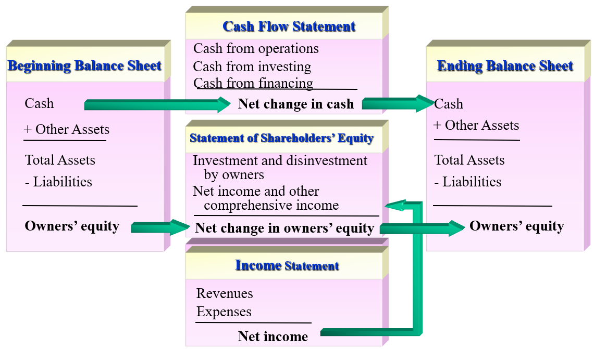

# Chapter 2: Introduction to the Financial Statements

### Four Financial Statements

#### Balance Statement
$\text{Cash}$

$+ \text{ Other Assets}$

$\overline{\qquad \qquad \qquad \qquad \qquad}$

$\text{Total Assets}$

$- \text{ Liabilities}$

$\overline{\qquad \qquad \qquad \qquad \qquad}$

$\text{Shareholders' Equity}$

#### Cash Flow Statement
$$
\text{Change in Cash} = \text{Cash from Operations} + \text{Cash from Investing} + \text{Cash from Financing}
$$

#### Statement of Shareholders' Equity
$$
\text{Ending Equity} = \text{Beginning Equity} + \text{Comprehensive Income} - \text{Net Payout to Shareholders}\\
{}\\
\text{Comprehensive Income} = \text{NI} + \text{Other Comprehensive Income}\\
{}\\
\text{Net Payout to Shareholders} = \text{Dividends} + \text{Share Repurchases} - \text{Share Issues}
$$

#### Income Statement
$\text{Net Revenue}$

$- \text{ Cost of Goods Sold}$

$\overline{\qquad \qquad \qquad \qquad \qquad \qquad \qquad \qquad \qquad \qquad \ }$

$\text{Gross Margin}$

$- \text{ Operating Expenses}$

$\overline{\qquad \qquad \qquad \qquad \qquad \qquad \qquad \qquad \qquad \qquad \ }$

$\text{Operating Income (EBIT)}$

$- \text{ Interest Expense}$

$+ \text{ Interest Income}$

$\overline{\qquad \qquad \qquad \qquad \qquad \qquad \qquad \qquad \qquad \qquad \ }$

$\text{Income before Taxes}$

$- \text{ Income Taxes}$

$\overline{\qquad \qquad \qquad \qquad \qquad \qquad \qquad \qquad \qquad \qquad \ }$

$\text{Income before Extraordinary Items}$

$+ \text{ Extraordinary Items}$

$\overline{\qquad \qquad \qquad \qquad \qquad \qquad \qquad \qquad \qquad \qquad \ }$

$\text{Net Income (NI)}$

$- \text{ Preferred Dividends}$

$\overline{\qquad \qquad \qquad \qquad \qquad \qquad \qquad \qquad \qquad \qquad \ }$

$\text{Net Income Available to Common Shareholder}$

#### Articulation

#### Example
From the following information for the year 2012, calculate the ending equity under <abbr title='Generally Accepted Accounting Principle'>GAAP</abbr> rules (<abbr title='Research and Development'>R&D</abbr> expenses are expensed as incurred), for a company with shareholders' equity at the beginning of 2012 of $\text{\textdollar}3,270 \text{ million}$. Amounts are in millions.
> <abbr title='Generally Accepted Accounting Principle'>GAAP</abbr> is used in America, while <abbr title='International Financial Report Standard'>IFRS</abbr> is the international version. China uses a version closed to <abbr title='International Financial Report Standard'>IFRS</abbr>.

$$
\text{Gross Margin} = \text{\textdollar}4458 - \text{\textdollar}3348 = \text{\textdollar}1110\\
{}\\
\text{EBIT} = \text{Gross Margin} - \text{\textdollar}1230 - \text{\textdollar}450 = \text{\textdollar}(-570)
$$

Note that <mark>the number in the parentheses means negative number</mark>. Thus, we have 
$$
\text{NI} = \text{EBIT} - \text{\textdollar}(-200) = \text{\textdollar}(-370)
$$

> [!TIP]
> A loss yields a tax benefit that the firm can carry forward to reduce future taxes.

$$
\text{Comprehensive Income} = \text{NI} + \text{\textdollar}76 = \text{\textdollar}(-294)\\
{}\\
\text{Net Payout} = \text{\textdollar}140 - \text{\textdollar}680 = \text{\textdollar}(-540)\\
{}\\
\text{Ending Equity} = \text{\textdollar}3270 + \text{Comprehensive Income} - \text{Net Payout} = \text{\textdollar}3516
$$

### Price-to-Book Ratio (P/B)
$$
\text{P/B} = \frac{\text{Market Value of Equity}}{\text{Book Value of Equity}}
$$

#### Market Premium and Intrinsic Premium
$$
\text{Market Premium} = \text{Market Value of Equity} - \text{Book Value of Equity}\\
{}\\
\text{Intrinsic Premium} = \text{Intrinsic Value of Equity} - \text{Book Value of Equity}
$$

#### Intrinsic P/B
$$
\text{Intrinsic P/B} = \frac{\text{Intrinsic Value of Equity}}{\text{Book Value of Equity}}
$$

#### Book Value Measurement
- Historical Cost Accounting
- Fair Value Accounting

#### Median-Level Comparison between China and US

The reasons that P/B in China is higher than that in US should be organized into 2 aspects: <mark>overestimated price and underestimated book value</mark>. Overestimated price may result from the <mark>short-selling constraints</mark> and underestimated book value may be related to the omitted <mark>shell value</mark>.

#### Industry Comparison

Price is about expectation, which means industries like Information Technology and Health Care have higher P/B due to the imagination of their development (high <abbr title='Research and Development'>R&D</abbr> expenses), while industries like Utilities and Financials have lower P/B (close to 1 in US) because of their limited development.

### Price-to-Eearnings Ratio (P/E)

#### Trailing P/E
$$
\text{Trailing P/E} = \frac{\text{Price}}{\text{Most Recent Annual EPS}}
$$

#### Rolling P/E
$$
\text{Rolling P/E} = \frac{\text{Price}}{\text{Sum of EPS for Most Recent 4 Quarters}}
$$

#### Forward P/E
$$
\text{Forward P/E} = \frac{\text{Price}}{\text{Forecast of Next Year's EPS}}
$$

#### Dividend-Adjusted P/E
$$
\text{Dividend-Adjusted P/E} = \frac{\text{Price}+\text{Annual DPS}}{\text{EPS}}
$$

> [!TIP]
> Dividends affects prices but not earnings.