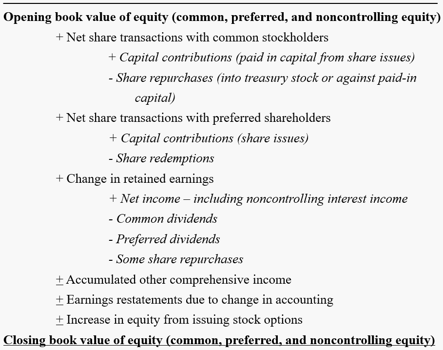

# The Analysis of the Statement of Shareholders' Equity

### Reformulated Statement of Common Stockholders' Equity

GAAP Statement of Shareholders' Equity

Reformulated Statement of Common Stockholders' Equity

Here common dividends that we consider is <mark>cash dividends</mark>. And other comprehensive income includes 
- currency <mark>translation</mark> gains and losses (caused by the change of exchange rate from the day it is realized to the day it is recognized);
- <mark>unrealized</mark> gains and losses on securities (debt and equity);
- <mark>hedging</mark> gains and losses (gains and losses on derivative instruments).

> [!TIP]
> Other comprehensive income is income that out of control, i.e., it is not about company's management.

> The reformulated statement above is what we want to get, but how to reformulate it in detail? Let's see the following example.

#### Example: Reformulate Statement of Common Stockholder's Equity for Nike
The GAAP statement of shareholders' equity is shown below: 

First, we should identify share issues. Note that <mark>stock options exercised is seen as a type of share issues</mark> and <mark>shares forfeited from employees would be treasury stock</mark>. Thus, we have
$$
\begin{aligned}
 \text{Share Issues} &= \text{Stock Options Exercised} + \text{Issuance of Shares to Employees}\\ &\quad - \text{Forfeiture of Shares from Employees}\\ 
 &= 416.7
 \\
\end{aligned}
$$

<mark>Dividends declared includes cash dividends and dividends payable.</mark> The balance sheet shows that the change in dividends payable is $130.7-121.4=9.3$, which means cash dividends is 
$$
\begin{aligned}
 \text{Cash Dividends} &= \text{Dividends Declared} - \text{Change in Dividends Payable}\\
 &= 514.8 - 9.3\\
 &= 505.5
\end{aligned}
$$

From above we can also calculate that net hedging gains or losses is $87.1 + 44.8 - 121.6 - 3.8 = 6.5$.

Note that the item <mark>*Stock-based compensation* does not belong to transactions with shareholder or comprehensive income, so we should list it alone.</mark>

Finally, we have 

### Dirty-Surplus Accounting
