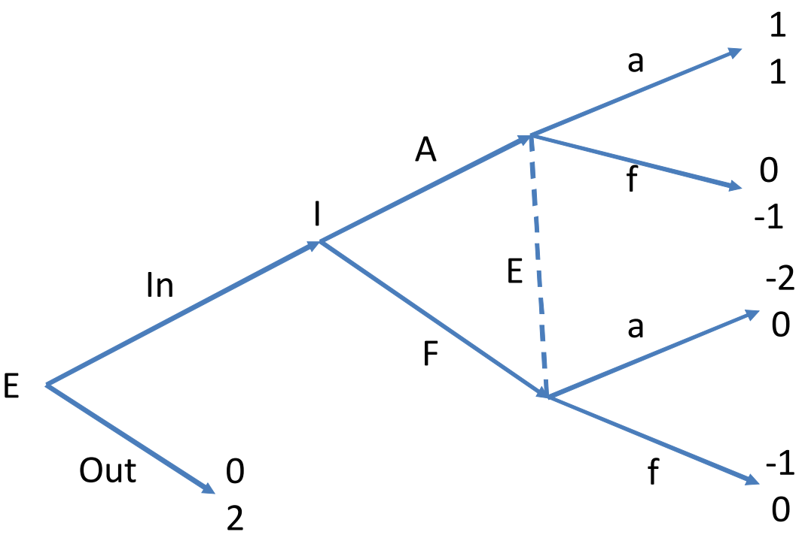
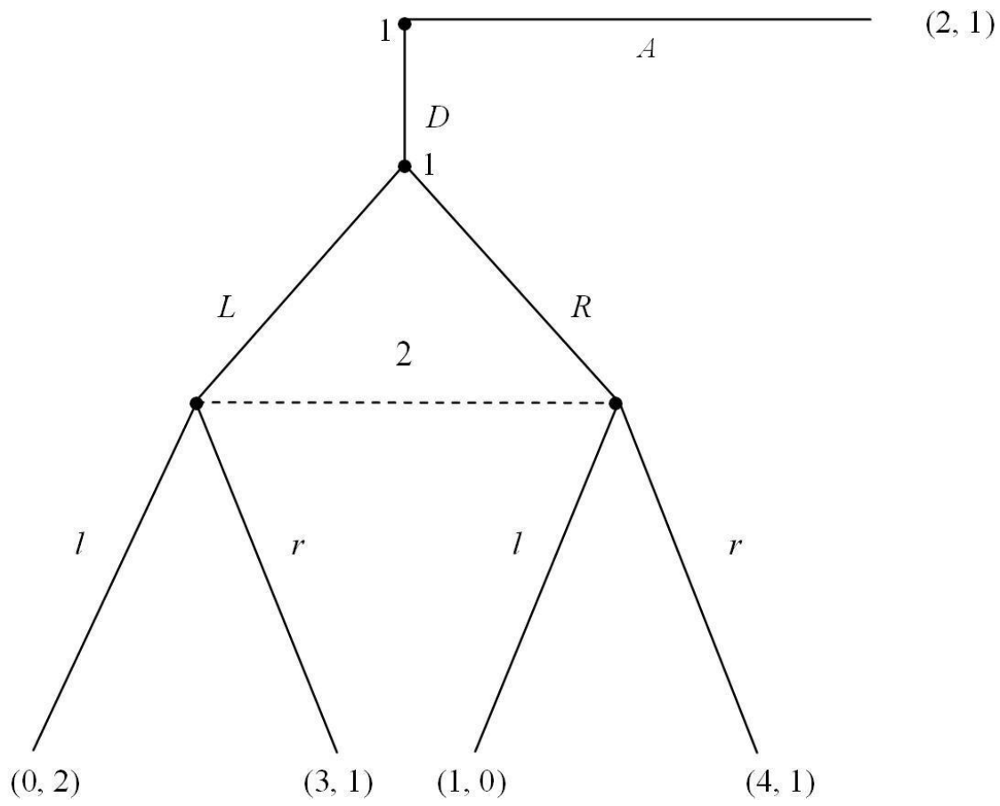

# Perfect Bayesian Equilibrium

|                         |                    Perfect Information                     |                 Imperfect Information                 |
| :---------------------: | :--------------------------------------------------------: | :---------------------------------------------------: |
|  **Normal Form Game**   |          <abbr title='Nash Equilibrium'>NE</abbr>          |  <abbr title='Bayesian Nash Equilibrium'>BNE</abbr>   |
| **Extensive Form Game** | <abbr title='Subgame Perfect Nash Equilibrium'>SPNE</abbr> | <abbr title='Perfect Bayesian Equilibrium'>PBE</abbr> |

> [!NOTE]
> **Imperfect VS. Incomplete**
> 
> - Imperfect information: Unobservable actions
> - Incomplete information: Unobservable types
> 
> We can transfer infomplete information to inperfect information by adding a "Nature" player, i.e., we change types to be actions given by nature, e.g., see [example of policy advice](courses/game_theory/5_games_of_incomplete_information.md#example-policy-advice) (though we use "incomplete" there, actually it has been transfered to "imperfect").

### Example: Enter in the Market

Remember we have discussed this example in [sequential move games](courses/game_theory/4_sequential_move_games.md#example-enter-in-the-market), here we assume an imperfect information set: 

Under this assumption, there are only 2 subgames instead of 4. The second subgame starting from decision node $\text{In}$ can be seen as a normal form game since the decisions of $\text{I}$ and $\text{E}$ can be seen as simultaneous decisions due to the imperfect information. Thus, we have 

|       |                A                |                F                 |
| :---: | :-----------------------------: | :------------------------------: |
| **a** | $\underline{1},\ \underline{1}$ |             $-2,\ 0$             |
| **f** |            $0,\ -1$             | $\underline{-1},\ \underline{0}$ |

and Nash equilibria of this subgame are $(\text{a},\ \text{A})$ and $(\text{f},\ \text{F})$, which means <abbr title='Subgame Perfect Nash Equilibrim'>SPNE</abbr> outcomes are $((\text{In},\ \text{a}),\ \text{A})$ and $((\text{Out},\ \text{f}),\ \text{F})$.

### Sequential Rationality

A strategy in an extensive form game specifies a probability distribution over all available actions at each information set. Call $\sigma_i(\cdot | h)$ the probability distribution over actions available at information set $h$ for player $i$. Then a strategy can be written as 

$$
\sigma_i = \left\{ \sigma_i(\cdot | h) \right\}_{h\in H(i)}
$$

where $H(i)$ is the set of information sets at which $i$ decides.

Given belief $\mu(\cdot)$, the expected payoff of player $i$ can be denoted as 

$$
\mathrm{E}(u_i | h,\ \mu,\ \sigma_i,\ \sigma_{-i})
$$

Recall that we can denote $i$ as $P(h)$. Then, a strategy profile $\sigma=(\sigma_1,\ \sigma_2,\ \cdots,\ \sigma_I)$ in an extensive form game is <mark>sequentially rational</mark> at information set $h$ given a system of belief $\mu$ if we have 

$$
\mathrm{E}\left( u_{P(h)} | h,\ \mu,\ \sigma_{P(h)},\ \sigma_{-P(h)} \right) \geqslant \mathrm{E}\left( u_{P(h)} | h,\ \mu,\ \widetilde{\sigma}_{P(h)},\ \sigma_{-P(h)} \right),\quad \forall \widetilde{\sigma}_{P(h)}\in \Delta\left( S_{P(h)} \right) 
$$

where $S_{P(h)}$ is the strategy space of $P(h)$ and $\Delta(\cdot)$ denotes all probability distributions on a strategy space, i.e., all mixed strategies.

Furthermore, if strategy profile $\sigma$ satisfies this condition for all information sets $h$, then we say $\sigma$ is sequentially rational given belief system $\mu$.

### Weak Perfect Bayesian Equilibrium

A strategy profile and belief system $(\sigma,\ \mu)$ in an extensive form game is a weak <abbr title='Perfect Bayesian Equilibrium'>PBE</abbr> if it has the following properties: 

- The strategy profile $\sigma$ is sequentially rational given belief system $\mu$.
- The belief system $\mu$ is derived from strategy profile $\sigma$ through Bayes' rule whenever possible, i.e., $\forall $ information set $h$ s.t. $\mathbb{P}(h|\sigma)>0$, we must have 

    $$
    \mu(x) = \frac{\mathbb{P}(x|\sigma)}{\mathbb{P}(h|\sigma)},\quad x\in h
    $$

#### Example: Limitation of Weak PBE

Consider a game tree below: 

For player 1, $\text{R}$ is a strictly dominant strategy to $\text{L}$ and thus choosing $\text{L}$ is impossible. However, a weak <abbr title='Perfect Bayesian Equilibrium'>PBE</abbr> is not restricted by Bayes' rule at the zero-possibility information set, which means player 2 can have a belief that the possibility of player 1 choosing $\text{L}$ is bigger than $0$.

For example, $((A,\ R),\ l,\ \mu_2(L)=1)$ is a weak <abbr title='Perfect Bayesian Equilibrium'>PBE</abbr> outcome since player 2 would choose $l$ due to his belief $\mu_2(L)=1$ and player 1 would choose $R$ based on this belief. Compared with choosing $D$ to get payoff $1$, the best choice of player 1 at first is $A$ with payoff $2$.

However, this outcome is not an <abbr title='Subgame Perfect Nash Equilibrium'>SPNE</abbr>.

### Perfect Bayesian Equilibrium

Different from [weak PBE](#weak-perfect-bayesian-equilibrium), <abbr title='Perfect Bayesian Equilibrium'>PBE</abbr> consider $\forall $ information set $h$ s.t. $\mathbb{P}(h|\sigma)\geqslant 0$, which means in the [example](#example-limitation-of-weak-pbe) above, player 2 cannot have a belief that the possibility of player 1 choosing $\text{L}$ is bigger than $0$.

Recall that we solved the system with imperfect information by seeing it as a normal form game in the [game of entering in the market](#example-enter-in-the-market). Actually the equilibrium is reached when players have a belief that the other would choose the equilibrium strategy with probability $1$, which satisfies Bayes' rule and thus the Nash equilibrium is also a <abbr title='Perfect Bayesian Equilibrium'>PBE</abbr>.