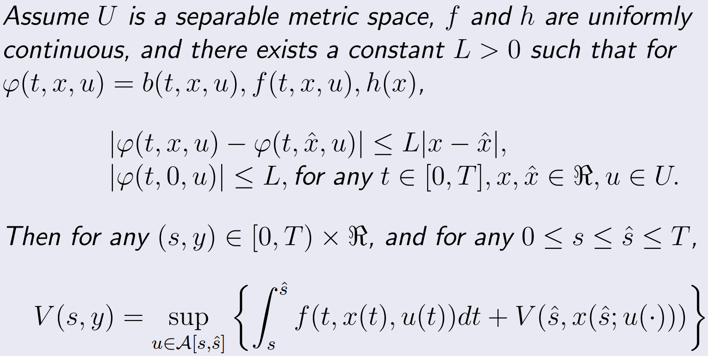

# Continuous-Time Deterministic Dynamic Programming

### Basic Structure

#### Control System
$$
\begin{cases}
 \frac{\mathrm{d}x}{\mathrm{d}t} = b(t,\ x(t),\ u(t)),& t \in [0,\ T] \\
 x(0) = x_0
\end{cases}
$$
where the initial value $x_0 \in \mathbb{R}$, the control $u: [0,\ T] \to U$ with a metric space $U$ and the map $b: [0,\ T]\times \mathbb{R}\times U \to \mathbb{R}$.
Consider $s \in [0,\ T)$ and $y \in \mathbb{R}$, the control system becomes
$$
\begin{cases}
  \frac{\mathrm{d}x}{\mathrm{d}t} = b(t,\ x(t),\ u(t)),& t \in [s,\ T] \\
  x(s) = y
\end{cases}
$$

#### Value Functional
$$
J(s,\ y;\ u(\cdot)) = h(x(T)) + \int_s^{T} f(t,\ x(t),\ u(t))~\mathrm{d}t
$$for some given payoff maps $f$ and $h$.

#### Value Function
$$
V(s,\ y) =
\begin{cases}
   \underset{u \in U}{\mathrm{sup}}\ J(s,\ y;\ u(\cdot)),& s \in [0,\ T) \\
   h(y),& s=T
\end{cases}
$$

### Principle of Optimality

The equation above is called the <mark>dynamic programming equation</mark>.

If the value function $V \in \mathbb{C}^{1}([0,\ T]\times \mathbb{R})$ (the first order derivatives are continuous), then $V$ satisfies the <mark>HJB (Hamilton-Jacobi-Bellman) equation</mark>: 
$$
\begin{cases}
  V_t + \underset{u \in U}{\mathrm{sup}}\ [b(t,\ x,\ u)V_x + f(t,\ x,\ u)] = 0 \\
  V(t=T,\ x) = h(x)
\end{cases}
$$
where $x(t)$ and $u(t)$ are simply written as $x$ and $u$.

Proof

Fix a $u \in U$. By the principle of optimality, we have
$$
 \int_{s}^{\hat{s}} f(t,\ x,\ u)  ~\mathrm{d}t + V(\hat{s},\ x(\hat{s})) \leqslant V(s,\ y)
$$
Let $\hat{s} \to s$, then we can write 
$$
 \int_{s}^{\hat{s}} f(t,\ x,\ u)  ~\mathrm{d}t = (\hat{s}-s)f(s,\ x(s),\ u(s)) + \omicron(\hat{s}-s) \implies \frac{\int_{s}^{\hat{s}} f(t,\ x,\ u)  ~\mathrm{d}t}{\hat{s}-s} = f(s,\ x(s),\ u(s))
$$
and 
$$
 V(\hat{s},\ x(\hat{s})) = V(s,\ x(s)) +V_t|_{t=s}(\hat{s}-s)+\omicron(\hat{s}-s)+V_x|_{x=x(s)}(x(\hat{s})-x(s))+\omicron(x(\hat{s})-x(s)) \\
 \implies \frac{V(\hat{s},\ x(\hat{s}))-V(s,\ x(s))}{\hat{s}-s} = V_t|_{t=s} + V_x|_{x=x(s)}b(s,\ x(s),\ u(s))
$$
by Taylor expansion.

> [!TIP]
> When $\hat{s} \to s$, $\frac{\omicron(x(\hat{s})-x(s))}{\hat{s}-s}=\frac{\omicron(x(\hat{s})-x(s))}{x(\hat{s})-x(s)}\frac{x(\hat{s})-x(s)}{\hat{s}-s}=\frac{\omicron(x(\hat{s})-x(s))}{x(\hat{s})-x(s)}b(s,\ x(s),\ u(s))=0$. 

Thus, we have 
$$
f(s,\ x(s),\ u(s)) + V_t|_{t=s} + V_x|_{x=x(s)}b(s,\ x(s),\ u(s)) \leqslant 0
$$
Then for any $u \in U$, we obtain 
$$
V_t|_{t=s} + \underset{u \in U}{\mathrm{sup}}[ f(s,\ x(s),\ u(s)) + V_x|_{x=x(s)}b(s,\ x(s),\ u(s)) ] \leqslant 0
$$On the other hand, by the definition of supremum, $\forall \varepsilon>0$ with $\hat{s}-s>0$ small enough, $\exists u \in U$ s.t. 
$$
V(s,\ y) - \varepsilon(\hat{s}-s) \leqslant \int_{s}^{\hat{s}} f(t,\ x,\ u)  ~\mathrm{d}t + V(\hat{s},\ x(\hat{s}))
$$Using the same method above, this yeilds
$$
f(s,\ x(s),\ u(s)) + V_t|_{t=s} + V_x|_{x=x(s)}b(s,\ x(s),\ u(s)) \geqslant -\varepsilon
$$
which means 
$$
V_t|_{t=s} + \underset{u \in U}{\mathrm{sup}}[ f(s,\ x(s),\ u(s)) + V_x|_{x=x(s)}b(s,\ x(s),\ u(s)) ] \geqslant 0
$$
Hence, we finish the proof.

#### Example: Bliss Point
Ramsey (1928) proposed the idea of a bliss point, an accumulation point of a sequence of consumption decisions representing the nonattainable, ideal consumption goal of the consumer. In math form, we write the bliss point 
$$
B=\underset{c\geqslant 0}{\mathrm{sup}}\ U(c)>0
$$where $U(c)$ is the utility experienced as a result of per capita consumption $c$.

Consumers want to minimize the gap between utility and the bliss point, so the value functional of the control system can be written as 
$$
J(0,\ k_0;\ c(\cdot)) = \int_{0}^{\infty} U(c)-B ~\mathrm{d}t 
$$
and the value function 
$$
V(s,\ k_0) = \underset{c}{\mathrm{sup}}\ \int_{0}^{\infty} U(c)-B ~\mathrm{d}t = V(k_0)
$$is <mark>time-homogeneous</mark>.

Now we start to build the control system.

The neoclassical production function is 
$$
Y = F(K,\ L) 
$$where $Y$ is output, $K$ and $L$ are time-varying capital input and constant labor input, respectively, and $F(\cdot,\ \cdot)$ is homogeneous of degree one, i.e., $F(\alpha K,\ \alpha L)=\alpha F(K,\ L),\ \forall \alpha>0$.

Thus, if we take labor $L$ to be fixed, per capita output can be expressed as 
$$
y = \frac{Y}{L} = F\left( \frac{K}{L}, 1 \right)  := f(k)
$$
where $k=\frac{K}{L}$.

The well-known macroeconomic identities show that 
$$
\begin{cases}
  I = Y - C \\
  \mathrm{d}K = I \mathrm{d}t - \delta K \mathrm{d}t
\end{cases}
$$
where $I$ represents investment, $C$ is total consumption and $\delta$ is the rate of depreciation of capital.

Let per capita consumption $c=\frac{C}{L}$, we obtain 
$$
\frac{\mathrm{d}k}{\mathrm{d}t} = \frac{1}{L}\frac{\mathrm{d}K}{\mathrm{d}t} = \frac{I-\delta K}{L} = \frac{Y}{L} - \frac{C}{L} - \delta \frac{K}{L} = f(k) - c - \delta k
$$
which means the control system can be written as 
$$
\begin{cases}
  \frac{\mathrm{d}k}{\mathrm{d}t} = f(k) - c - \delta k\\
  k(0) = k_0
\end{cases}
$$
given initial per capita capital $k_0$.

Assume $U(c) = B - e^{-\lambda c}$ with constant $\lambda>0$. By HJB equation we know that 
$$
V_t + \underset{c}{\mathrm{sup}}\ \left[(f(k)-c-\delta k) V_k - e^{-\lambda c}  \right]  = 0 \\
$$
Since the value function is time-homogeneous, $V_t=0$. The first-order derivative of the function in the bracket w.r.t. $c$ is $-V_k + \lambda e^{-\lambda c}$, and the second-order derivative w.r.t. $c$ is $-\lambda^{2}e^{-\lambda c}$, which means the function reaches an unique maximum when $c$ satisfies $\lambda e^{-\lambda c} = V_k$. Thus, the equation above becomes 
$$
\begin{aligned}
 (f(k^{*}) - c^{*} - \delta k^{*}) \lambda e^{-\lambda c^{*}} - e^{-\lambda c^{*}} &= 0 \\
 c^{*} &= f(k^{*}) - \delta k^{*} - \frac{1}{\lambda}
\end{aligned}
$$
and we have 
$$
\frac{\mathrm{d}k^{*}}{\mathrm{d}t} = f(k^{*}) - c^{*} - \delta k^{*} = \frac{1}{\lambda}
$$
which means 
$$
k^{*} = k_0 + \frac{t}{\lambda}
$$