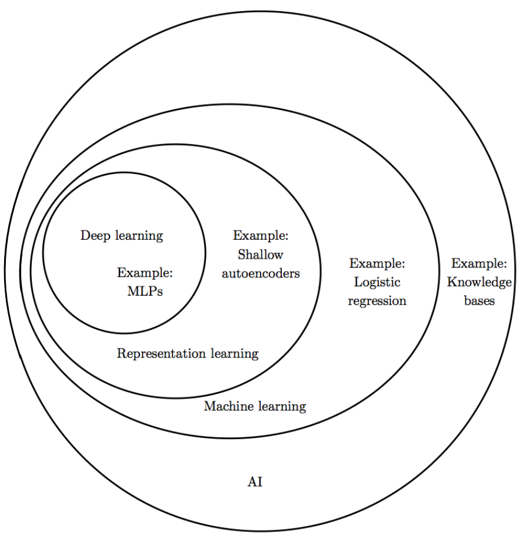
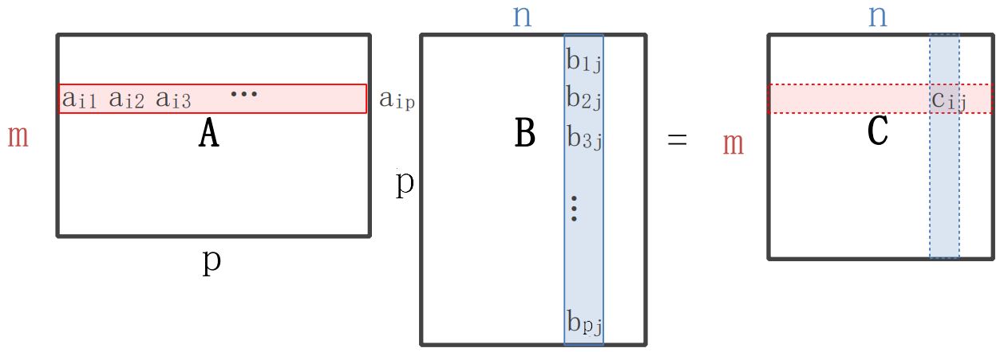

# 深度学习 {ignore}
- 2022春季
- 郑锋

<!-- @import "[TOC]" {cmd="toc" depthFrom=1 depthTo=6 orderedList=false} -->

<!-- code_chunk_output -->

- [Introduction](#introduction)
- [Mathematical Background](#mathematical-background)

<!-- /code_chunk_output -->

### Introduction
- **Concept Relationships**

  - ==AI== is a field of CS that makes a computer system can mimic human intelligence.
  - There are different ways to realize AI, including ==machine learning==, which enables a coumputer system to make predictions or take some decisions using historical data without being explicitly programmed.
  - In machine learning, ==representation learning== (a.k.a. feature learning) is a set of techniques that allows a system to automatically discover the representations needed for feature detection or classification from raw data.
  - ==Deep learning== is just a part of representation learning with deep neural network.

 

- **Why representation matters?**

  - Consider data with distribution above. In Cartesian coordinates, linear functions cannot classify the data well. However, if we represent the data in the Polar coordinates, then linear functions work well.
  - The process that change raw data into Polar representatives is called encoding, the inverse process is decoding. ==Autoencoders== encode unlabeled data into representatives. If an autoencoder can decode the representatives back to the raw data with little loss, then it is an good autoencoder.
  - Sometimes the feature are too complex to be automatically extracted from raw data. Thus, we need deep neural network to solve problems that shallow autoencoders cannot solve.

### Mathematical Background

- **Matrix**
  - Inner Product
    
    ==When the vectors are unit vectors or the same multiples of unit vectors, i.e., they have the same length, the inner product is a kind of correlation (cosine similarity).== If the row in A and the column in B are the same, the product would be the biggest.
    > For any vectors $\bm{a}$, $\bm{b}$, $\bm{a} \cdot \bm{b} = \left\vert a \right\vert \left\vert b \right\vert \cos \theta$ where $\theta$ is the angle between $\bm{a}$ and $\bm{b}$.
  - Trace
    $$
    Tr(\bm{ABC}) = Tr(\bm{CAB}) = Tr(\bm{BCA})
    $$
  - Orthogonal Matrix
    $$
    \bm{A}^{-1} = \bm{A}^{\mathsf{T}}
    $$
  - Eigendecomposition
    Suppose matrix $\bm{A}$ satisfies
    $$
    \bm{A} \bm{v} = \lambda \bm{v}
    $$where $\lambda$ is its eigenvalue and $\bm{v}$ is the corresponding eigenvector.
    - If $\bm{A}$ is a square diagonalizable matrix, then it can be decomposed into $\bm{V} \text{diag}(\lambda) \bm{V}^{-1}$ where $\bm{V}$ is composed of eigenvectors.
      Moreover, if $\bm{A}$ is a real symmetric matrix, then any 2 eigenvectors corresponding to different eigenvalues are orthogonal, which means $\bm{V}$ is an orthogonal matrix and $\bm{A} = \bm{V} \text{diag}(\lambda) \bm{V}^{\mathsf{T}}$
    - If $\bm{A}$ is not square, e.g., $\bm{A}$ is an $m \times n$ matrix, we can use SVD (Singular Value Decomposition) to get $\bm{UD}\bm{V}^{\mathsf{T}}$ where $\bm{U}$ is an $m \times m$ orthogonal matrix composed of eigenvectors of $\bm{A}\bm{A}^{\mathsf{T}}$, $\bm{D}$ is an $m \times n$ diagonal matrix with square roots of eigenvalues of $\bm{A}^{\mathsf{T}}\bm{A}$ on the diagonal, and $\bm{V}$ is a $n \times n$ orthogonal matrix composed of eigenvectors of $\bm{A}^{\mathsf{T}}\bm{A}$.
      The SVD decomposition can be used to get Moore-Penrose pseudoinverse $\bm{A}^{+} = \bm{V}\bm{D}^{+}\bm{U}^{\mathsf{T}}$ where $\bm{D}^{+}$ is the transpose of $\bm{D}$ with reciprocal transformation on nonzero elements. When $m>n$, $\bm{x}=\bm{A}^{+}\bm{y}$ gives the solution to $\underset{\bm{x}}{\mathrm{min}}\ \left\| \bm{A}\bm{x}-\bm{y} \right\|_{2}$.
 

- **Norms**
  - Definition
  Functions that measure how "large" a vector is and should satisfy 
    - $f(\bm{x}) = 0 \implies \bm{x} = 0$
    - $f(\bm{x}+\bm{y}) \leqslant f(\bm{x}) + f(\bm{y})$ (the triangle inequality)
    - $\forall \alpha \in \mathbb{R},\ f(\alpha \bm{x}) = \left\vert \alpha \right\vert  f(\bm{x})$
  - $L_p$ Norms
  $$
  \left\| \bm{x} \right\|_{p} = \left( \sum\limits_{i} \left\vert x_i \right\vert ^{p}  \right) ^{\frac{1}{p}}
  $$
    - $L_2$ norm is the most popular.
    - $L_0$ norm: num of nonzero elements in $\bm{x}$
    - $L_{\infty}$ norm (max norm): $\left\| \bm{x} \right\|_{\infty} = \underset{i}{\mathrm{max}}\ \left\vert x_i \right\vert $
 

- **Bayes' Rule**
  $$
  \mathrm{P}(X|Y) = \frac{\mathrm{P}(X)\mathrm{P}(Y|X)}{\mathrm{P}(Y)}
  $$
  - Modified Bayes' Theorem
  $$
  \mathrm{P}(H|X) = \mathrm{P}(H) \left[ 1 + \mathrm{P}(C) \left( \frac{\mathrm{P}(X|H)}{\mathrm{P}(X)} - 1 \right)  \right] 
  $$where $H$ is hypothesis, $X$ is observation, $\mathrm{P}(H)$ is prior probability that $H$ is true, $\mathrm{P}(X)$ is prior probability of observing $X$ and $\mathrm{P}(C)$ is probability that using Bayesian statistics correctly. When $\mathrm{P}(C)=1$, the equation above is just the Bayes' rule.
 

- **Distribution**
  - Bernoulli Distribution
    $$
    \mathrm{P}(X=x) = 
    \begin{cases}
      \phi,& x=1 \\
      1-\phi,& x=0
    \end{cases} = 
    \phi^{x} (1-\phi)^{1-x}\ (x = 0,\ 1)
    $$
    - $\mathrm{E}(X)=\phi$
    - $\mathrm{Var}(X)=\phi(1-\phi)$
  - Gaussian Distribution (Precision Version)
    $$
    N(x; \mu,\ \beta ^{-1}) = \sqrt{\frac{\beta}{2\pi}}e^{- \frac{1}{2}\beta(x-\mu)^{2}}
    $$where $\beta = \frac{1}{\sigma^{2}}$ is called precision.
    - Multivariate: $N(\bm{x}; \bm{\mu},\ \bm{\beta} ^{-1}) = \sqrt{\frac{\left\vert \bm{\beta} \right\vert }{(2\pi)^{n}}}e^{- \frac{1}{2}(\bm{x}-\bm{\mu})^{\mathsf{T}}\bm{\beta}(\bm{x}-\bm{\mu})}$ for $n$-dimension.
    - ==Why using precision version==: especially in mulitivariate cases, using $\bm{\beta}$ instead of $\bm{\Sigma}$ avoids to calculate the matrix's inverse.
  - Mixture Distributions
    $$
    \mathrm{P}(X=x) = \sum\limits_{i} \mathrm{P}(c=i) \mathrm{P}(X=x|c=i)
    $$where $\mathrm{P}(c=i)$ is probability of choosing the $i$-th distribution.
    - Mixing distributions together can get more complicated distribution.
 

- **Functions**
 

- **Information Theory**
 

- **Curvature**