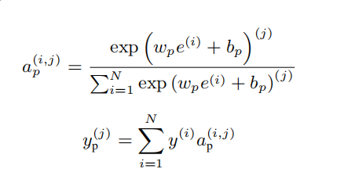

# FactorVAE: A Probabilistic Dynamic Factor Model Based on Variational Autoencoder for Predicting Cross-Sectional Stock Returns

### 论文信息

#### 作者

Yitong Duan, Lei Wang, Qizhong Zhang, Jian Li

清华大学

#### 收录情况

收录于 AAAI 2022

#### 背景知识

1. Dynamic factor model (DFM)
 
factor exposure随时间变化的factor model，传统DFM根据实际经验设计因子，可能引入model bias，原因是先验知识和实际市场存在不一致。

$y_s$表示Future return

$N_s$是$s$时刻stock的数量，$\alpha_s$是idiosyncratic returns，$\beta_s$是factor exposure，$z_s$是$K$个factor的向量，$\epsilon_s$是idiosyncratic noises。

目标任务为学习参数为$\Theta$的模型$f$，从历史数据中预测未来的cross-sectional收益：

其中$x_s\in\mathbb{R}^{N_s\times T\times C}$是历史的股票特征。

2. VAE

假定数据$x$从隐变量（latent random variable）$\mathbf{z}$中生成，编码器$\phi$生成后验分布的近似分布$q_\phi(z|x)$（因为真正的后验分布$p(z|x)=\frac{p(x|z)p(z)}{p(x)}$无法计算，所以使用变分推断近似），从$q_\phi(z|x)$中采样后验$z_{post}$，解码器$\theta$根据后验重构数据$x'$。在变分推断中，先验分布$p(z)$往往假设为标准高斯分布，$q_\phi(z|x)$要尽可能接近$p(z)$（等价推到见下式的变分推断的KL项）

VAE生成时从$p(z)$采样先验$z_{prior}$。

### 研究动机

  low signal-to-noise ratio of the stock data，大的噪声会干扰ML模型的学习，导致学习到的latent factors不是很有效

### 研究思路

  FactorVAE: bridging the gap between the noisy data and effective factors (可以理解为找到好的feature）。将factors表示为latent random variables ，然后引导模型学习有效的factors。

   

    Encoder：以历史和未来数据为输入，得到后验（posterior）的最优factors
    Decoder：根据输入的factors预测（重构）returns
    Predictor：以历史数据为输入，预测先验的（prior）的factors
    利用VAE的变分推断中最小化prior-posterior的思路（最小化KL分布），提取好的factors，预测returns

### 研究方法

$x$和$y$输入到encoder预测后验factor，使用$x$输入到predictor预测先验factor，decoder根据factor重构或预测return

基本思路：计算后验factors时是已知历史数据$x$和return$y$的，这样学到的factor是和$y$最密切相关的，并且decoder保证能从这样的后验factor中回复return$y$，因此后验factor包含足够的信息且与$y$很相关。先验factors仅根据已知历史数据$x$进行预测，本身不一定是最好的，但是使用KL散度损失，使它和后验factor接近，目的是让predictor学到好的factor，并通过decoder进行预测。

编码解码过程

编码过程中，使用GRU编码$x$得到$e$,然后计算portfolos的weight和return

然后使用一个map函数计算后验factors。
解码过程中，使用$e$计算alpha和beta，然后计算得到return $y$。
预测过程中：

使用Transformer计算不同股票$e$的attention，预测prior factors

### 实验结果

