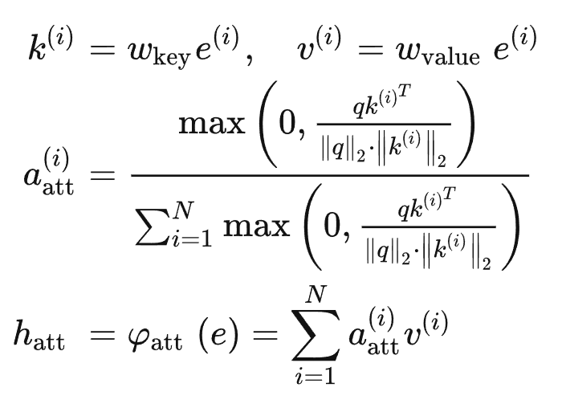
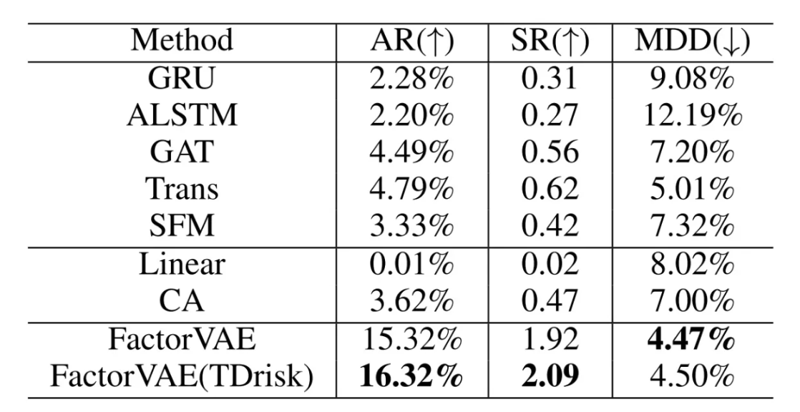

# FactorVAE: A Probabilistic Dynamic Factor Model Based on Variational Autoencoder for Predicting Cross-Sectional Stock Returns

### 论文信息

#### 作者

Yitong Duan, Lei Wang, Qizhong Zhang, Jian Li

清华大学

Jian Li: https://people.iiis.tsinghua.edu.cn/~jianli/

#### 收录情况

收录于 AAAI 2022

#### 背景知识

1. Factor model (DFM)
 
因子模型通过各种因素来解释市场现象和资产回报，这些因子可以是基本面、技术面、宏观经济等。具体来说，在因子模型中，股票收益由因子和对应的因子暴露（指因子对股票的影响）来描述，并由因子的线性组合计算。根据因子暴露是否随时间变化，因子模型分为两类：静态模型和动态模型。

> Static factor models: the factor exposure of stock is time-invariant: CAPM, Fama-French three-factor model, and so on.

> Dynamic factor models: factor exposure varies with time, and is usually calculated from the firm or asset characteristics (such as market capitalization, book-to-market ratio, asset liquidity)

2. VAE


假定数据$x$从隐变量（latent random variable）$\mathbf{z}$中生成，编码器$\phi$生成后验分布的近似分布$q_\phi(z|x)$（因为真正的后验分布$p(z|x)=\frac{p(x|z)p(z)}{p(x)}$无法计算，所以使用变分推断近似），从$q_\phi(z|x)$中采样后验$z_{post}$，解码器$\theta$根据后验重构数据$x'$。在变分推断中，先验分布$p(z)$往往假设为标准高斯分布，$q_\phi(z|x)$要尽可能接近$p(z)$（等价推到见下式的变分推断的KL项）


VAE生成时从$p(z)$采样先验$z_{prior}$。

### 摘要

作为经济学和金融学中的一种资产定价模型，因子模型已被广泛用于量化投资中。为了建立更有效的因子模型，近年来见证了从线性模型到更灵活的非线性数据驱动的机器学习模型的范式转变。然而，由于金融数据的低信噪比，学习有效的因子模型是相当具有挑战性的。在本文中，我们提出了一个新的因子模型，FactorVAE，作为一个具有内在随机性的概率模型，用于噪声建模。本质上，我们的模型整合了机器学习中的动态因子模型（DFM）和变分自动编码器（VAE），并提出了一种基于VAE的先验-后验学习方法，该方法可以有效地指导模型的学习，通过未来信息来接近最佳后验因子模型。特别是，考虑到风险建模对含有噪声的股票数据很重要，FactorVAE除了预测收益率外，还可以从VAE的潜空间分布中估计出变异。在真实的股票市场数据上的实验证明了FactorVAE的有效性，它优于各种基线方法。

### 研究动机

传统的动态因子模型采用由实践经验设计的因子（例如，动量因子是根据过去收益较高的股票在未来也会有较好表现的观察而设计的），这可能会引入模型偏差，因为先前的知识和真实的市场之间存在不一致。

最近机器学习（ML）的发展为动态因子模型提供了一个新的数据驱动的视角。由于从市场数据中捕捉复杂模式的能力较强，一些ML解决方案可以从市场数据中自动提取而非经验设计潜在因子。尽管如此，现有的ML解决方案可能受到一个重要问题的影响，即股票数据的低信噪比。大量的噪音数据会干扰基于ML的模型的学习，并导致模型提取潜在因子的效果不佳。这样的问题确实为获得有效的因子模型来预测截面收益率带来了障碍。

### 研究思路

 新型概率动态因子模型FactorVAE: bridge the gap between the noisy data and effective factors (可以理解为找到好的feature）。将因子视为VAE中的潜伏随机变量，用VAE潜伏空间的分布来模拟数据中的噪声，然后引入先验-后验学习方法来指导有效因子的提取，以预测截面收益。
 
 如图所示，首先采用了一个编码器-解码器的架构，通过获取未来的股票收益率，来提取重建收益率的最优因子，然后训练一个预测器，只给定可观察的历史数据，来预测因子以接近最优因子。

  

    Encoder：以历史和未来数据为输入，得到后验（posterior）的最优factors
    Decoder：根据输入的factors预测（重构）returns
    Predictor：以历史数据为输入，预测先验的（prior）的factors
    利用VAE的变分推断中最小化prior-posterior的思路（最小化KL分布），提取好的factors，预测returns


### 研究方法

1. 问题描述

态因子模型问题定义为


$y_s$表示Future return


$N_s$是$s$时刻stock的数量，$\alpha_s$是股票的特质回报（idiosyncratic returns），$\beta_s$是因子暴露矩阵（factor exposure），$z_s$是$K$个factor的向量，$\epsilon_s$是0均值的特质性噪音（idiosyncratic noises）。

> the idiosyncratic return is defined as the asset return for asset i less the average return for all n assets in the class (expected excess returns？)

> 

任务可以表述为：学习一个参数为$\Theta$的动态面板模型，用于从历史数据中预测未来的截面收益


目标任务为学习参数为$\Theta$的模型$f$，从历史数据中预测未来的cross-sectional收益：


其中$x_s\in\mathbb{R}^{N_s\times T\times C}$是历史的股票特征。


2. FactorVAE方法模型

具体来说，这个架构包含三个部分：特征提取器、因子编码器和因子解码器。基本思路是，计算后验factors时是已知历史数据$x$和return$y$的，这样学到的factor是和$y$最密切相关的，并且decoder保证能从这样的后验factor中回复return$y$，因此后验factor包含足够的信息且与$y$很相关。先验factors仅根据已知历史数据$x$进行预测，本身不一定是最好的，但是使用KL散度损失，使它和后验factor接近，目的是让predictor学到好的factor，并通过decoder进行预测。


（1）特征提取器：特征提取器从历史序列特征$x$中提取股票的潜在特征$e$，表述$\phi_{feat}(x)$。为了捕捉序列中的时间依赖性，采用了门循环单元（GRU），一个RNN的变种（Chung等人，2014）。在时间步$t$，它可被表达为


````
class FeatureExtractor(nn.Module):
        super(FeatureExtractor, self).__init__()
        self.C, self.H = C, H
        self.proj_layer = nn.Sequential(nn.Linear(C, h_proj_size), nn.LeakyReLU())
        self.gru = nn.GRU(input_size=h_proj_size, hidden_size=H, batch_first=True)

    def forward(self, x: torch.Tensor) -> torch.Tensor:
        N, T = x.shape[1:3]  # N and T can be arbitrary
        x = x.reshape((-1, T, self.C))
        h_proj = self.proj_layer(x)
        _, h_T = self.gru(h_proj)
        e = h_T.reshape(-1, N, self.H)
        return e
````

（2）因子编码器（Factor Encoder）因子编码器从未来股票收益率 $y$和潜在特征 $e$中提取后验因子$z_{post}$：


编码解码过程


$\phi_{enc}$的架构如图所示。由于横截面上单个股票的数量很大，而且随时间变化，不直接使用股票收益率$y$，而是构建了一组投资组合，这些投资组合在股票潜在特征的基础上动态地重新加权，即$y_p=y\cdot \varphi(e)=y\cdot a_p$，其中$a_p$表示$M$个投资组合的权重:


其中$a_p^{i,j}$表示第$i$只股票在第$j$个投资组合的权重， 满足 $\sum_{i=1}^Na_p^{i,j}=1$。$y_p$是投资组合的收益向量。构建投资组合的主要优势在于。1）减少输入维度，避免过多的参数。2）对横断面上缺失的股票具有鲁棒性。

然后，后验因子的平均值和标准差由映射层（mapping layer）输出，即为$[\mu_{post},\sigma_{post}]=\varphi_{map}(y_p)$。映射层可被表达为：


其中，softplus是激活函数


````
 class FactorEncoder(nn.Module):
    def __init__(self, H: int, M: int, K: int) -> None:
        super(FactorEncoder, self).__init__()
        self.portfolio_layer = PortfolioLayer(H, M)
        self.mapping_layer = MappingLayer(M, K)
    def forward(self, e: torch.Tensor, y: torch.Tensor) -> tuple[torch.Tensor]:
        a = self.portfolio_layer(e)
        y_p = torch.einsum("bn, bnm -> bm", y, a)
        mu_post, sigma_post = self.mapping_layer(y_p)
        return mu_post, sigma_post


class PortfolioLayer(nn.Module):
    def __init__(self, H: int, M: int) -> None:
        super(PortfolioLayer, self).__init__()
        self.pf_layer = nn.Sequential(nn.Linear(H, M), nn.Softmax(dim=1))
    def forward(self, e: torch.Tensor) -> torch.Tensor:
        a = self.pf_layer(e)
        return a


class MappingLayer(nn.Module):
    def __init__(self, M: int, K: int) -> None:
        super(MappingLayer, self).__init__()
        self.mean_layer = nn.Linear(M, K)
        self.std_layer = nn.Sequential(nn.Linear(M, K), nn.Softplus())
    def forward(self, y_p: torch.Tensor) -> tuple[torch.Tensor]:
        mu_post = self.mean_layer(y_p)
        sigma_post = self.std_layer(y_p)
        return mu_post, sigma_post
````
（3）因子解码器（factor decoder）。因子解码器使用因子$z$和潜在特征$e$来计算股票收益率$\hat{y}$


基本上，解码器网络由$\alpha$层和$\beta$层组成。

Alpha层从潜在特征$e$中输出股票特异性回报$\alpha$，假设$\alpha$是一个高斯随机向量，即$\alpha\sim\mathcal{N}(\mu_\alpha,diag(\sigma_\alpha^2))$，均值和标准差是一个分布网络的输出，具体如下


Beta层通过线性映射，从潜在的特征e中得到数据，然后由Beta层计算因子暴露


$\alpha$和$z$服从独立的高斯分布，解码器输出$\hat{y}$也服从高斯分布$\hat{y}\sim\mathcal{N}(\mu_y^{(i)},\sigma_y^{(i)^2})$


````
class FactorDecoder(nn.Module):

    def __init__(self, H: int, K: int, h_alpha_size: int) -> None:
        super(FactorDecoder, self).__init__()
        self.alpha_layer = AlphaLayer(H, h_alpha_size)
        self.beta_layer = BetaLayer(H, K)

    def forward(self, e: torch.Tensor, z: torch.Tensor) -> tuple[torch.Tensor]:
        mu_alpha, sigma_alpha = self.alpha_layer(e)
        beta = self.beta_layer(e)
        mu_y = mu_alpha + torch.einsum("bnk, bk -> bn", beta, z)
        sigma_y = sigma_alpha
        return mu_y, sigma_y


class AlphaLayer(nn.Module):
    def __init__(self, H: int, h_alpha_size: int) -> None:
        super(AlphaLayer, self).__init__()
        self.h_layer = nn.Sequential(nn.Linear(H, h_alpha_size), nn.LeakyReLU())
        self.mean_layer = nn.Linear(h_alpha_size, 1)
        self.std_layer = nn.Sequential(nn.Linear(h_alpha_size, 1), nn.Softplus())

    def forward(self, e: torch.Tensor) -> tuple[torch.Tensor]:
        h_alpha = self.h_layer(e)
        mu_alpha = self.mean_layer(h_alpha).squeeze(-1)
        sigma_alpha = self.std_layer(h_alpha).squeeze(-1)
        return mu_alpha, sigma_alpha


class BetaLayer(nn.Module):
    def __init__(self, H: int, K: int) -> None:
        super(BetaLayer, self).__init__()
        self.bt_layer = nn.Linear(H, K)

    def forward(self, e: torch.Tensor) -> torch.Tensor:
        beta = self.bt_layer(e)
        return beta
````


3. 先验-后验学习（Prior-Posterior Learning)

如前所述，目标是弥合嘈杂的市场数据和有效的因子模型之间的差距，以便预先确定回报。用端到端方法训练的模型可能无法从嘈杂的数据中提取有效的因子。因此，我们提出了一种基于VAE的先验后验学习方法来实现这一目标：只在给定的历史观察数据下训练一个因子预测器，它预测的因子与上述最佳后验因子相近，称为先验因子。然后，我们使用因子解码器，在不泄露任何未来信息的情况下，通过先验因子计算出股票收益，作为模型的预测收益。

因子预测器（Factor Predictor）。因子预测器从股票潜在特征$e$提取先验因子$z_{prior}$


预测网络如图所示。


考虑到一个因子通常代表市场中的某类风险溢价（如规模因子代表小盘股的风险溢价），设计了一个多头全局注意力机制，将市场的两个全局表征并行整合，并从中提取因子来代表市场的不同风险溢价，如图所示。从形式上看，一个注意力头的表达为：



其中$q$是一个可学习参数，$h_att$市场的全局表征向量，多头注意力将$K$独立的头串联起来得到$h_{muti}$，然后使用分布网络预测先验因子：


````
class FactorPredictor(nn.Module):

    def __init__(self, H: int, K: int, h_prior_size: int) -> None:
        super(FactorPredictor, self).__init__()
        self.attention = MultiheadGlobalAttention(H, K, H)
        self.h_layer = nn.Linear(H, h_prior_size)
        self.mean_layer = nn.Linear(h_prior_size, 1)
        self.std_layer = nn.Sequential(nn.Linear(h_prior_size, 1), nn.Softplus())

    def forward(self, e: torch.Tensor) -> tuple[torch.Tensor]:
        h_att = self.attention(e)
        h_prior = self.h_layer(h_att)
        mu_prior = self.mean_layer(h_prior).squeeze(-1)
        sigma_prior = self.std_layer(h_prior).squeeze(-1)
        return mu_prior, sigma_prior
````

目标函数包括两部分，第一部分是训练一个最佳的后验因子模型，第二部分是通过后验因子有效指导因子预测器。因此，模型的损失函数为:


其中，第一个损失项是负对数似然函数，用于减少后验因子模型的重建误差(reconstruction error)，第二个损失项是先验因子和后验因子分布之间的KL散度（KLD），用于强制要求先验因子近似于后验因子。


预测。在预测阶段，该模型只通过预测器（predictor）和解码器（decoder）来预测股票收益率，没有编码器（encoder）或任何未来的信息泄漏。从形式上看


### 实验结果

在这一节中，文章在现实世界的股票市场数据上评估了所提出的模型，并通过各种实验证明模型的有效性。为了引导讨论，作者提出以下研究问题:

问题1：先验后验学习方法是否有效地指导了模型的学习？
问题2：我们的模型对在训练阶段从未学习过的缺失股票是否稳健？
问题3：我们模型的风险估计对股票投资有什么帮助？

1. 实验设置

数据。采用全A股数据，使用Qlib平台的Alpha158数据作为特征（注意这里的叫法，Alpha158在这里不是因子，而是股票的特征。）。文章将2010-01-01至2017-12-31的数据用作训练，将2018-01-01至2018-12-31用作验证，将2019-01-01至2020-12-31用作测试。

基线。文章将其模型与其他动态因子模型和基于ML的预测模型进行比较：

Linear是一个线性动态因子模型。

CA（Gu, Kelly, and Xiu 2021）是一个动态因子模型，有一个条件自动编码器来提取潜在因子。

GRU是一个具有GRU层（Chung等人2014）和线性预测层的神经网络。

ALSTM（Qin等人，2017）是LSTM的一个变种，它在LSTM模型中增加了一个注意力层，以专注地聚合信息。

GAT（Veliékovié等人，2017）是一个图注意网络，它将股票视为图上的节点，在不知道图结构的情况下预先预测。

Trans（Ding等人，2020）是一个采用Transformer架构的神经网络，用于股票收益预测。

SFM（Zhang, Aggarwal, and Qi，2017）是一个RNN，使用离散傅里叶变换来分解隐藏状态并捕捉多频交易模式。

2. 实验一：截面回报预测

在这个实验中，训练模型来预测截面股票的未来走势。为了评估比较方法的性能，我们采用了等级信息系数（Rank IC）作为衡量标准，这是金融学中最主要的排名指标


结果如下。


3. 实验二：鲁棒性

在这个实验中，文章评估了模型对训练数据集中缺失股票的稳健性。。具体的，将$m$只股票从训练数据集中移除，然后将新的数据集用作训练。然后我们在测试数据集上预测股票收益率，并选择这$m$只股票的预测收益率。最后，我们通过计算测试数据集上这$m$只股票集的Rank IC和Rank ICIR来评估模型在缺失股票上的表现。


3. 实验三：组合投资

在这个实验中，根据模型的预测来构建投资组合，并通过回测来比较它们的表现。我们采用TopK-Drop策略，在每个交易日维持一个投资组合。形式上，在交易日t，TopK-Drop构建了一个由 $k$只股票组成的等权重投资组合，这 $k$只股票依据其预测收益的顺序选出。

作为中国A股市场广泛使用的基准，沪深300指数由300只规模最大、流动性最好的A股股票组成，旨在反映市场的整体表现。因此，我们选择沪深300指数作为基准，在每个交易日从沪深300指数中选择50只股票来构建投资组合。在实验中，我们采用严格的回测程序来模拟真实市场，其中考虑了A股市场的交易费用、股票停牌和价格限制。


文章还通过衡量累计超额收益的年化收益率（AR）、夏普比率（SR）和最大回撤（MDD）来报告投资组合的表现，这些数据展示在表



### 结论

本文展示了如何学习一个有效的因子模型来预测横截面股票收益。具体来说，考虑到股票数据的低信噪比，我们提出了一个基于变异自动编码器（VAE）的概率动态因子模型。通过将因子视为VAE中的潜伏随机变量，所提出的具有内在随机性的模型可以对噪声数据进行建模并估计股票风险。为了从嘈杂的市场数据中提取有效的因子，文章提出了一种先验后验的学习方法，它可以有效地指导模型的学习。实验结果证明了模型的有效性。

