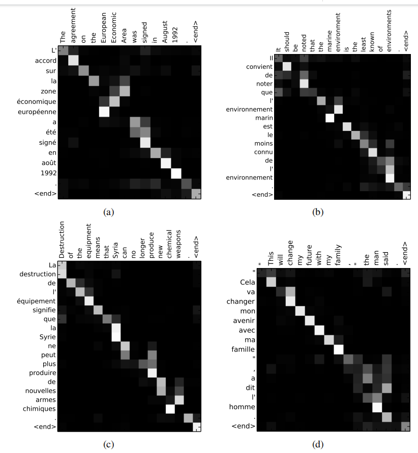

# NEURAL MACHINE TRANSLATION BY JOINTLY LEARNING TO ALIGN AND TRANSLATE

### 论文信息

#### 作者

Dzmitry Bahdanau(1), KyungHyun Cho(2), and Yoshua Bengio(2)

(1) 德国不来梅雅各布大学（Jacobs University Bremen）
(2) 加拿大蒙特利尔大学（Université de Montréal）

#### 收录情况

收录于2015ICLR。

#### 背景知识
1. 对齐翻译

   

2. LSTM
   
   

3. seq2seq模型
   
   encoder用RNN来构成，每个time-step向encoder中输入一个词的向量，直到句子的最后一个单词被输入，得到的输出为句向量。
   
   decoder用另一个RNN来构成，用来根据之前encoder得到的句向量和前一时刻的结果来得到下个时刻的输出，依此类推直到得到结尾输出EOS。
   
   

### 解决什么问题

传统的seq2seq模型有以下2个问题：

1. 因为把源语言输入压缩为一个固定维度的向量c，这个向量表达能力有限，句子长时肯定会造成信息丢失。
   
2. 如果句子过长，即使是倒序输入，decoder最后的单元也未必记得住多少c的信息，依赖关系会很弱。

### 主要思路

通过注意力机制对齐的方式，decoder翻译到t个词时，从encoder里找t个词对应的信息用于翻译。

### 注意力机制（Attention mechanism）作用
Attention和常用的Full-Connection、RNN、CNN有什么区别呢？这种新的方法可以带来什么不一样的效果呢？

> Intuitively, this implements a mechanism of attention in the decoder. The decoder decides parts of the source sentence to pay attention to. By letting the decoder have an attention mechanism, we relieve the encoder from the burden of having to encode all information in the source sentence into a fixedlength vector. With this new approach the information can be spread throughout the sequence of annotations, which can be selectively retrieved by the decoder accordingly.

让解码部分具有注意力机制的功能，就是让解码部分可以选择性地使用编码部分的信息。

### 注意力机制详解
#### 1.结构设计

 

从上图可知，Decoder中每一时刻的输出是由好几个变量共同决定的，其中包含了Encoder中每一时刻的隐藏状态向量$(h_1,\cdots,h_n)$，和上一时刻的输出$y_{t-1}$，以及当前时刻Decoder中的隐藏状态向量$s_t$，可得，$p(y_t)=g(y_{t-1},s_t,attention_t(h_1,\codts,h_n))$。

传统RNN Encoder-Decoder 中t时刻的输出为$p(y_t)=g(y_{t-1},s_t,c_t)$，可以发现，本文不再使用固定的语义编码向量$c$，而是使用一个动态的语义编码向量$c_t$，它是由Encoder中每一时刻的隐藏状态向量计算得到，即$c_t=attention_t(h_1,\cdots,h_n)$。

#### 2.算法设计

(1) 如何计算t时刻的概率输出$y_t$?

   t时刻的概率输出$y_t$，它由$y_{t-1}$,$c_t$和$s_t$共同决定，即$p(y_t)=g(y_{t-1},s_t,c_t)$。

(2) $c_t$和$s_t$如何得到？

   对于$s_t$，$s_t=f(y_{t-1},c_t,s_{t-1})$；对于$c_t$，它需要在attention作用下，由Encoder中每一时刻的隐藏状态向量$(h_1,\cdots,h_n)$一起计算得到，就有$c_t=\sum_{j=1}^n\alpha_{tj}h_j$，其中，$\alpha_{tj}$是attention计算得到的。

(3) $\alpha_{tj}$如何得到？

   $\alpha_{tj}=softmax(e_{tj})=\frac{exp(e_{tj})}{\sum_{k=1}^n exp(e_{tk})}$，其中$e_{tj}=a(s_{t-1},h_j)$是一个alignment model，对位置j的输入和位置i的输出的匹配程度进行评分。$a$是一个前向传播的网络（和Transformer的类余弦相似度的计算不同），这个网络的参数需要在训练中学习。

可以看出，attention的计算有三个过程：第一步计算匹配得分$e$，第二步是对原始分值进行归一化处理得到$\alpha$，第三步使用$\alpha$对拟编码对象$(h_1,\cdots,h_n)$进行加权求和得到attention向量$c$。

attention的好处就是可以得到任务指向的重要信息，而不是那种重要但对任务无用的信息（本文是翻译某个单词的对齐信息）。这里贴原文的解释：

> Let $\alpha_{ij}$ be a probability that the target word $y_i$ is aligned to, or translated from, a source word $x_j$. Then, the $i$-th context vector $c_i$ is the expected annotation over all the annotations with probabilities $x_j$.

> The probability $\alpha_{ij}$, or its associated energy $e_{ij}$, reflects the importance of the annotation $h_j$ with respect to the previous hidden state $s_{i-1}$ in deciding the next state $s_{i}$ and generating $y_{i}$. Intuitively, this implements a mechanism of attention in the decoder. The decoder decides parts of the source sentence to pay attention to. By letting the decoder have an attention mechanism, we relieve the encoder from the burden of having to encode all information in the source sentence into a fixed-length vector. With this new approach the information can be spread throughout the sequence of annotations, which can be selectively retrieved by the decoder accordingly.

### 实验和结论

#### 1.实验结果

 

从上表得知，RNNsearch均比RNNencdec的效果要好。其中，RNNsearch是加入了Bahdanau Attention的RNN Encoder-Decoder，RNNencdec是未加入的。

#### 2.可视化效果

 

上面的4个图都是在RNNsearch-50上的结果。x轴和y轴分别是输入的英语和输出的法语，以及每一个输出的法语单词在所有输入英文单词上的注意力数值。

例如，在图(a)中，法语单词 "accord" 的注意力基本上都集中在输入英文单词 "agreement" 上；法语单词 "été" 的注意力大部分集中在输入英文单词 "was" 和 "signed" 上。

# Attention is All You Need

#### 作者

 

#### 收录情况

收录于Neurips2017。

### 论文信息

 
 
不同于《NEURAL MACHINE TRANSLATION BY JOINTLY LEARNING TO ALIGN AND TRANSLATE》，本文完全抛弃了RNN和CNN等网络结构，设计了原始Transformer模型的结构。该模型由编码器和解码器两部分组成，这两个部分在后续模型中分离成两个独立的模块。此外，该论文还引入了缩放点积注意力机制 （Scaled Dot Product Attention Mechanism） 、多头注意力机制 （Multi-head Attention Blocks） 和位置编码 （Positional Input Encoding） 等概念，这些概念仍然是现代 Transformer 系列模型的基础。

介绍略

 

# (GPT-1) Improving Language Understanding by Generative Pre-Training

#### 作者
 
Alec Radford, Karthik Narasimhan, Tim Salimans, and Ilya Sutskever

OpenAI

#### 收录情况

是一篇技术报告，没有发表在期刊或会议上

#### 背景知识

1. 生成式模型（generative model）和判别式模型（discriminative model）
   
   机器学习模型可以分为生成式模型和判别式模型：

   生成式模型建模联合概率$P(X,Y)$，然后根据贝叶斯公式$P(X,Y)=P(X)P(Y|X)$来计算$P(Y|X)$，例如VAE、GAN等模型；

   判别式模型直接建模条件概率$P(Y|X)$，例如SVM分类模型。

2. NLP的预训练模型
   
   基于特征的无监督方法，即pre-trained word embedding，首先将文本级别的输入输出为特征向量的形式，再将预训练好的嵌入向量作为下游任务的输入。

   词嵌入向量是单词表征学习的最细粒度。通过统计学习或深度学习方法，文本中的单词被映射至向量空间中的密集向量。

   句子和段落级别的嵌入表征被提出，更多的数据特征被获取，进一步提升了预训练效果。相比于从头开始的词嵌入训练，预训练的引入对于各类任务的性能具有显著的提升效果。

3. 辅助任务学习（多任务）

   增加多任务的优化目标（无监督或无监督），通过对共享知识的学习可能会提高性能。
   

### 研究动机

尽管大量未标记的文本语料库很丰富，但是用于学习这些特定任务的标记数据却很少，仅使用这些数据传统的判别模型难以得到好的效果，一定程度缓解了数据标注（成本、质量、数量等）对AI模型的限制。

pre-trained word embedding存在两个问题，第一是并不清楚哪种优化目标会学到能很好transfer不同NLP任务的embedding，第二是将学习到的embedding迁移到目标任务上没有一个有效的统一方法

> Leveraging more than word-level information from unlabeled text, however, is challenging for two main reasons. First, it is unclear what type of optimization objectives are most effective at learning text representations that are useful for transfer. Recent research has looked at various objectives such as language modeling [44], machine translation [38], and discourse coherence [22], with each method outperforming the others on different tasks.1 Second, there is no consensus on the most effective way to transfer these learned representations to the target task. Existing techniques involve a combination of making task-specific changes to the model architecture [43, 44], using intricate learning schemes [21] and adding auxiliary learning objectives [50]. These uncertainties have made it difficult to develop effective semi-supervised learning approaches for language processing.

### 主要思路

形成“生成式预训练（无监督且任务无关）+判别式微调（监督且任务相关）”的训练范式，两阶段数据的语料库不要求属于同一领域。通过对众多的长文本语料进行无监督预训练，模型获得了大量知识和处理长时序依赖的能力；然后成功地迁移到解决下游监督任务，如语义匹配、自然语言推断和文本分类等任务。也就是说，可以从海量数据集中初步获取潜在的特征规律，再将这些共性特征移植到特定的任务模型中去，将学习到的知识进行迁移

本文在通过将不同的任务在输出层面进行统一，来实现有效的迁移，也只需要对模型架构进行最少的修改。

以Transformer为backbone，能够提供结构化的记忆和长时序的依赖（更强的上下文建模能力），带来鲁邦的迁移效果。

> This model choice provides us with a more structured memory for handling long-term dependencies in text, compared to alternatives like recurrent networks, resulting in robust transfer performance across diverse tasks

 

方法在多个任务上都超过传统的判别式模型。

### 方法框架

1. 无监督预训练

使用标准的语言优化目标：

 

 使用多层Transformer decoder进行输出：

 

2. 监督微调

输入a sequence of input tokens $x^1,\codts,x^m$和标注$y$，经过预训练模型得到transformer blocks的输出$h_l^m$，输入到一个简单的线性层去预测y：

 

优化目标函数为：

 

 这里将预训练目标设计为辅助任务，提高监督的泛化性和加速收敛，得到
 
 

 值得注意的是，微调只优化参数矩阵$W^y$以及分隔符（后面会介绍）。

 
 3. 任务特定输入变换

不同任务输入不一样的，需要将输入统一化，下游任务可能不是label的预测。将特定任务结构化的输入，转换成预训练模型中的有序序列，避免对网络架构的修改。

 

具体变换如图，左边是Transformer架构，可以直接完成文本预测和文本分类。

文本分类：加一个开始和终止的tokens，输入到Transformer中，进行预分类；

文本蕴含（textual entailment，如果一个人读了句子t能够推论h非常可能是真实的，那么t蕴涵h）：使用开始、结束和分隔符，凭借两个句子输入到Transformer；

语义匹配：使用开始、结束和分隔符，两个句子分别拼接（全序拼接），分别输入到Transformer中，加到一起进行预测；

多选题（根据context选择正确的answer）：使用开始、结束和分隔符，将问题和答案拼接，输入到Transformer中，分别进行预测；
 

### 实验

Natural Language Inference任务中（两句话蕴含、矛盾或无关的预测），在最后一个RTE数据集上没有取得最好的结果，因为[64]用了多任务（额外的辅助任务）

> On RTE, one of the smaller datasets we evaluate on (2490 examples), we achieve an accuracy of 56%, which is below the 61.7% reported by a multi-task biLSTM model. Given the strong performance of our approach on larger NLI datasets, it is likely our model will benefit from multi-task training as well but we have not explored this currently

### 分析

Transformer层数影响：预训练都用，微调时用的层数越多效果越好；

零样本（zero-shot）行为：不进行微调，仅仅预训练，然后使用启发式方法进行测试。图中看到一般预训练越多效果越好，Transformer比LSTM好。一个简单的启发式方法是，对于文本情感分析任务，在原句子后面加上very的单词，使用预训练的文本预测，进行“positive”和“negative”的预测，从而得到情感分类结果。类似promote learning方式（在GPT-3中的重点研究）。

消融实验

大数据下，微调时使用辅助任务效果更好，小数据下反而会下降；

使用预训练效果明显；

Transformer效果好于LSTM。

# BERT: Pre-training of Deep Bidirectional Transformers for Language Understanding

#### 作者
 
Jacob Devlin, Ming-Wei Chang, Kenton Lee, and Kristina Toutanova

Google AI Language

#### 收录情况

NAACL-HLT 2019最佳论文

