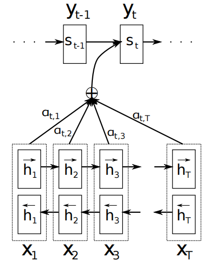
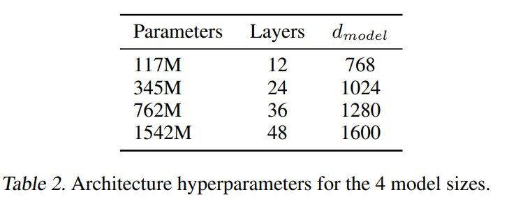
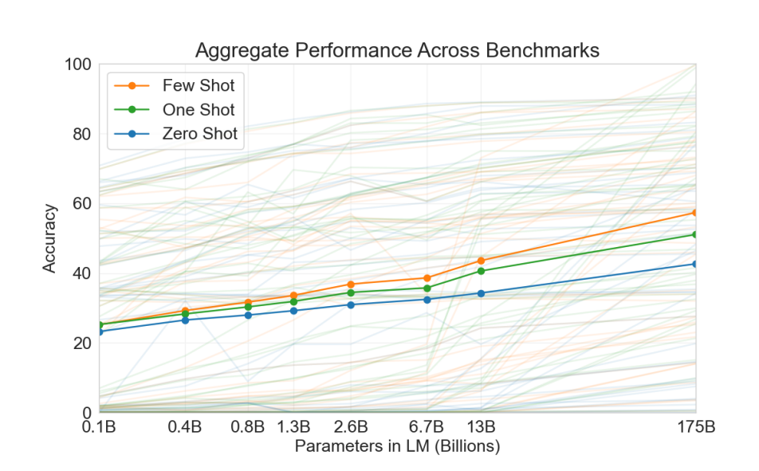
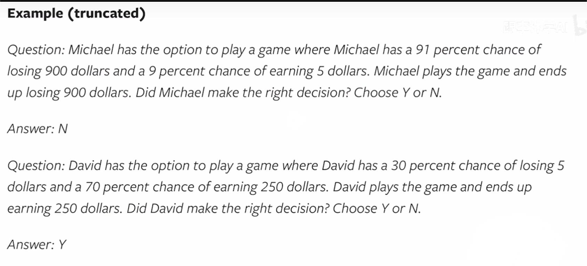
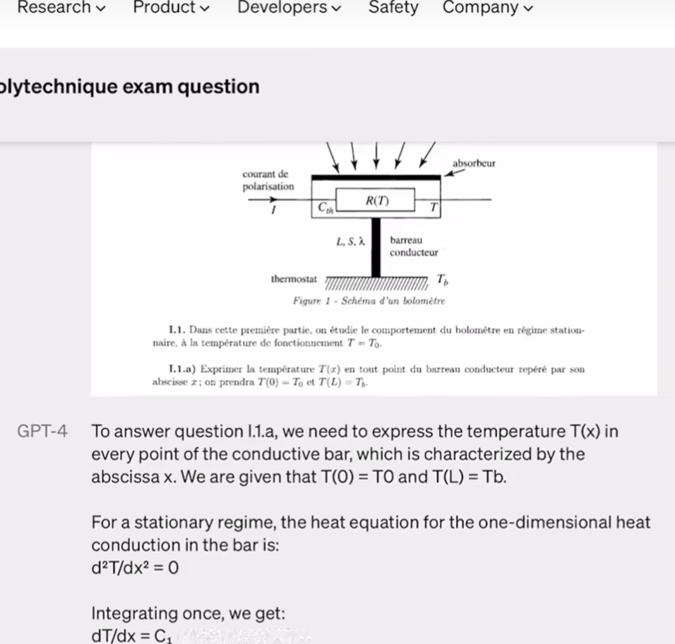

# NEURAL MACHINE TRANSLATION BY JOINTLY LEARNING TO ALIGN AND TRANSLATE

### 论文信息

#### 作者

Dzmitry Bahdanau(1), KyungHyun Cho(2), and Yoshua Bengio(2)

(1) 德国不来梅雅各布大学（Jacobs University Bremen）
(2) 加拿大蒙特利尔大学（Université de Montréal）

#### 收录情况

收录于2015ICLR。

#### 背景知识
1. 对齐翻译

   

2. LSTM
   
   

3. seq2seq模型
   
   encoder用RNN来构成，每个time-step向encoder中输入一个词的向量，直到句子的最后一个单词被输入，得到的输出为句向量。
   
   decoder用另一个RNN来构成，用来根据之前encoder得到的句向量和前一时刻的结果来得到下个时刻的输出，依此类推直到得到结尾输出EOS。
   
   

### 解决什么问题

传统的seq2seq模型有以下2个问题：

1. 因为把源语言输入压缩为一个固定维度的向量c，这个向量表达能力有限，句子长时肯定会造成信息丢失。
   
2. 如果句子过长，即使是倒序输入，decoder最后的单元也未必记得住多少c的信息，依赖关系会很弱。

### 主要思路

通过注意力机制对齐的方式，decoder翻译到t个词时，从encoder里找t个词对应的信息用于翻译。

### 注意力机制（Attention mechanism）作用
Attention和常用的Full-Connection、RNN、CNN有什么区别呢？这种新的方法可以带来什么不一样的效果呢？

> Intuitively, this implements a mechanism of attention in the decoder. The decoder decides parts of the source sentence to pay attention to. By letting the decoder have an attention mechanism, we relieve the encoder from the burden of having to encode all information in the source sentence into a fixedlength vector. With this new approach the information can be spread throughout the sequence of annotations, which can be selectively retrieved by the decoder accordingly.

让解码部分具有注意力机制的功能，就是让解码部分可以选择性地使用编码部分的信息。

### 注意力机制详解
#### 1.结构设计

 

从上图可知，Decoder中每一时刻的输出是由好几个变量共同决定的，其中包含了Encoder中每一时刻的隐藏状态向量$(h_1,\cdots,h_n)$，和上一时刻的输出$y_{t-1}$，以及当前时刻Decoder中的隐藏状态向量$s_t$，可得，$p(y_t)=g(y_{t-1},s_t,attention_t(h_1,\codts,h_n))$。

传统RNN Encoder-Decoder 中t时刻的输出为$p(y_t)=g(y_{t-1},s_t,c_t)$，可以发现，本文不再使用固定的语义编码向量$c$，而是使用一个动态的语义编码向量$c_t$，它是由Encoder中每一时刻的隐藏状态向量计算得到，即$c_t=attention_t(h_1,\cdots,h_n)$。

#### 2.算法设计

(1) 如何计算t时刻的概率输出$y_t$?

   t时刻的概率输出$y_t$，它由$y_{t-1}$,$c_t$和$s_t$共同决定，即$p(y_t)=g(y_{t-1},s_t,c_t)$。

(2) $c_t$和$s_t$如何得到？

   对于$s_t$，$s_t=f(y_{t-1},c_t,s_{t-1})$；对于$c_t$，它需要在attention作用下，由Encoder中每一时刻的隐藏状态向量$(h_1,\cdots,h_n)$一起计算得到，就有$c_t=\sum_{j=1}^n\alpha_{tj}h_j$，其中，$\alpha_{tj}$是attention计算得到的。

(3) $\alpha_{tj}$如何得到？

   $\alpha_{tj}=softmax(e_{tj})=\frac{exp(e_{tj})}{\sum_{k=1}^n exp(e_{tk})}$，其中$e_{tj}=a(s_{t-1},h_j)$是一个alignment model，对位置j的输入和位置i的输出的匹配程度进行评分。$a$是一个前向传播的网络（和Transformer的类余弦相似度的计算不同），这个网络的参数需要在训练中学习。

可以看出，attention的计算有三个过程：第一步计算匹配得分$e$，第二步是对原始分值进行归一化处理得到$\alpha$，第三步使用$\alpha$对拟编码对象$(h_1,\cdots,h_n)$进行加权求和得到attention向量$c$。

attention的好处就是可以得到任务指向的重要信息，而不是那种重要但对任务无用的信息（本文是翻译某个单词的对齐信息）。这里贴原文的解释：

> Let $\alpha_{ij}$ be a probability that the target word $y_i$ is aligned to, or translated from, a source word $x_j$. Then, the $i$-th context vector $c_i$ is the expected annotation over all the annotations with probabilities $x_j$.

> The probability $\alpha_{ij}$, or its associated energy $e_{ij}$, reflects the importance of the annotation $h_j$ with respect to the previous hidden state $s_{i-1}$ in deciding the next state $s_{i}$ and generating $y_{i}$. Intuitively, this implements a mechanism of attention in the decoder. The decoder decides parts of the source sentence to pay attention to. By letting the decoder have an attention mechanism, we relieve the encoder from the burden of having to encode all information in the source sentence into a fixed-length vector. With this new approach the information can be spread throughout the sequence of annotations, which can be selectively retrieved by the decoder accordingly.

### 实验和结论

#### 1.实验结果

 

从上表得知，RNNsearch均比RNNencdec的效果要好。其中，RNNsearch是加入了Bahdanau Attention的RNN Encoder-Decoder，RNNencdec是未加入的。

#### 2.可视化效果

 

上面的4个图都是在RNNsearch-50上的结果。x轴和y轴分别是输入的英语和输出的法语，以及每一个输出的法语单词在所有输入英文单词上的注意力数值。

例如，在图(a)中，法语单词 "accord" 的注意力基本上都集中在输入英文单词 "agreement" 上；法语单词 "été" 的注意力大部分集中在输入英文单词 "was" 和 "signed" 上。

# Attention is All You Need

#### 作者

 

#### 收录情况

收录于Neurips2017。

### 论文信息

attention 模型

 
 
 

网络架构

 
 
不同于《NEURAL MACHINE TRANSLATION BY JOINTLY LEARNING TO ALIGN AND TRANSLATE》，本文完全抛弃了RNN和CNN等网络结构，设计了原始Transformer模型的结构。该模型由编码器和解码器两部分组成，这两个部分在后续模型中分离成两个独立的模块。此外，该论文还引入了缩放点积注意力机制 （Scaled Dot Product Attention Mechanism） 、多头注意力机制 （Multi-head Attention Blocks） 和位置编码 （Positional Input Encoding） 等概念，这些概念仍然是现代 Transformer 系列模型的基础。

介绍略

 

# (GPT-1) Improving Language Understanding by Generative Pre-Training

#### 作者
 
Alec Radford, Karthik Narasimhan, Tim Salimans, and Ilya Sutskever

OpenAI

Alec Radford：DCGAN、PPO(instructGPT)，GPT-1,2,3

Ilya Sutskever：AlexNet二作，openai CTO

#### 收录情况

是一篇技术报告，没有发表在期刊或会议上

#### 背景知识

1. 生成式模型（generative model）和判别式模型（discriminative model）
   
   机器学习模型可以分为生成式模型和判别式模型：

   生成式模型建模联合概率$P(X,Y)$，然后根据贝叶斯公式$P(X,Y)=P(X)P(Y|X)$来计算$P(Y|X)$，例如VAE、GAN等模型；

   判别式模型直接建模条件概率$P(Y|X)$，例如SVM分类模型。

2. NLP的预训练模型
   
   基于特征的无监督方法，即pre-trained word embedding，首先将文本级别的输入输出为特征向量的形式，再将预训练好的嵌入向量作为下游任务的输入。

   词嵌入向量是单词表征学习的最细粒度。通过统计学习或深度学习方法，文本中的单词被映射至向量空间中的密集向量。

   句子和段落级别的嵌入表征被提出，更多的数据特征被获取，进一步提升了预训练效果。相比于从头开始的词嵌入训练，预训练的引入对于各类任务的性能具有显著的提升效果。

3. 辅助任务学习（多任务）

   增加多任务的优化目标（无监督或无监督），通过对共享知识的学习可能会提高性能。
   

### 研究动机

尽管大量未标记的文本语料库很丰富，但是用于学习这些特定任务的标记数据却很少，仅使用这些数据传统的判别模型难以得到好的效果，存在数据标注（成本、质量、数量等）对AI模型的限制。

pre-trained word embedding存在两个问题，第一是并不清楚哪种优化目标会学到能很好transfer不同NLP任务的embedding，第二是将学习到的embedding迁移到目标任务上没有一个有效的统一方法

> Leveraging more than word-level information from unlabeled text, however, is challenging for two main reasons. First, it is unclear what type of optimization objectives are most effective at learning text representations that are useful for transfer. Recent research has looked at various objectives such as language modeling [44], machine translation [38], and discourse coherence [22], with each method outperforming the others on different tasks.1 Second, there is no consensus on the most effective way to transfer these learned representations to the target task. Existing techniques involve a combination of making task-specific changes to the model architecture [43, 44], using intricate learning schemes [21] and adding auxiliary learning objectives [50]. These uncertainties have made it difficult to develop effective semi-supervised learning approaches for language processing.

### 主要思路

形成“生成式预训练（无监督且任务无关）+判别式微调（监督且任务相关）”的训练范式，两阶段数据的语料库不要求属于同一领域。通过对众多的长文本语料进行无监督预训练，模型获得了大量知识和处理长时序依赖的能力；然后成功地迁移到解决下游监督任务，如语义匹配、自然语言推断和文本分类等任务。也就是说，可以从海量数据集中初步获取潜在的特征规律，再将这些共性特征移植到特定的任务模型中去，将学习到的知识进行迁移

本文在通过将不同的任务在输出层面进行统一，来实现有效的迁移，也只需要对模型架构进行最少的修改。

以Transformer为backbone，能够提供结构化的记忆和长时序的依赖（更强的上下文建模能力），带来鲁邦的迁移效果。

> This model choice provides us with a more structured memory for handling long-term dependencies in text, compared to alternatives like recurrent networks, resulting in robust transfer performance across diverse tasks

 

方法在多个任务上都超过传统的判别式模型。

### 方法框架

1. 无监督预训练

使用标准的语言优化目标：

 

 使用多层Transformer decoder进行输出：

 

2. 监督微调

输入a sequence of input tokens $x^1,\codts,x^m$和标注$y$，经过预训练模型得到transformer blocks的输出$h_l^m$，输入到一个简单的线性层去预测y：

 

优化目标函数为：

 

 这里将预训练目标设计为辅助任务，提高监督的泛化性和加速收敛，得到
 
 

 值得注意的是，微调只优化参数矩阵$W^y$以及分隔符（后面会介绍）。

 
 3. 任务特定输入变换

不同任务输入不一样的，需要将输入统一化，下游任务可能不是label的预测。将特定任务结构化的输入，转换成预训练模型中的有序序列，避免对网络架构的修改。

 

具体变换如图，左边是Transformer架构，可以直接完成文本预测和文本分类。

文本分类：加一个开始和终止的tokens，输入到Transformer中，进行预分类；

文本蕴含（textual entailment，如果一个人读了句子t能够推论h非常可能是真实的，那么t蕴涵h）：使用开始、结束和分隔符，凭借两个句子输入到Transformer；

语义匹配：使用开始、结束和分隔符，两个句子分别拼接（全序拼接），分别输入到Transformer中，加到一起进行预测；

多选题（根据context选择正确的answer）：使用开始、结束和分隔符，将问题和答案拼接，输入到Transformer中，分别进行预测；
 

### 实验

Natural Language Inference任务中（两句话蕴含、矛盾或无关的预测），在最后一个RTE数据集上没有取得最好的结果，因为[64]用了多任务（额外的辅助任务）

> On RTE, one of the smaller datasets we evaluate on (2490 examples), we achieve an accuracy of 56%, which is below the 61.7% reported by a multi-task biLSTM model. Given the strong performance of our approach on larger NLI datasets, it is likely our model will benefit from multi-task training as well but we have not explored this currently

### 分析

Transformer层数影响：预训练都用，微调时用的层数越多效果越好；

零样本（zero-shot）行为：不进行微调，仅仅预训练，然后使用启发式方法进行测试。图中看到一般预训练越多效果越好，Transformer比LSTM好。一个简单的启发式方法是，对于文本情感分析任务，在原句子后面加上very的单词，使用预训练的文本预测，进行“positive”和“negative”的预测，从而得到情感分类结果。prompt learning方式（在GPT-3中的重点研究）。

消融实验

大数据下，微调时使用辅助任务效果更好，小数据下反而会下降；

使用预训练效果明显；

Transformer效果好于LSTM。

# BERT: Pre-training of Deep Bidirectional Transformers for Language Understanding

#### 作者
 
Jacob Devlin, Ming-Wei Chang, Kenton Lee, and Kristina Toutanova

Google AI Language

#### 收录情况

NAACL-HLT 2019最佳论文

#### 背景知识

NLP的预训练模型：feature-based的预训练语言模型（word embedding）和fine-tuning预训练语言模型（GPT）

### 研究动机

1. 已有的NLP预训练模型的结构会受到单向语言模型（从左到右或者从右到左）的限制，因而也限制了模型的表征能力，使其只能获取单方向的上下文信息。

> We argue that current techniques restrict the power of the pre-trained representations, especially for the fine-tuning approaches. The major limitation is that standard language models are unidirectional, and this limits the choice of architectures that can be used during pre-training. For example, in OpenAI GPT, the authors use a left-to-right architecture, where every token can only attend to previous tokens in the self-attention layers of the Transformer (Vaswani et al., 2017). Such restrictions are sub-optimal for sentence-level tasks, and could be very harmful when applying fine-tuning based approaches to token-level tasks such as question answering, where it is crucial to incorporate context from both directions.

### 主要思路

该模型有以下主要优点：

1）采用masked language model（MLM）对双向的Transformers进行预训练，以生成深层的双向语言表征。

2）预训练后，只需要添加一个额外的输出层进行fine-tune，就可以在各种各样的下游任务中取得state-of-the-art的表现。在这过程中并不需要对BERT进行任务特定的结构修改。

总结一下，BERT强调了不再像以往一样采用传统的单向语言模型或者把两个单向语言模型进行浅层拼接的方法进行预训练，而是采用新的masked language model（MLM），以致能生成深度的双向语言表征，并且采用深层的双向Transformer组件（单向的Transformer一般被称为Transformer decoder，其每一个token（符号）只会attend到目前往左的token。而双向的Transformer则被称为Transformer encoder，其每一个token会attend到所有的token）来构建整个模型，因此最终生成能融合左右上下文信息的深层双向语言表征。

### 方法框架

“预训练+微调”的方法框架和GPT是一样的，对于不同的下游任务，BERT的结构可能会有不同的轻微变化。

1. 预训练方法框架

如图所示，BERT的主题部分就是由多个Transformer encoder层堆叠在一起。

2. 输入输出

BERT的输入为每一个token对应的embedding（图中的粉红色块就是token，黄色块就是token对应的embedding），并且单词字典是采用WordPiece算法来进行构建的（后面介绍）。为了完成具体的分类任务，除了单词的token之外，作者还在输入的每一个序列开头都插入特定的分类token（[CLS]），该分类token对应的最后一个Transformer层输出被用来起到聚集整个序列信息的作用，类似LSTM中的C。

为了应对各种各样的自然语言任务，BERT模型所输入的序列必须有能力包含一句话（文本情感分类，序列标注任务）或者两句话以上（自然语言推断，问答任务）。因此BERT的输入如下：

每个input tokens包括单词本身的token embedding、指示单词属于哪个句子的segment embeddings以及单词位置的position embeddings。设计了[CLS]的tokens聚合整个句子的信息，[SEP]的tokens分隔不同的句子。

WordPiece算法类似词根拆解的形式，将例如“playing”拆解成“play”和“##ing”，目的是减少整个词表中所使用的单词总数（百万级词表->万级别）。

如图所示，C为分类token（[CLS]）对应最后一个Transformer的输出，$T_i$则代表其他token对应最后一个Transformer的输出。对于一些token级别的任务（如，序列标注和问答任务），就把$T_i$输入到额外的输出层中进行预测。对于一些句子级别的任务（如，自然语言推断和情感分类任务），就把C输入到额外的输出层中，这里也就解释了为什么要在每一个token序列前都要插入特定的分类token。

3. 自监督预训练任务设计

3.1  Masked Language Model（MLM）

MLM是BERT能够不受单向语言模型所限制的原因。就是以15%的概率用mask token（[MASK]）随机地对每一个训练序列中的token进行替换，然后预测出[MASK]位置原有的单词。然而，由于[MASK]并不会出现在下游任务的微调（fine-tuning）阶段，因此预训练阶段和微调阶段之间产生了不匹配（这里很好解释，就是预训练的目标会令产生的语言表征对[MASK]敏感，但是却对其他token不敏感）。因此BERT采用了以下策略来解决这个问题：

首先在每一个训练序列中以15%的概率随机地选中某个token位置用于预测，假如是第i个token被选中，则会被替换成以下三个token之一

1）80%的时候是[MASK]。如，my dog is hairy——>my dog is [MASK]

2）10%的时候是随机的其他token。如，my dog is hairy——>my dog is apple

3）10%的时候是原来的token（保持不变，作为2）所对应的负类）。如，my dog is hairy——>my dog is hairy

再用该位置对应的$T_i$去预测出原来的token（输入到全连接，然后用softmax输出每个token的概率，最后用交叉熵计算loss）。

该策略令到BERT不再只对[MASK]敏感，而是对所有的token都敏感，以致能抽取出任何token的信息。

3.2 Next Sentence Prediction（NSP）
当每个选择输入句子A和B时，50％的时间B是跟着A（标记为ISNEXT）的实际下一个句子，而50％的时间是来自语料库的随机句子（标记为NotNext）

最后训练样例长这样：

Input1=[CLS] the man went to [MASK] store [SEP] he bought a gallon [MASK] milk [SEP]

Label1=IsNext

Input2=[CLS] the man [MASK] to the store [SEP] penguin [MASK] are flight ##less birds [SEP]

Label2=NotNext

通过这种方式，学习到句子间相关联系。

4. 微调方法框架

在海量语料上训练完BERT之后，便可以将其应用到NLP的各个任务中了，如图所示：

（a）基于句子对的分类任务：

MNLI：给定一个前提 (Premise) ，根据这个前提去推断假设 (Hypothesis) 与前提的关系。该任务的关系分为三种，蕴含关系 (Entailment)、矛盾关系 (Contradiction) 以及中立关系 (Neutral)。所以这个问题本质上是一个分类问题，需要做的是去发掘前提和假设这两个句子对之间的交互信息。

QQP：判断Quora上的两个问题句是否表示的是一样的意思。

QNLI：用于判断文本是否包含问题的答案，类似于做阅读理解定位问题所在的段落。

STS-B：预测两个句子的相似性，包括5个级别。

MRPC：判断两个句子是否是等价的。

RTE：类似于MNLI，但是只是对蕴含关系的二分类判断，而且数据集更小。

SWAG：从四个句子中选择为可能为前句下文的那个。

（b）基于单个句子的分类任务

SST-2：电影评价的情感分析。

CoLA：句子语义判断，是否是可接受的（Acceptable）。

BERT的微调方法是根据[CLS]标志生成一组特征向量$C$，并通过一层全连接进行微调。损失函数根据任务类型自行设计，例如多分类的softmax或者二分类的sigmoid。

（c）问答任务

SQuAD v1.1：给定一个句子（通常是一个问题）和一段描述文本，输出这个问题的答案，类似于做阅读理解的简答题。如图(c)表示的，SQuAD的输入是问题和描述文本的句子对。输出是特征向量，通过在描述文本上接一层激活函数为softmax的全连接来获得输出文本的条件概率。

（d）命名实体识别

CoNLL-2003 NER：判断一个句子中的单词是不是人名Person，组织名称Organization，地名Location，或者无命名实体other。微调CoNLL-2003 NER时将整个句子作为输入，在每个时间片输出一个概率，并通过softmax得到这个Token的实体类别。

### 实验

数据集使用了BooksCorpus（800M words）和English Wikipedia（2500 M words），而GPT只用了BooksCorpus（800M words）

BERT-BASE (L=12, H=768, A=12, Total Parameters=110M) and BERT-LARGE (L=24, H=1024, A=16, Total Parameters=340M)，实验结果达到state-ot-the-art。

消融研究如下：

# (GPT-2) Language Models are Unsupervised Multitask Learners

#### 作者
 
Alec Radford, Jeffrey Wu, Rewon Child, David Luan, Dario Amodei, and Ilya Sutskever

OpenAI

#### 收录情况

OpenAI blog？出现于BERT四个月后

#### 背景知识

Zero-shot learning （ZSL）:上述例子中包含了一个人类的推理过程，就是利用过去的知识（马，老虎，熊猫和斑马的描述），在脑海中推理出新对象的具体形态，从而能对新对象进行辨认。（如图所示）ZSL就是希望能够模仿人类的这个推理过程，使得计算机具有识别新事物的能力。ZSL就是希望我们的模型能够对其从没见过的类别进行分类，让机器具有推理能力，实现真正的智能。其中零次（Zero-shot）是指对于要分类的类别对象，一次也不学习。

Multitask learning(?)：如图所示，单任务学习（single task learning）：一个loss，一个任务，例如NLP里的情感分类、NER任务一般都是可以叫单任务学习。多任务学习（multi task learning）：简单来说有多个目标函数loss同时学习的就算多任务学习。

### 研究动机

1. BERT使用Transformer encoder，用更大的数据（3.4亿）和模型效果比GPT-1好
   
2. 主流deep learning范式对每一个任务收集一个数据集，在上面模型训练和预测。原因是模型泛化性不好。现有pre-training的NLP方法（GPT-1和BERT）在下游任务还需要为每人任务收集监督的数据进行finetuning，导致拓展到新任务上有一定成本

> The dominant approach to creating ML systems is to collect a dataset of training examples demonstrating correct behavior for a desired task, train a system to imitate these behaviors, and then test its performance on independent and identically distributed (IID) held-out examples. This has served well to make progress on narrow experts. But the often erratic behavior of captioning models (Lake et al., 2017), reading comprehension systems (Jia & Liang, 2017), and image classifiers (Alcorn et al., 2018) on the diversity and variety of possible inputs highlights some of the shortcomings of this approach.

> Our suspicion is that the prevalence of single task training on single domain datasets is a major contributor to the lack of generalization observed in current systems. Progress towards robust systems with current architectures is likely to require training and measuring performance on a wide range of domains and tasks. Recently, several benchmarks have been proposed such as GLUE (Wang et al., 2018) and decaNLP (McCann et al., 2018) to begin studying this

### 主要思路

本文要继续使用Transformer decoder，使用更大的模型（15亿）和更多的数据。考虑到在传统的任务中比BERT效果提升不明显，以及拓展新任务的成本，所以选择了zero-shot，即做下游任务不需要标注的数据（不需要有监督微调）

### 方法框架

整体方法框架和GPT-1近似，这里只介绍不同的地方。这里的Zero-shot实现的总体思路是下游任务的输入和pre-training的输入保持一致（提示prompt）。传统方法针对某个任务来说，其目标就是$p(output|input)$。本文需要在输入相同但任务不同的情况下，输出不同结果（即针对相同输入，由于任务种类不一样，对应的输出就不同）。所以，本文针对某个任务其目标就是学习$p(output|input,task)$，作者在原文把这种称为Task conditioning。实现这种Task conditioning有两种方法，一种是模型结构层面（architectural level），另一种是算法层面的（algorithmic level）。模型结构（architectural level）层面，针对不同的任务构建不同的encoder-decoder结构，即不同的任务用不同的结构，和GPT-1类似。算法层面（algorithmic level），主要是利用语言模型的灵活性，将输入、输出、任务类型统一打包成新的输入。例如，对于翻译任务可以写成一个序列（translate to french, english text, french text），对于阅读理解可以写成（answer the question, document, question, answer）。给模型一个提示，让模型知道要做什么任务。

不同于“预训练+微调”的范式，而是prompt的方式。

1. 训练数据集
   
GPT-2的思想是尽可能使训练数据大且更加多样化，以此来学习到不同领域的知识，和之前的做法不同的是不再针对单个领域特定任务进行学习。

使用Common Crawl是一个公开可获得通过抓取网页的数据集（信噪比很低，很多无用网页），使用reddit（新闻聚合网页）服务对其中一些网页进行分类，找到有价值信息，最终获得WebText数据集，包含了4500万个链接的文本数据，800M文本，40GB的数据。

2. 模型
   
GPT-2的模型结构和GPT-1的模型结构类似，都是基于Transformer的。相对于GPT-1，做的修改有：

1）调整Transformer的decoder： 将layer normalization移动到block的输入位置并且在最后一个self-attention之后加了一层 layer normalization。

2）词典被扩展到了50257，context的维度从512提高到了1024并且batchsize采用了512。

3）去掉了Fine-tune部分：使用了完全的无监督训练。这样使得预训练和Fine-tuning的结构完全一致。

4）堆叠的层数增加：GPT-1使用的12层的TransformerDecoder，GPT-2分别使用了24、36、48层。

3. Zero-shot的prompt

基本上是借鉴了文献[1]的方法，使用QA的模型设计一个通用框架解决10个NLP问题。整个过程类似下图。

[1] McCann B, Keskar N S, Xiong C, et al. The natural language decathlon: Multitask learning as question answering[J]. arXiv preprint arXiv:1806.08730, 2018.

但其实部分原理就来自于于超大的预训练数据中包含的丰富文本知识。例如English2French的翻译任务，在预训练文本中会自然出现一些英法的对应文本如下（数据集本身）。而提示词的加入可以理解为尝试还原模型在以下场景中的上下文(Attention)

如何让模型针对不同的任务给出预测呢？作者通过在原始Input上加入任务相关提示词的方式，例如：

（1）Translation；English = 输入； French = ？
（2）Summarization；文章 + TL；DR：？，这里TL；DR是Too Long; Didn't Read的缩写，可类比‘一言以蔽之‘，会出现在大段文本的末尾作为总结升华，或者对话中。

### 实验

（1）语言建模Language Modeling （和Zero-shot方法比较）

语言建模的一个主要目标就是在zero-shot情况下提升表现，GPT-2系列的模型在8个zero-shot数据集中7个达到了sota。在小样本数据集Penn Treebank 和 WikiText-2提升也很大。

（2）和监督方法比较

可以看出差别还是比较大的。

# (GPT-3) Language Models are Few-Shot Learners

#### 作者
 

#### 收录情况

一篇技术报告（63页），未发表

#### 背景知识

Zero-shot learning/Few-shot learning/One-shot learning/Fine-tuning

### 研究动机

1. “预训练+微调”的范式中，微调的数据标注成本，大模型在小数据集上微调也容易过拟合，人类不需要大的监督数据集掌握某个任务
   
> First, from a practical perspective, the need for a large dataset of labeled examples for every new task limits the applicability of language models...Second, the potential to exploit spurious correlations in training data fundamentally grows with the expressiveness of the model and the narrowness of the training distribution. This can create problems for the pre-training plus fine-tuning paradigm, where models are designed to be large to absorb information during pre-training, but are then fine-tuned on very narrow task distributions...Third, humans do not require large supervised datasets to learn most language task...
   
2. GPT-2中zero-shot的性能并不是很理想。

### 主要思路

使用了1750亿的参数模型和few-shot learning提升了GPT-2的zero-shot的性能。值得注意的是，即使有少部分监督数据，GPT并不需要计算梯度更新权重参数（不是finetuning），而是使用in-context learning的方式进行学习，在无监督的预训练期间，语言模型会发展出广泛的技能和模式识别能力。然后，它在推理过程中使用这些能力来快速适应或识别所需的任务。 使用术语“in-context learning”来描述此过程的内部循环。

大概结果如下

局限性：如果有很多标注样本时，并不能很好的建模长的时序关系，放不进去；如果有不错的训练样本，需要每一次都得给模型。

### 方法框架（仅仅半页）

GPT-3和GPT-2的模型差不多(Sparse Transformer），GPT-2和GPT-1差不多（normalization）。

这里提一下，batch-size在小模型不用设置很大，因为需要每个batch采样时给一下noise防止过拟合，对于大模型则不需要，大的batch会给更大的搜索范围，更容易得到一个正确的方向。

### 训练数据集

大模型不得不去考虑Common Crawl数据集，进行过滤。（1）将GPT-2数据集视为正例（高质量），Common Crawl视为负例（大部分低质量），进行二分类，对Common Crawl预测，过滤掉很“负”的类别；（2）根据与一系列高质量参考语料库的相似性进行去重；（3）加入已知的高质量数据集，BERT、GPT-1、GPT-2使用的数据集都加进来。

作者认为Common Crawl仍然是低质量的，所以采样时，60%采样Common Crawl，22%采样WebText2，其他采样其他数据。

### 训练过程（一小段）

基本和GPT-2、GPT-1一样的。

### 评估

在每个下游任务，采样K个样本作为条件（K可以等于0,1或其他）。使用Prompt的方式，"任务+条件+Context+Answer"

### 结果（20页）

1. 性能-计算量

当找到一个合适的模型，不用过度训练的情况下，计算量指数增加，loss线性下降，而人类不需要。

2. 性能表现

3. 可视化

### 局限性

1. 文本生成比较弱，容易重复；

2. 结构式单向的语言模型，顺序预测每个词，没有告诉哪些词比较重要；

3. 没有多模态；

4. 样本有效性不够；

5. 有一个不确定的东西是，GPT-3中few-shot的方式，更像是从样本库记忆找出来，而不是真正的学习（有无泛化性？）；

6. 昂贵；

7. 没有解释力。

### 社会影响

1. 可能被用来做坏事，新闻造假（散布）、垃圾邮件、论文造假；

2. 不公平性（偏见），性别、种族、宗教等

3. 能耗

19万度？70万公里

# (InstructGPT/chatGPT) Training language models to follow instructions with human feedback

#### 作者
 

是一个joint project

#### 收录情况

Neurips2022

#### 背景知识

ChatGPT使用的是InstructGPT的基本框架，数据收集方式有些不同，ChatGPT使用的是GPT3.5的模型。GPT3.5应该是GPT3里加入github爬的Codex的数据，再在InstructGPT上加上人类一些少的标注数据。

> In recent weeks, the internet has been going crazy with the new ChatGPT model. In general, ChatGPT is part of a series of releases around GPT 3.5 that are highlighting some of the capabilities of the upcoming GPT-4 model. One of the key differences of ChatGPT with previous models is its ability to follow instructions. This is powered another model called InstructGPT which OpenAI quietly unveiled at the beginning of the year.

### 研究动机

大模型依赖数据的质量，难以直接控制输出的质量，用户意图怎么注入模型（如何实现alignment between语言模型和人类意图）？

（1）有效性问题，如果想让模型回答特定问题，但是本身文本没有这些内容，无法学会回答这样的问题；

（2）安全性问题，模型输出不期望的内容，捏造事实，例如google photo的ai算法，微软小冰的种族歧视语言。

大语言模型的预训练目标仅仅是预测下一个词，和人类使用的意图是不alignment的。

### 主要思路

Fine-tuning with human feedback（标注？）：首先，收集一些“问题+标注”的数据付GPT-3进行微调；其次，对一个问题可以控制模型产生不同的输出（概率采样），人类给答案进行质量排序，使用强化学习fine-tuning模型使它选择合适的答案。

1.3B参数的InstructGPT性能超过了175B的GPT-3，而且答案的真实性提升很多（标注数据的信噪比高）。

### 方法框架

1. InstructGPT的Fine-tuning分三步：

第一步，人工收集高质量<Prompt, Response范例>的数据集，训练有监督的精调模型SFT。先是从GPT API中收集了大家提交的Prompt，又让训练有素的标注人员手写了一批，形成了高质量的Prompt的数据集。再对其中每个Prompt，人工撰写高质量的Response范例。这样就形成了高质量的任务导向的数据集。这些数据集，是面向GPT的使用用户的，虽然用户需求对应的学术上的NLU问题多种多样，但可以理解为是一个统一的任务。使用这个任务导向的数据集对GPT-3做精调可以显著提升其回应的质量。精调的目标是最大化P(Response|Prompt)。

第二步，半自动地收集偏好数据集，训练Reward Model，用于后面RL精调时给Response打分。让SFT对每个Prompt输出多个Response，让标注人员标注哪个更好，形成对Response的偏好数据集。偏好只是说哪个比哪个好，而非哪个有多好。使用此偏好数据集训练Reward Model。对于同一个提示x，如果响应$y_i$优于响应 $y_j$，我们希望Reward Model给$y_i$打的分要比$y_j$高，其差值可类比于“人类偏好$y_i$多于 $y_j$，使用pairwise的ranking loss作为Reward Model的损失函数如下： 

希望排序高的奖励大于排序低的奖励，使用了logistic loss，希望预测值越大越好，公式中$K=9$（之前的工作中$K=4$，而且是softmax容易过拟合），每次选择36对进行训练。如此训练出来的Reward Model只考虑了相对分值的合理性，没有明确的锚点。可能打分普遍偏高，也可能普遍偏低。在使用之前，需要加一个bias，将模型输出均值调整到0附近。Reward Model参数规模60亿，说是参数再多会不稳定。

第三步，以Reward Model作为奖励函数，以SFT为初始策略，跑PPO改善策略表现，得到强化版本的模型PPO-ptx，这个版本也就是所谓的InstructGPT。简介:https://zhuanlan.zhihu.com/p/374897976?utm_id=0

在本文中，状态是Prompt和已经生成的Response片段，动作是下一个token。Reward在中间步骤都是0，只有在幕尾Response结束输出EOS才有奖励，折扣因子为1。目标函数为

其中$\pi^{RL}_\phi$是学习到的RL策略（GPT-3）模型，$\pi^{SFT}$是监督的训练模型，开始时模型是一致的。对于每个数据对，输入到当前模型$\pi^{RL}_\phi$产生$y$，然后输入到$r_\theta$的奖励模型中。

优化目标第一项指的是，生成的回复总能使奖励模型给出大的奖励（实时反馈）。第二项类似KL散度，使得RL的新模型和之前监督的模型接近（不要差异太大），防止模型被Reward Model过度优化，增加模型的探索性和输出的多样性。为了不使模型在原有NLP任务中的表现退步。第三项是原始的目标函数（GPT-3预训练目标），防止模型获得排序能力而失去语言生成能力。

2. 数据集

对于标注者（标注工），要求完成三类的prompts（问题或任务）：标注者写的任意的问题；标注者写指令（为该指令形成多个query/response对）；用户提供的一些应用场景所构建的任务。在回答问题时，要考虑帮助性、真实性和无害性。

> • Plain: We simply ask the labelers to come up with an arbitrary task, while ensuring the tasks had sufficient diversity.
>
> • Few-shot: We ask the labelers to come up with an instruction, and multiple query/response pairs for that instruction.
>
> • User-based: We had a number of use-cases stated in waitlist applications to the OpenAI API. We asked labelers to come up with prompts corresponding to these use cases.

然后使用这些prompts进校fine-tuning，将模型放到网上（Playground）让用户免费使用，用户会再提一些问题，继续采集用户问题。根据用户ID划分训练和测试集（公平划分），过滤人名等敏感信息。

最后形成三个数据集：

> (1) our SFT dataset, with labeler demonstrations used to train our SFT models, (2) our RM dataset, with labeler rankings of model outputs used to train our RMs, and (3) our PPO dataset, without any human labels, which are used as inputs for RLHF fine-tuning.

文章有较为详细的标注过程。

### 实验结果

大概结果

### 讨论

训练代价并不高，但存在一定偏见（数据标注），模型也不是完全安全。

# GPT-4 Technical Report

#### 作者
 

#### 收录情况

无

#### 背景知识

GPT-1,2,3, InstructGPT?

### 主要思路

基本没有太多的细节，更多的是实验结果，这里介绍GPT-4的能力。

GPT-4可以接受文字和图片的输入，比不过真是世界的人类表现，但是在专业性和学术性的任务上，能达到甚至超过人，例如考试、面试、写代码等。

### 训练过程（稳定性）

预训练任务预测下一个词，RLHF（reinforcement learning with human feedback）微调。

一个可用的结论是，模型能力从预训练得到（数据和算力），RLHF在并不能提高考试成绩，RLHF目的是做控制，alignment受控制。

实现了predictable scaling的目标，在GPT-4刚开始训练时就可以准确预测最终的loss（使用1/10000的计算资源即可）

优势在于投入资源前可以有一个预期的结果（meta-AI）

设计了一些针对大模型陷阱hindsight neglect任务，模型越大反而结果越差，直到GPT-4的出现

hindsight neglect任务指的是，本身用理性的结果做了决断，但是结果不好，如果时间倒流，是继续理性还是选择高风险的选择，如上图结果，大模型越大越不理性，只是根据偶然性的结果来判断。

结论，感觉什么都没说。

### 能力

1.考试

AMC微积分效果不好，Codeforces编程不好，英语文学也不好

律师资格证、法学院入学、美国大学入学考试、GRE、奥赛等等都是很好的

存在的一个问题，2021的数据codeforces的编程题做的对而之后做的不好。
 
2. NLP传统任务

高于language model，和其他的fine-tuning也可比较。

3. 视觉语言

Demo

指标

4. 可操纵性 steerablilty

system message定义ai用什么语气风格说话

5. 其他

### Limitations

不完全可靠，可能会捏造事实，高风险领域还是小心慎用

存在大量偏见

缺少2021年9月的知识

容易受骗

过于自信，不论回答是否正确

### 安全性

找专家确认哪些问题不能回答（人力过程）

RLHF方法自动给出safety的reward

# Sparks of Artificial General Intelligence: Early experiments with GPT-4

### 作者

### 核心内容

研究GPT-4在文本、音乐、视觉等多模态各种生成和判别任务上的表现，研究GPT-4在数学、交互、社会影响等等各方面能力。

### 总结

概括下本文的核心思想，GPT-4的出现揭示了AGI（Artificial general intelligence）的一种可能性。

Confidence Calibration：现在的模型还不能理解什么时候它是在表达绝对正确的观点，而什么时候它又仅仅是在猜测而已。有时模型会捏造一些未在训练数据中出现过的子虚乌有的信息，有时甚至前后自相矛盾。这样的“hallucination”问题时常发生，尽管在一些有创造性的场景下也许这并不是什么坏事，但是这无疑为用户增加了一些不信任和顾虑。一种改进的思路是改进模型的Calibration（标定），允许模型在输出时能够提供类似信心的度量，从而可以在下游任务中进一步改善在部分场景下的效果；另一种改进的思路是结合外部的其他信息，比如外部的回答链接等，从而改进回答的质量。

Long-term Memory：目前整体模型的上下文仍然比较有限（8000token左右），对于模型而言，能否执行阅读一本“大部头”等类似的书籍仍然是不确定的。

Continual Learning：模型一旦训练完成，目前尚不具备持续学习，或者通过环境来改进自身的能力。尽管我们可以通过fine-tune的方式对模型进行微调，但是这却会导致模型在其他任务上的退化或者过拟合。同时考虑到训练数据漫长的处理周期，模型对于信息、事件、知识的时效性也是较难保证的。

Personalization：目前模型尚不具备将高度个人化的信息进行协同、得到结果的能力---除非使用meta-prompt，但是这种方式往往比较局限，且效率较差。

Planning and conceptual leaps：模型在部分需要“早做规划”的场景之中表现较差。

Transparency, interpretability and consistency：在我们上面提到的“hallucination”问题之外，模型还有一个巨大的问题---它并不能够判断什么其输出是否与训练数据是自恰的。

Cognitive fallacies and irrationality：模型在继承了人类智慧的同时，也继承了存在于训练数据之中人类的偏见、误差和错误。

Challenges with sensitivity to inputs：模型的输出与prompt的输入、单词的顺序等都是息息相关的，非常小的调整都有可能导致输出截然不同的结果。

分享下原论文中我认为最精彩的一段话：

在罗列了上面的种种缺陷、问题之后，我们必须要回归原点并思考---作为一个next-word-predict-machine，究竟哪些问题是可以在这个前提下被解决？单纯的堆叠模型、数据？抑或是需要对整体的架构进行重构？

也许在未来会有以下的这些扩展：

调用外部组件（搜索引擎、计算器等）

一种更深层次的“slow-thinking”机制而不是当前这种“fast-thinking”机制，允许模型在输出前进行更有效的规划

一种long-term memory的结合方式，允许我们显式的对context进行处理。

在single-word prediction之外，通过其他的启发式的方式对模型进行改造。

# Adaptive mixtures of local experts, Neural Computation

### 作者

Robert A. Jacobs, Micheal I. Jordan, Steven J. Nowlan, and Geoffrey E. Hinton

麻省理工学院和多伦多大学

### 研究动机

数据集中存在一些天然的子集（比如来自不同的domain，不同的topic），用单个模型去学习，就会受到很多干扰（interference），导致学习很慢、泛化困难。

 ### 研究方法

 一个系统包括多个分开的网络（专家），每个网络去处理训练样本的一个子集，使用一个门网络（gating network）来决定每个数据应该被哪个模型去训练，这样就可以减轻不同类型样本之间的干扰。
 
 

 对于样本$c$，第$i$个expert的输出为$o_i^c$，真实的标签为$d^c$，那么之前工作的损失函数为

 

其中 $p_i^c$是 gating network 分配给每个 expert 的权重，相当于多个 expert共同作用得到输出。

本文提出，这个方法存在一个严重的问题是：不同 expert 之间的互相影响会非常大，一个expert的参数改变了，其他的都会跟着改变，也就是说鼓励expert进行合作。因此，本文设计了一个新的loss函数，鼓励expert是竞争关系：

 

 就是让不同的 expert 单独计算 loss，然后在加权求和得到总体的 loss。这样的话，每个专家，都有独立判断的能力，而不用依靠其他的 expert 来一起得到预测结果。

此外，本文还提出了一个trick，对目标函数进行变体得到更好的效果（像softmax）：

 

这里指数化了再进行加权求和，然后取log。这么做的原因是梯度回传时，同时考虑当前expert和其他 experts 跟当前 sample $c$的匹配程度，求导如下

 
 

 可以看出，前者的导数，只会跟当前 expert 有关。而后者导数中，如果当前 sample 跟其他的 experts 也比较匹配，那么 $E^c$ 对第 $i$个 expert 的输出的导数也会相对更小一下。

# Outrageously Large Neural Networks: The Sparsely-Gated Mixture-of-Experts Layer

### 作者

Noam Shazeer, Azalia Mirhoseini, Krzysztof Maziarz*, Andy Davis, Quoc Le, Geoffrey Hinton
and Jeff Dean

Google Brain和Jagiellonian University（波兰雅盖隆大学）

ICLR 2017

### 背景知识

条件计算（conditional computation）是指一类算法，其中每个输入样本使用模型的不同部分，从而平均减少计算、延迟或功率（取决于我们的目标）。引用Bengio 等人的话， “条件计算是指仅激活网络中的一些单元，以依赖于输入的方式。例如，如果我们认为我们正在看一辆汽车，我们只需要计算车辆检测单元的激活，而不是网络可能计算的所有特征中的一个。激活更少单元的直接效果是通过网络传播信息会更快，无论是在训练时还是在测试时。但是，需要能够以智能方式做出决定“打开和关闭哪些单元，具体取决于输入数据。这通常是通过某种形式的门控结构来实现的，与原始网络并行学习。”

> Conditional computation, where parts of the network are active on a per-example basis, has been proposed in theory as a way of dramatically increasing model capacity without a proportional increase in computation.

### 研究动机

本文希望使用conditional computation做出极大的神经网络，但是在具体实现时，存在很多问题，例如：

现代计算设备，尤其是 GPU，算术运算比分支运算快得多。 

大batch对于性能至关重要，因为它们可以分摊参数传输和更新的成本。 而条件计算减少了网络中条件活动块的批量大小。

网络带宽可能成为瓶颈。 GPU 集群的计算能力可能比设备间网络带宽的总和大数千倍。由于嵌入通常需要通过网络发送，因此（例如参数）交互的数量受到网络带宽而不是计算能力的限制等。

### 思路

这篇文章提出了 Sparsely-Gated Mixture-of-Experts layer ，声称终于解决了传统 conditional computational 的问题，在牺牲极少的计算效率的情况下，把模型规模提升1000多倍。

### 方法 

1. Sparsely-Gated Mixture-of-Experts layer
   
本文提出Sparsely-Gated Mixture-of-Experts layer，与1991年的工作相比，主要有两个区别

Sparsely-Gated：不是所有expert都会起作用，而是极少数的expert会被使用来进行推理。这种稀疏性，也使得可以使用海量的experts来把模型容量做的超级大。

token-level：前面那个文章，是 sample-level 的，即不同的样本，使用不同的experts，但是这篇则是 token-level 的，一个句子中不同的token使用不同的experts。

这篇文章是在RNN的结构上加入了MoE layer

 

如图所示，每个token输入一个MoE Layer，每个MoE layer中包含了一堆的experts，每个expert都是一个小型的FFN，还有一个gating network会根据当前position的输入，选择少数几个expert来进行计算。

2. Gating Network

设$G(X)$和$E_i(x)$分别是 gating network 和第i个 expert 的输出，那么对于在当前position的输入$x$，输出就是所有 experts 的加权和：

 

但是这里可能有上千个 experts，如果每个都算的话，计算量会非常大，所以这里的一个关键就是希望$G(X)$的输出是稀疏的，只有部分的 experts 的权重是大于 0 的，其余等于 0 的 expert 直接不参与计算。作者加入了 sparsity 和 noise

 

 sparsity是通过 TopK sampling 的方式实现的，对于非 TopK 的部分，由于值是负无穷，这样在经过 softmax 之后就会变成 0，就相当于关门了。noise 项则可以使得不同 expert 的负载更加均衡。在具体实验中，作者使用的K=2~4.

3. Expert Balancing

作者在实验中发现，不同 experts 在竞争的过程中，会出现“赢者通吃”的现象：前期变现好的 expert 会更容易被 gating network 选择，导致最终只有少数的几个 experts 真正起作用。因此作者额外增加了一个 loss，来缓解这种不平衡现象，公式如下：

 

其中$X$代表的是一个batch的样本，把一个batch所有样本的gating weights加起来，然后计算coefficient of variation。总之，这个反映了不同 experts 之间不平衡的程度。最后这个 loss 会加到总体 loss 中，鼓励不同的 experts 都发挥各自的作用。

在概率论和统计学中，变异系数，又称“离散系数”（英文：coefficient of variation），是概率分布离散程度的一个归一化量度，其定义为标准差与平均值之比。

4. load-Balancing loss

 
