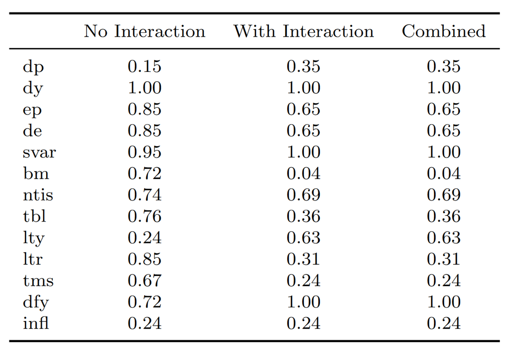
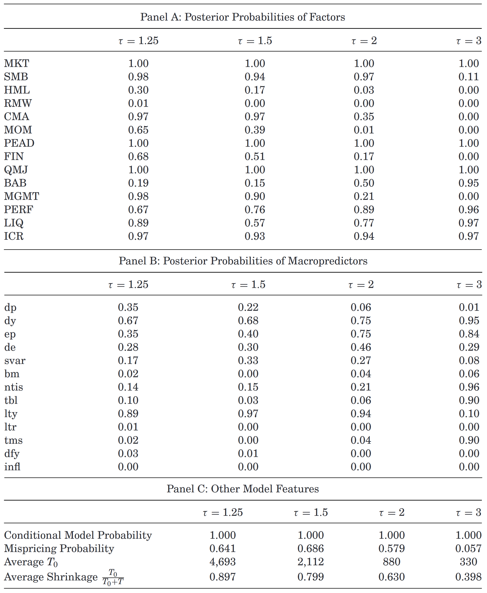
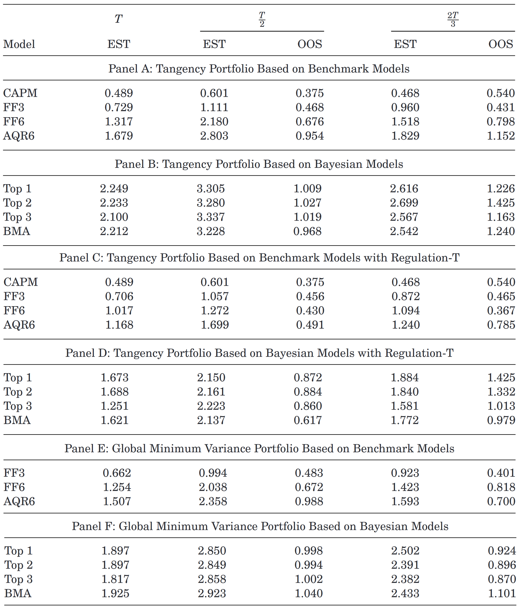
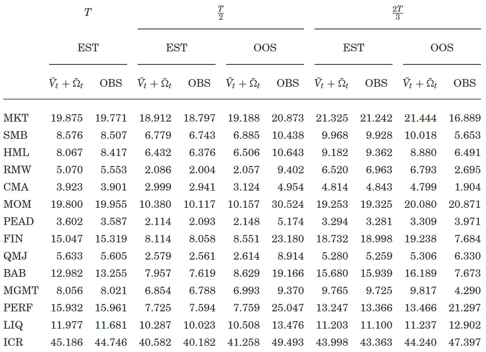
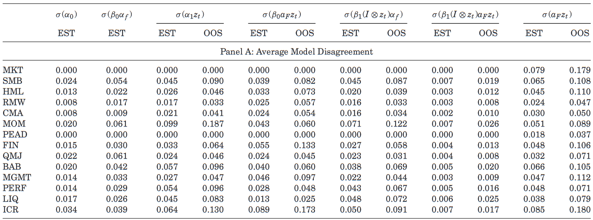

# Integrating Factor Models

## 论文信息

### 作者

Doron Avramov, Si Cheng, Lior Metzker, and Stefan Voigt

Avramov 和 Metzker 都在以色列，前者是 Reichman University 的教授，后者来自耶路撒冷希伯来大学；程斯是雪城大学的副教授，Voigt 是哥本哈根大学的长聘助理教授。

### 收录情况

JF2023

## 解决什么问题

面对未知的因子模型：

1. 哪些因子更重要？
2. 哪些宏观变量更重要？
3. 模型是否应该包含错误定价 α？

> However, the collection of factors that matter most remains subject to research controversy. Significant uncertainty also extends to the choice of macro variables that potentially govern time-varying investment opportunities. Moreover, even if the econometrician has prior information about the identity of asset pricing factors and macro predictors, there is still uncertainty about whether the underlying model holds exactly or instead admits the possibility of mispricing.

## 摘要

通常使用贝叶斯方法会考虑因子的不确定性，即正确的因子模型中应当包含什么因子。而这篇文章不仅考虑了因子的不确定性，还考虑了因子模型框架的不确定性，即是否存在 α，α 和 β 是否与宏观变量相关。

> This paper develops a comprehensive framework to address uncertainty about the correct factor model.

这篇文章的定价模型是将不同的因子模型（不同框架或不同因子）通过后验概率加权得到。

> Asset pricing inferences draw on a composite model that integrates over competing factor models weighted by posterior probabilities.

实证表明：

1. Unconditional 的模型后验权重几乎为 0；
2. 盈余公告漂移（Post-Earnings Announcement Drift，PEAD）、质量因子（Quality-Minus-Junk，QMJ）、中介收益因子（Intermediary Capital，ICR）是 conditional 模型中后验概率较高的因子；
3. 本文的 integrated 模型在样本外也表现得很好，成功排除了在样本外表现不好的因子。

> [!TIP|label:提示]
> PEAD 在 *Bayesian Solutions for the Factor Zoo*（Bryzgalova 等，2023，以下简称 BHJ2023）中也是后验概率最高的因子。
>
> 质量因子中的“质量”其实包括三个维度：盈利性、成长性和安全性，每个维度都由不同的公司特征构成（Asness 等，2019）。这个因子相当于一个因子集合体，表现好似乎是应该的？
>
> 中介收益因子中的“中介”用美联储指定的 primary dealer 来做代理，primary dealer 是美联储的交易对手，在货币政策中扮演重要角色（He 等，2017）。

> Evidence shows that unconditional models record near-zero probabilities, while postearnings announcement drift, quality-minus-junk, and intermediary capital are potent factors in conditional asset pricing. Out-of-sample, the integrated model performs well, tilting away from subsequently underperforming factors.

本文还研究了模型的不确定性（或预测分歧）对定价的影响：

1. 模型的不确定性让股票的风险看起来很大；
2. 模型对期望收益率的预测分歧在市场崩盘的时期激增；
3. 预测分歧张成了所有收益率的成分，包括：错误定价、因子载荷、风险溢价。

> Model uncertainty makes equities appear considerably riskier, while model disagreement about expected returns spikes during crash episodes. Disagreement spans all return components involving mispricing, factor loadings, and risk premia.

## 模型的不确定性

模型的不确定性包括：

1. 哪些因子才应该被包含进模型？
2. 哪些宏观变量应该用来择时？
3. 是否应该允许定价误差的存在（模型包不包含 α）？

> However, the collection of factors that matter most remains subject to research controversy. Significant uncertainty also extends to the choice of macro variables that potentially govern time-varying investment opportunities. Moreover, even if the econometrician has prior information about the identity of asset pricing factors and macro predictors, there is still uncertainty about whether the underlying model holds exactly or instead admits the possibility of mispricing.

贝叶斯的方法可以很好地解决不确定的问题。

### 定价模型

本文的定价模型设定如下：

$$
\begin{equation}
    \bm{r}_{t+1} = \bm{\alpha}(\bm{z}_t) + \bm{\beta}(\bm{z}_t) \bm{f}_{\! t+1} + \bm{u}_{r,\ t+1} \label{1}
\end{equation}
$$

其中 $\bm{r}_{t+1}$ 是 $t+1$ 时刻 $N$ 个股票的超额收益率向量，$K \times 1$ 的因子向量 $\bm{f}_{\! t+1}$ 则可以通过 $M \times 1$ 的宏观变量 $\bm{z}_t$ 来预测：

$$
\begin{equation}
    \bm{f}_{\! t+1} = \bm{\alpha}_f + \bm{a}_F \bm{z}_t + \bm{u}_{f,\ t+1} \label{2}
\end{equation}
$$

其中残差 $\bm{u}_{r,\ t+1}$ 和 $\bm{u}_{f,\ t+1}$ 是正交的，且都服从均值为 0 的多元正态分布：

$$
\bm{u}_{r,\ t+1} \sim \mathcal{N}(\bm{0},\ \bm{\Sigma}_{RR}),\qquad \bm{u}_{f,\ t+1} \sim \mathcal{N}(\bm{0},\ \bm{\Sigma}_{FF})
$$

$\eqref{1}$ 式中的 $\bm{\alpha}$ 和 $\bm{\beta}$ 都是与宏观变量 $\bm{z}_{t}$ 有关的，本文假设的是线性关系：

$$
\begin{equation}
    \begin{split}
        \bm{\alpha}(\bm{z}_{t}) &= \bm{\alpha}_{0} + \bm{\alpha}_{1} \bm{z}_{t} \\
        \bm{\beta}(\bm{z}_{t}) &= \bm{\beta}_{0} + \bm{\beta}_{1} (\bm{I}_{\! K} \otimes \bm{z}_{t}) \\
    \end{split} \label{3}
\end{equation}
$$

其中 $\bm{I}_{\! K}$ 是 $K \times K$ 的单位矩阵，$\otimes$ 代表 Kronecker 积，乘完后 $\bm{I}_{\! K} \otimes \bm{z}_{t}$ 是 $KM \times K$ 的矩阵。

> [!TIP|label:Kronecker积]
> $\bm{X} \otimes \bm{Y}$ 得到的矩阵是 $(X_{ij} \bm{Y})$，即 $\bm{X}$ 中每一个元素都与 $\bm{Y}$ 相乘。

将 $\eqref{3}$ 式代入 $\eqref{1}$ 式，定价模型就变成了

$$
\begin{equation}
    \bm{r}_{t+1} = \bm{\alpha}_{0} + \bm{\alpha}_{1} \bm{z}_{t} + \bm{\beta}_{0} \bm{f}_{\! t+1} + \bm{\beta}_{1} (\bm{I}_{\! K} \otimes \bm{z}_{t}) \bm{f}_{\! t+1} + \bm{u}_{r,\ t+1} \label{4}
\end{equation}
$$

其中 $\bm{\alpha}_{0}$ 代表了时不变的错误定价，$\bm{\alpha}_{1}$ 则代表了随宏观状态变化的错误定价；$\bm{\beta}_{0}$ 代表了时不变的 β，而 $\bm{\beta}_{1}$ 则代表随宏观状态变化的 β。

### 模型框架的不确定性

对 $\bm{\alpha}(\bm{z}_{t}),\ \bm{\beta}(\bm{z}_{t}),\ \bm{a}_{F}$ 有不同限制就产生了不同的模型**框架**：

- Unconditional：$\bm{\alpha}_{1} = 0$，$\bm{\beta}_{1} = 0$，$\bm{a}_{F} = 0$（α、β 和因子的风险溢价都是时不变的）
    - $\mathbb{M}_{1}$：$\bm{\alpha}_{0} = 0$（不存在错误定价）

        $$
        \begin{aligned}
            \bm{r}_{t+1} &= \bm{\beta}_{0} \bm{f}_{\! t+1} + \bm{u}_{r,\ t+1} \\
            \bm{f}_{\! t+1} &= \bm{\alpha}_f + \bm{u}_{f,\ t+1}
        \end{aligned}
        $$

    - $\mathbb{M}_{2}$：$\bm{\alpha}_{0} = 0$（允许错误定价）

        $$
        \begin{aligned}
            \bm{r}_{t+1} &= \bm{\alpha}_{0} + \bm{\beta}_{0} \bm{f}_{\! t+1} + \bm{u}_{r,\ t+1} \\
            \bm{f}_{\! t+1} &= \bm{\alpha}_f + \bm{u}_{f,\ t+1}
        \end{aligned}
        $$

- Conditional：$\bm{\alpha}_{1} \neq 0$，$\bm{\beta}_{1} \neq 0$，$\bm{a}_{F} \neq 0$（α、β 和因子的风险溢价都是时变的）
    - $\mathbb{M}_{3}$：$\bm{\alpha}_{0} = \bm{\alpha}_{1} = 0$（不存在错误定价）

        $$
        \begin{aligned}
            \bm{r}_{t+1} &= \bm{\beta}_{0} \bm{f}_{\! t+1} + \bm{\beta}_{1} (\bm{I}_{\! K} \otimes \bm{z}_{t}) \bm{f}_{\! t+1} + \bm{u}_{r,\ t+1} \\
            \bm{f}_{\! t+1} &= \bm{\alpha}_f + \bm{a}_{F} \bm{z}_{t} + \bm{u}_{f,\ t+1}
        \end{aligned}
        $$

    - $\mathbb{M}_{4}$：$\bm{\alpha}_{0} \neq 0$（允许错误定价）

        $$
        \begin{aligned}
            \bm{r}_{t+1} &= \bm{\alpha}_{0} + \bm{\alpha}_{1} \bm{z}_{t} + \bm{\beta}_{0} \bm{f}_{\! t+1} + \bm{\beta}_{1} (\bm{I}_{\! K} \otimes \bm{z}_{t}) \bm{f}_{\! t+1} + \bm{u}_{r,\ t+1} \\
            \bm{f}_{\! t+1} &= \bm{\alpha}_f + \bm{a}_{F} \bm{z}_{t} + \bm{u}_{f,\ t+1}
        \end{aligned}
        $$

### BMA（Bayesian Model Averaging）

基于不同的模型（包括不同的模型框架和不同的因子选择），BMA（Bayesian Model Averaging）给出的期望收益率预测可以写成

$$
\begin{equation}
    \E[\bm{r}_{t+1} \mid D] = \sum\limits_{l=1}^{L} P(\mathcal{M}_{l} \mid D) \E[\bm{r}_{t+1} \mid \mathcal{M}_{l},\ D]
\end{equation}
$$

其中 $D$ 代表可观测的数据（包括 $N$ 个 test assets、$K$ 个因子、$M$ 个宏观变量，时间长度为 $T$ 的面板数据），$\mathcal{M}_{l}$ 代表某一个模型，总共有 $L$ 个模型，$P(\mathcal{M}_{l} \mid D)$ 代表模型 $\mathcal{M}_{l}$ 的后验概率。

> [!NOTE|label:注意]
> 本文设定每个模型都包含市场因子，$K$ 代表最多有 $K$ 个因子，当某个模型 $\mathcal{M}_{l}$ 选择了 $k$ 个因子（$1 \leqslant k < K$），剩余的 $K - k$ 个“冗余”因子会被加入 test assets。

### 模型预测分歧带来的方差收缩

本文除了关注期望收益率的预测，还关注收益率的协方差矩阵：

$$
\begin{equation}
    \Var[\bm{r}_{t+1} \mid D] = \underbrace{\E[\Var[\bm{r}_{t+1} \mid \mathcal{M}_{l},\ D]]}_{\bm{V}_{\! t}} + \underbrace{\Var[\E[\bm{r}_{t+1} \mid \mathcal{M}_{l},\ D]]}_{\bm{\Omega}_{t}} \label{6}
\end{equation}
$$

其中 $\bm{V}_{\! t}$ 是**不同模型得到的协方差矩阵的后验均值**，而 $\bm{\Omega}_{t}$ 则是**不同模型得到的期望收益率之间的协方差**，即反映了**模型预测分歧带来的波动**。

> [!TIP|label:提示]
> $\eqref{6}$ 式成立是因为**方差等于条件方差的期望 + 条件期望的方差**。

如果我们限制 $\bm{\Omega}_{t}$ 是对角阵，则 $\Var[\bm{r}_{t+1} \mid D]$ 可以很容易做到可逆（即使 $\bm{V}_{\! t}$ 不可逆），且在这个条件下 $\bm{\Omega}_{t}$ 跟岭回归的正则项很相似，**相当于对协方差的后验均值做了 asset-specific 的收缩，收缩的比例取决于模型对这个 test asset 的预测分歧。**

> the posterior predictive variance imposes asset-specific shrinkage toward the grand mean, $\bm{V}_{\! t}$, in proportion to the general agreement among candidate models about mean returns.

> [!TIP|label:提示]
> 频率派通常只考虑一个模型 $\mathcal{M}$，它们的预测协方差为 $\Var[r_{t+1} \mid \mathcal{M},\ D] = \bm{\tilde{V}}_{\! t}$，如果做岭回归则为 $\Var[r_{t+1} \mid \mathcal{M},\ D] = \bm{\tilde{V}}_{\! t} + \gamma \bm{I}_{\! N}$。

### 后验概率求解

#### 贝叶斯公式

记模型参数为 $\theta$，似然函数为 $\mathcal{L}(D \mid \theta,\ \mathcal{M})$，参数的先验为 $\pi(\theta \mid \mathcal{M})$，则边际似然为

$$
\begin{align}
    m(D \mid \mathcal{M}) &= \int_{\theta} \mathcal{L}(D \mid \theta,\ \mathcal{M}) \pi(\theta \mid \mathcal{M}) ~ \mathrm{d}\theta \notag \\
    &= \frac{\mathcal{L}(D \mid \theta,\ \mathcal{M}) \pi(\theta \mid \mathcal{M})}{\pi(\theta \mid D,\ \mathcal{M})}
\end{align}
$$

> [!TIP|label:提示]
> 似然、先验、后验，**本质上都是概率**，只是换了个专有名词而已，可以把对应的符号都想成概率 $p$。
>
> $\eqref{7}$ 式成立是因为
> 
> $$m(D \mid \mathcal{M}) \pi(\theta \mid D,\ \mathcal{M}) = p(D,\ \theta \mid \mathcal{M}) = \mathcal{L}(D \mid \theta,\ \mathcal{M}) \pi(\theta \mid \mathcal{M})$$

而模型 $\mathcal{M}$ 的后验概率为

$$
\begin{equation}
    P(\mathcal{M} \mid D) = \frac{p(\mathcal{M},\ D)}{p(D)} = \frac{m(D \mid \mathcal{M}) P(\mathcal{M})}{\sum_{l=1}^{L} m(D \mid \mathcal{M}_{l}) P(\mathcal{M}_{l})} \label{8} \\
\end{equation}
$$

其中 $P(\mathcal{M}_{l})$ 为模型 $\mathcal{M}_{l}$ 的先验概率。在没有其他信息的情况下，本文令每个模型的先验概率相同，接下来的问题就是如何计算边际似然。

#### 经验贝叶斯

经验贝叶斯是根据历史数据建立先验的贝叶斯方法。

作者假设在长度为 $T_0$ 的先验样本中，各变量（$\bm{r},\ \bm{f},\ \bm{z}$）自身的期望和协方差矩阵分别等于样本均值和样本协方差，且 $\bm{r}$ 与 $\bm{f}$ 之间的协方差矩阵也等于它们的样本协方差。在这个假设下，对样本数据做 $\eqref{4}$ 式的回归，会得到 $\bm{\widehat{\alpha}}_{0} = \bm{\widehat{\alpha}}_{1} = \bm{\widehat{\beta}}_{1} = 0$。也就是说，本文的先验为：$\bm{\alpha}_{0},\ \bm{\alpha}_{1},\ \bm{\beta}_{1}$ 都在 0 左右徘徊。随着样本长度 $T_0$ 的增加，这个先验还会更紧，也就是这些变量收缩到 0 的力度会更大。

> [!TIP|label:提示]
> 先验样本的长度并不代表真实的样本长度，只是假设在这个长度的样本内满足我们的先验。

> 为什么这个假设能推出 $\bm{\widehat{\alpha}}_{0} = \bm{\widehat{\alpha}}_{1} = \bm{\widehat{\beta}}_{1} = 0$？

> The prior distribution is based on a hypothetical sample of length $T_0$. In that sample, the means and the covariance matrices of stock returns, factors, and predictors are set equal to the actual sample counterparts given by ... The prior sample is also weighted against predictability by macro variables and against mispricing. Thus, on the basis of equation $\eqref{4}$, regressing $\bm{r}_{t}$ on a constant term, $\bm{z}_{t-1}$, $\bm{f}_{t}$, and the interaction terms $\bm{f}_{t} \otimes \bm{z}_{t-1}$ yields zero estimates for $\bm{\alpha}_{0}$, $\bm{\alpha}_{1}$,and $\bm{\beta}_{1}$ in the prior sample. Hence, the prior densities of $\bm{\alpha}_{0}$, $\bm{\alpha}_{1}$,and $\bm{\beta}_{1}$ are centered around zero. Moreover, as $T_0$ increases, the informed prior about underlying parameters becomes tighter.

根据这一先验可以计算出不同框架下的边际似然，这里以包含最多变量的 $\mathbb{M}_{4}$ 为例：

$$
\begin{equation}
    \begin{split}
        & m\left(D \mid \mathbb{M}_4\right)=\pi^{-\frac{1}{2} T(N+K)} \times\left[\frac{T_0}{T^*}\right]^{\frac{1}{2}(N+K-k)\left(T_0+k\right)+\frac{1}{2} k(m+1)} \times\left[\frac{T}{T^*}\right]^{\frac{1}{2}(N+K-k) T} \times \\
        & {\left[\frac{\Gamma_{N+K-k}\left(\frac{1}{2}\left[T^*-(k+1) m-1\right]\right)}{\Gamma_{N+K-k}\left(\frac{1}{2}\left[T_0-(k+1) m-1\right]\right)}\right]\left[\frac{\Gamma_k\left(\frac{1}{2}\left[T^*+N+K-k-m-1\right]\right)}{\Gamma_k\left(\frac{1}{2}\left[T_0+N+K-k-m-1\right]\right)}\right] \times} \\
        & {\left[\frac{\left|R^{\prime} R-R^{\prime} F\left(F^{\prime} F\right)^{-1} F^{\prime} R\right|^{\frac{1}{2}\left(T_0-(k+1) m-1\right)}}{\left|R^{\prime} R-\tilde{\Phi}^{\prime} W^{\prime} W \tilde{\Phi}\right|^{\frac{1}{2}\left(T^*-(k+1) m-1\right)}}\right]\left[\frac{\left|T_0 \hat{V}_f\right|^{\frac{1}{2}\left(T_0+N+K-k-m-1\right)}}{\left|S_F\right|^{\frac{1}{2}\left(T^*+N+K-k-m-1\right)}}\right]}
        \label{9} \\
    \end{split}
\end{equation}
$$

不用管这些字母是什么，我们只需要知道，最后两项，也就是第二行和第三行，反映了截面的拟合效果（**拟合得越好边际似然越大**）；而第一行的其他项反映的是模型复杂度带来的惩罚（**因子或宏观变量越多边际似然越小**）。因此这个边际似然反映了**拟合效果与模型复杂度之间的 trade-off**。

#### 确定先验样本长度

要用上面的经验贝叶斯计算边际似然，我们还需要确定先验样本的长度（$T_0$）。

根据[上面](#经验贝叶斯)的先验，我们可以得到定价误差的方差为

$$
\begin{equation}
    \Var[\bm{\alpha}(\bm{z}_t) \mid \bm{\Sigma}_{RR},\ D] = \frac{\bm{\Sigma}_{RR}}{T_0} (1 + m) (1 + \text{SR}^{2}(F)) \label{10}
\end{equation}
$$

其中 $m$ 是选择的宏观变量个数（$0 < m < M$），$\text{SR}^{2}(F) = \bm{\overline{f}}^{\top} \bm{\widehat{V}}_{\! f}^{-1} \bm{\overline{f}}$ 代表用因子构建的切点组合的夏普比。

> 具体推导见论文。

接下来作者想找到一个 $T_0$ 来让 $\bm{\alpha}$ 的先验与前人的工作 &mdash; *Comparing Asset Pricing Models*（Barillas 和 Shanken，2018，以下简称 BS2018）相匹配。BS2018 的 $\bm{\alpha}$ 先验为

$$
\begin{equation}
    \bm{\alpha} \mid \bm{\Sigma}_{RR},\ D \sim \mathcal{N}(0,\ \eta \bm{\Sigma}_{RR}) \label{11}
\end{equation}
$$

其中 $\eta > 0$ 控制先验的扩散程度（趋于 0 代表坚定认为没有 α，趋于无穷则相当于均匀分布）。

在 BS2018 的先验下，我们有

$$
\begin{align}
    &\bm{\alpha}^{\top} (\eta \bm{\Sigma}_{RR})^{-1} \bm{\alpha} \sim \chi^{2}(N + K - k) \notag \\
    {} \notag\\
    \implies& \E[\bm{\alpha}^{\top} \bm{\Sigma}_{RR}^{-1} \bm{\alpha}] = \eta(N + K - k) \label{12}
\end{align}
$$

$\bm{\alpha}^{\top} \bm{\Sigma}_{RR}^{-1} \bm{\alpha}$ 实际上是最大夏普比平方与因子夏普比平方的差（省略期望）：

$$
\bm{\alpha}^{\top} \bm{\Sigma}_{RR}^{-1} \bm{\alpha} = \text{SR}^{2}(R,\ F) - \text{SR}^{2}(F)
$$

在本文设定中，由于每个模型选中了 $k$ 个因子后，剩余的 $K - k$ 个“冗余”因子会被归到 test assets 里，所以最大夏普比 $\text{SR}(R,\ F) = \text{SR}_{\text{max}}$ 都是一样的，不一样的是第二项。又因为本文设定所有模型都包含市场因子，最小的 $\text{SR}(F)$ 为 $\text{SR}(\text{Mkt})$，记最大夏普比 $\text{SR}_{\text{max}} = \tau \text{SR}(\text{Mkt})$，比如 $\tau = 1.5$ 就代表我们先验的认为最大夏普比是市场组合夏普比的 $1.5$ 倍。

当 benchmark 是 CAPM 的时候，$\eqref{12}$ 式又可以写成

$$
\begin{align}
    \E[\bm{\alpha}^{\top} \bm{\Sigma}_{RR}^{-1} \bm{\alpha}] &= \eta(N + K - k) = (\tau^{2} - 1) \text{SR}^{2}(\text{Mkt}) \notag \\
    {} \notag \\
    \implies& \phantom{=} \eta = \frac{(\tau^{2} - 1) \text{SR}^{2}(\text{Mkt})}{N + K - k}
\end{align}
$$

令 $\eqref{10}$ 式与 $\eqref{11}$ 式中的方差相等，我们有

$$
\begin{align}
    \frac{\bm{\Sigma}_{RR}}{T_0} (1 + m) (1 + \text{SR}^{2}(F)) &= \frac{(\tau^{2} - 1) \text{SR}^{2}(\text{Mkt})}{N + K - k} \bm{\Sigma}_{RR} \notag \\
    T_0 &= \frac{(N + K - k) (1 + m) (1 + \text{SR}^{2}(F))}{(\tau^{2} - 1) \text{SR}^{2}(\text{Mkt})} \label{14} \\
\end{align}
$$

从 $\eqref{14}$ 式可以看出，$T_0$ 与 $m$ 是正相关的，即选择更多的宏观变量就需要更长的先验样本，而在[前面](#经验贝叶斯)我们提过，$T_0$ 越大，先验就越紧，这就说明选择更多的宏观变量会导致时变 α 和 β &mdash; $\bm{\alpha}_{1},\ \bm{\beta}_1$ 收缩到 0 的力度更大（防过拟合）。同样地，如果可得的最大夏普比 $\text{SR}^{2}(F)$ 增大，$T_0$ 也会增大，说明选择更多的因子会使错误定价 $\bm{\alpha}_{0}$ 和 $\bm{\alpha}_{1}$ 收缩到 0 的力度变大。这跟 $\eqref{9}$ 式的边际似然所体现的对模型复杂度的惩罚有异曲同工之妙，根据 $\eqref{8}$ 式，后验概率正比于边际似然和先验概率，因此最终我们会倾向于给与 CAPM 相似的模型更高的后验概率。

> 这里还没完全看懂。

> The resulting prior is sound. First, it is informed for the comprehensive parameter space. Moreover, model pricing ability can improve as more predictors are included. Hence, the prior is more strongly weighted against time-varying parameters because $T_0$ and $m$ are positively related. Likewise, when the admissible squared Sharpe ratio increases, the prior is more strongly weighted against mispricing. Recall also from the marginal likelihood expressions that including more factors beyond the market or including more predictors leads to a higher penalty. Thus, the posterior probability is weighted against deviations from the unconditional CAPM.

## 实验

### 数据

<i>Which Alpha?</i>（Barillas 和 Shanken，2017）认为 test assets 的选取与模型的比较无关，因此作者没有选取除了因子以外的任何 test assets，即 $N = 0$。

> Our choice of test assets draws on Barillas and Shanken (2017), who suggest that the set of test assets is irrelevant for model comparison, that is, whether each model can price the factors in another model. Instead, only factor returns are required to conduct a relative test of model performance.

因子的选取包括：

- 老牌因子：FF5（MKT、SMB、HML、RMW、CMA）、动量（MOM）
- 行为因子：盈余公告漂移（PEAD）、融资因子（FIN）
- 其他因子：质量因子（QMJ）、BAB（Betting Against Beta）、管理引起的错误定价（MGMT）、表现因子（PERF）、流动性（LIQ）、中介收益因子（ICR）

共 14 个。

宏观变量的选取包括：

- 大盘：
    - 标普500：Dividend Price Ratio（dp）、Dividend Yield（dy）、Earnings Price Ratio（ep）、Dividend Payout Ratio（de）、Stock Variance（svar，成分股日收益率平方和）
    - 道琼斯工业指数：Book-to-market Ratio（bm）
    - NYSE：Net Equity Expansion（ntis，净发行量除市值）
- 债券：Treasury Bills（tbl）、Long Term Yield（lty）、Long Term Rate of Returns（ltr）、Term Spread（tms）、Default Yield Spread（dfy）
- 其他：Inflation（infl）

共 13 个。

样本从 1977 年 6 月到 2016 年 12 月，共 475 个月。样本的 summary 如下：

- 所有的因子都有正的月频收益，其中市值因子 SMB 最低（0.22\%），中介收益因子 ICR 最高（1.13\%）；
- 除了 ICR 和动量因子 MOM 以外，其他因子的波动都比市场因子 MKT 小；
- 除了 SMB 以外，其他因子都有显著的 CAPM α，其中 BAB 的 α 最大；
- MKT 与 ICR 的相关性是最高的（0.81）；
- 价值因子和投资因子之间的相关性是意料之内的高：HML、CMA、FIN、MGMT 之间的相关性都比较高；
- 动量因子和盈利因子之间的相关性也比较高：RMW、QMJ、MOM、PERF 之间的相关性比较高；
- 除了 svar、ltr、infl 以外，其他的宏观变量 AR（1）系数都接近 1，说明大多数宏观变量都是一阶自相关的。

### 实证

#### 选择什么宏观变量来预测收益率

做预测的时候，我们会将 $\eqref{4}$ 式和 $\eqref{2}$ 式合并，得到

$$
\begin{equation}
    \begin{split}
    \E[\bm{r}_{t+1} \mid \bm{z}_{t},\ \theta] &= \underbrace{(\bm{\alpha}_{0} + \bm{\beta}_{0} \bm{\alpha}_{f})}_{\bm{B}_{0}} + \underbrace{[\bm{\alpha}_{1} + \bm{\beta}_{0} \bm{a}_{F} + \bm{\beta}_{1}(\bm{\alpha}_{f} \otimes \bm{I}_{\! M})]}_{\bm{B}_{1}} \bm{z}_{t} \\
    &\phantom{=} + \underbrace{\bm{\beta}_{1} (\bm{a}_{F} \otimes \bm{I}_{\! M})}_{\bm{B}_{2}} (\bm{z}_{t} \otimes \bm{z}_{t})
    \end{split}\label{15}
\end{equation}
$$

考虑三种情况：
- No Interaction：$\bm{B}_{1} \neq 0,\ \bm{B}_{2} = 0$；
- With Interaction：$\bm{B}_{1} \neq 0,\ \bm{B}_{2} \neq 0$；
- Combined：$\bm{B}_{1} \neq 0$，$\bm{B}_{2}$ 不限制，即前面两种情况的结合。

13 个宏观变量在这三种情况下的后验概率如下：

- 在 No Interaction 的情况下，模型告诉我们 Dividend Yield（dy）和 Stock Variance（svar）几乎是必须包含的变量，Earnings Price Ratio（ep）、Dividend Payout Ratio（de）还有 Long-term Rate of Returns（ltr）需要包含的概率也都很高（85\%）；
- 在 With Interaction 的情况下，**Dividend Yield（dy）和 Stock Variance（svar）仍然是必须包含的变量，新增了一个 Default Yield Spread（dfy）也必须包含**，而 Book-to-market Ratio（bm）、Treasury Bill（tbl）、ltr 还有 Term Spread（tms）的后验概率都降到了很低的程度；
- With Interaction 的后验概率和 Combined 的后验概率是一致的，说明**股票未来的收益就应该与宏观变量的交互项有关。**

#### 选择什么因子和宏观变量来解释收益率

设定不同的最大夏普比（$\tau$ 代表最大夏普比是市场组合夏普比的多少倍），模型的后验概率如下所示：

对于因子（Panel A）：

- 当 $\tau = 1.5$（baseline），模型告诉我们必须包含 PEAD 和 QMJ，CMA、SMB、ICR 和 MGMT 也都有 90+\% 的后验概率，而这其中只有 SMB 是 2015 年以前提出来的，其他的都是后来的新因子；
- **PEAD、QMJ 和 ICR 这三个因子在各个情况下都有很高的后验概率，几乎是必选的因子；**
- SMB、CMA 和 MGMT 在 $\tau$ 比较小的时候都有很高的后验概率，但当要求很高的最大夏普比，它们的后验概率大幅下降；
- BAB 这个因子比较奇怪，$\tau$ 小的时候不怎么重要，到 $\tau = 3$ 的时候反而有 95\% 的后验概率；
- 盈利因子 RMW 好像比较冗余，这可能是因为它和 QMJ 的相关系数高达 0.75；
- **在所有的情况下，高于 90\% 后验概率的因子数量在 5 到 7 之间，说明因子模型确实不需要太多的因子**（也有可能是本文选取的因子数量不够多）。

对于宏观变量（Panel B）：

- 与[选择宏观变量预测收益率](#选择什么宏观变量来预测收益率)不同，解释收益率时由于有定价因子的存在，宏观变量的重要性没有在预测的时候那么强；
- **当 $\tau = 1.5$（baseline），Long Term Yield（lty）有 97\% 的后验概率**，排名第二的 dy 只有 68\% 的后验概率；
- **当要求很高的最大夏普比（$\tau = 3$），更多的宏观变量会变得重要起来**，ntis、dy、tbl、tms 都有 90+\% 的后验概率，这说明只需要样本外一点点的预测能力就可以在样本内达到很好的效果（理解可能有误）；

    > The rising inclusion probability with practically infeasible Sharpe ratios provides important evidence suggesting strong in-sample predictive power of macro items could be associated with only mild forecasting power out-of-sample.

- 在所有情况下，bm、ltr、dfy、infl 后验概率都几乎是 0，也就是它们对于解释收益率没用。

从 Panel C 我们可以看出：

- **在不断惩罚模型复杂度的情况下，conditional 的模型（$\mathbb{M}_{3}$ 和 $\mathbb{M}_{4}$）在所有情况下仍然是必须选择的；**
- 除了 infeasible 的最大夏普比（$\tau = 3$），**模型包含 α 的后验概率在 58\% 到 69\% 之间，说明 α 很重要；**
- 除了 $\tau = 3$ 外，平均的 $T_0$ 都超过了真实样本长度 $T = 475$，$T_0$ 随 $\tau$ 的增大而减小，符合 $\eqref{14}$ 式；
- 收缩强度 $\frac{T_0}{T^{*}} = \frac{T_0}{T_0 + T}$ 可以理解为是先验样本的权重，即我们先验地认为有 $\frac{T_0}{T_0 + T}$ 的概率 $\bm{\widehat{\alpha}}_{0} = \bm{\widehat{\alpha}}_{1} = \bm{\widehat{\beta}}_{1} = 0$，收缩强度随 $\tau$ 的增大而减小，$\tau$ 越大代表样本内越容易过拟合，这也是符合我们预期的。

#### 样本外表现

在 baseline（$\tau = 1.5$）下，用宏观变量预测出的收益率期望和收益率协方差矩阵构建切点组合（或最小方差组合），得到的样本内外夏普比如下（EST 是样本内，OOS 是样本外，$\frac{T}{2}$ 和 $\frac{2T}{3}$ 分别为不同的样本内长度）：

> [!TIP|label:Regulation-T]
> Regulation-T 是 SEC 颁布的规定，规定股票交易中杠杆的最大比例是 50\%，即投资者只能借等同于自己资产的金额来投资，自己有 1 块钱就最多只能借 1 块钱。在本文相当于限制投资权重的绝对值之和 $\sum_{i=1}^{14} \left\vert w_i \right\vert  \leqslant 2$。

可以看到**不管是样本内还是样本外，不管是切点组合还是最小方差组合（GMVP），BMA 在夏普比方面都是全面击败 benchmark。**Top3 的三个模型在样本外也都有比较稳健的表现，$\tau$ 取其他数值也是如此。**作者还看了最大回撤，同样 BMA 也是击败所有 benchmark**，在此就不放太多的图了。

> [!TIP|label:为什么要关注最小方差组合]
> 最小方差组合只由预测协方差决定，观察最小方差组合的表现可以剥离开对期望得预测，既可以判断协方差预测得好不好，又可以看考虑模型的不确定性是否会降低下行风险（最大回撤）。

下图是 BMA 切点组合在不同样本内长度下的表现：

可以看到样本外的表现居然和样本内**相差无几**（也有可能是图比例的原因）：红色的线代表用 $\frac{2T}{3}$ 的样本训练，即第二条蓝虚线后面是对应的测试集，居然和橙色的样本内表现差不太多！

#### 方差预测

回顾我们之前推导出的模型预测的方差，即 $\eqref{6}$ 式，在 baseline（$\tau = 1.5$）的情况下，预测（拟合）结果如下（OBS 为样本方差）：

首先样本方差是 unconditional 的，$\bm{\overline{V}}_{\! t} + \bm{\overline{\Omega}}_{t}$ 是考虑了宏观变量的 conditional，因此**样本方差本来就应该比 conditional 的方差大**，我们可以在 $\frac{T}{2}$ 的结果中看到这一点。

然而在使用 $\frac{2T}{3}$ 的训练集时，**14 个因子中有 8 个预测方差（conditional）是高于样本方差（unconditional）的，且平均下来 14 个因子的预测方差高出样本方差 53\%。**作者认为这是因为 heterogeneous 的投资者（每一个模型）并不知道真实的因子模型是什么，也不知道参数的真实值，导致贝叶斯 agent（BMA）认为股票比过去更有风险（模型预测方差 $>$ 样本方差）。

#### 模型预测分歧

Van Nieuwerburgh 和 Veldkamp（2010）用 $\frac{\left\vert \bm{\Sigma} \right\vert}{\left\vert \bm{\Sigma} \mid D \right\vert}$ 来衡量 entropy reduction，其中 $\bm{\Sigma}$ 是数据 $D$ 还没被观测到时的协方差矩阵，而 $\bm{\Sigma} \mid D$ 代表观测到数据 $D$ 后的协方差矩阵，$\left\vert \cdot \right\vert$ 代表行列式。因为观测到数据 $D$ 会减少不确定性，$\frac{\left\vert \bm{\Sigma} \right\vert}{\left\vert \bm{\Sigma} \mid D \right\vert}$ 越高则代表减少的越多。

作者借鉴他们的思路，用以下公式来衡量模型预测分歧 $\bm{\Omega}_{t}$ 带来的 entropy increase：

$$
\begin{equation}
    \text{EI}_{t} = \frac{\left\vert \bm{V}_t + \bm{\Omega}_t \right\vert}{\left\vert \bm{V}_{t} \right\vert}
\end{equation}
$$

下图展示了 EI 随时间变化的变化：

作者认为 EI 的两处突然增大分别与 1987 年 10 月的 Black Monday 和 2008 年 9 月的金融危机有关。因此在市场崩盘的时候考虑模型的预测分歧 $\bm{\Omega}_{t}$ 是很重要的，这也符合 BMA 能减小切点组合和最小方差组合的下行风险的实证结果。

作者还研究了哪些因子对 EI 的贡献大，在此不赘述，结论是 MKT、MGMT 和 ICR 的贡献大。

作者还想看预测分歧主要来自于模型的哪一部分，从 $\eqref{15}$ 式中可以看出期望收益率可以分解为以下 7 个部分：

1. 时不变的定价误差：$\bm{\alpha}_{0}$；
2. 时变的定价误差：$\bm{\alpha}_{1} \bm{z}_{t}$；
3. 时不变的 β 和时不变的风险溢价：$\bm{\beta}_{0} \bm{\alpha}_{f}$；
4. 时不变的 β 和时变的风险溢价：$\bm{\beta}_0 \bm{a}_{F} \bm{z}_{t}$；
5. 时变的 β 和时不变的风险溢价：$\bm{\beta}_{1} (\bm{I} \otimes \bm{z}_{t}) \bm{\alpha}_{f}$；
6. 时变的 β 和时变的风险溢价：$\bm{\beta}_{1} (\bm{I} \otimes \bm{z}_{t}) \bm{a}_{F} \bm{z}_{t}$；
7. 时变的风险溢价：$\bm{a}_{F} \bm{z}_{t}$。

每部分的标准差如下表（$\frac{2T}{3}$ 的训练集，$\tau = 1.5$）：

而在市场崩盘的时候（Black Monday 和金融危机之后的 6 个月窗口），上述第 2、5、7、4 部分的标准差分别增加了 88\%、65\%、27\% 以及 21\%，且。这说明在市场崩盘的时候，模型预测对定价误差、β、风险溢价都有更大的分歧，它们合在一起可以解释整个 EI 的变化，也就是[摘要](#摘要)中说的“预测分歧张成了收益率的所有成分”。

## Takeaway

- 真正的因子模型长什么样？我们不知道。面对未知，我们不应该只考虑因子的不确定性（BHJ2023），**还应该考虑因子模型框架的不确定性**（是否允许有定价误差 α，unconditional 还是 conditional）；

    

    
    

    对于这个问题，实证给出的结果说明：**conditional 是必要的，定价误差 α 同样很重要，需要定价模型去考虑。**

- 在隐因子的框架下，conditional 的信息由 β 提供（比如 *Characteristics are Covariances*（Kelly 等，2019））；在传统因子模型下，conditional 的信息可以由因子本身提供（比如 *Shrinking the Cross-section*（Kozak 等，2020））；本文虽然也在传统因子模型下，但 **conditional 的信息来源于因子与宏观变量，尤其在做预测的时候，宏观变量是 conditional 信息的主要来源，并且模型考虑了收益率与宏观变量之间的非线性关系**（平方项和交互项，见 $\eqref{15}$ 式）；
- 对模型的不确定会带来预测分歧
    - 预测分歧可以看作是 heterogeneous 的投资者对未来不同的预期，尤其**在市场崩盘的时候，预测分歧带来的熵增会激增；**
    - **考虑预测分歧相当于对方差做了 asset-specific 的收缩，收缩的比例取决于模型对这个 test asset 的预测分歧，预测分歧越大，收缩力度越大；**
    - **考虑预测分歧可以有效地减少策略的下行风险**（实际上使用 BMA 就会考虑预测分歧）；
- **假设先验样本上期望和协方差分别等于样本均值和样本协方差可以天然地对一些参数进行收缩**（原因未知）。

## 参考文献

Asness, C. S., Frazzini, A., & Pedersen, L. H. (2019). Quality minus junk. Review of Accounting Studies, 24(1), 34–112. https://doi.org/10.1007/s11142-018-9470-2

Avramov, D., Cheng, S., Metzker, L., & Voigt, S. (2023). Integrating Factor Models. The Journal of Finance, 78(3), 1593–1646. https://doi.org/10.1111/jofi.13226

Barillas, F., & Shanken, J. (2017). Which Alpha? The Review of Financial Studies, 30(4), 1316–1338. https://doi.org/10.1093/rfs/hhw101

Barillas, F., & Shanken, J. (2018). Comparing Asset Pricing Models. The Journal of Finance, 73(2), 715–754. https://doi.org/10.1111/jofi.12607

He, Z., Kelly, B., & Manela, A. (2017). Intermediary asset pricing: New evidence from many asset classes. Journal of Financial Economics, 126(1), 1–35. https://doi.org/10.1016/j.jfineco.2017.08.002

Kelly, B. T., Pruitt, S., & Su, Y. (2019). Characteristics are covariances: A unified model of risk and return. Journal of Financial Economics, 134(3), 501–524. https://doi.org/10.1016/j.jfineco.2019.05.001

Kozak, S., Nagel, S., & Santosh, S. (2020). Shrinking the cross-section. Journal of Financial Economics, 135(2), 271–292. https://doi.org/10.1016/j.jfineco.2019.06.008

Van Nieuwerburgh, S., & Veldkamp, L. (2010). Information Acquisition and Under-Diversification. Review of Economic Studies, 77(2), 779–805. https://doi.org/10.1111/j.1467-937X.2009.00583.x
