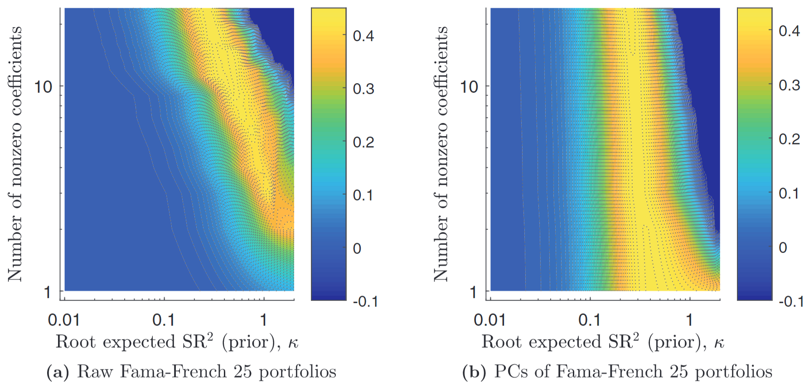
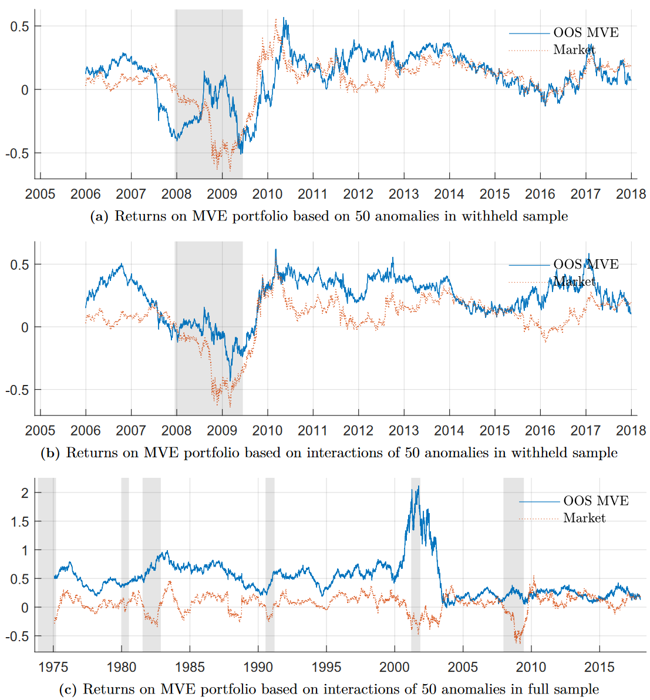

# Shrinking the Cross-Section

## 论文信息

### 作者

Serhiy Kozak, Stefan Nagel, Shrihari Santosh

Kozak 来自马里兰大学，Nagel 来自芝加哥大学，Santosh 来自科罗拉多大学博尔德分校。

### 收录情况

JFE2020

## 解决什么问题

在高维设定（factor zoo）下得到一个样本内外都强于传统因子模型的 SDF，且能从高维变量中方便地得到 test assets（传统排序方法不适用于高维变量）。这个模型能够和传统因子模型一样的 sparse。

## 前置知识

### 用（主成分）因子构成 SDF

在任意时刻 $t$，SDF $m_t$ 可以由 $N$ 个股票的超额收益率向量 $R_t^{e}$ 线性构成：

$$
m_t = 1 - b_{t-1}^{\top}\left[R_t^{e} - \E\left(R_t^{e} \right) \right] \\
\text{s.t. } \E_{t-1}\left(m_t R_t^{e} \right) = 0
$$

其中 $b_{t-1}$ 是 $N \times 1$ 的 SDF 载荷。

基于特征的定价模型通常用特征来表示 SDF 载荷，即 $b_{t-1} = Z_{t-1} b$，其中 $Z_{t-1}$ 是 $N$ 个资产 $H$ 个特征组成的 $N \times H$ 矩阵，$b$ 是 $H \times 1$ 的不随时间变化的 SDF 系数。

我们把基于特征的因子表示成 $F_t = Z_{t-1}^{\top} R_t^{e}$，则 SDF 可以写成

$$
\begin{align}
&m_t = 1 - b^{\top}[F_t - \E(F_t)] \label{1} \\
&\text{s.t. } \E(m_t F_t) = 0 \label{2}
\end{align}
$$

则 $b$ 是因子 $F$ 的[风险价格](asset_pricing/prices_of_risk_and_risk_premia.md#sdf)。

> [!TIP|label:提示]
> 这里从条件期望 $\E_{t-1}$ 变成没有条件的期望 $\E$，是认为 $Z_{t-1}$ 已经蕴含了条件信息。
>
> $F_t = Z_{t-1}^{\top} R_t^{e}$ 实际上是 [managed portfolios](papers/characteristics_are_covariances.md#工具变量和-managed-portfolio) 的收益率，本文对 $Z_{t-1}$ 做了截面上的 demean，因此这些 managed portfolios 实际上都是多空组合，而 $F_t$ 既是因子也是超额收益率。这个模型的 test assets 就是 $F_t$。

将 $\eqref{1}$ 式代入 $\eqref{2}$ 式，我们可以得到 $b$ 的理论解：

$$
\begin{equation}
b = \Sigma^{-1} \mu \\
\end{equation}
$$

其中 $\mu := \E(F_t)$ 是因子的期望（也是 test assets 收益率的期望），$\Sigma := \E\left[(F_t - \mu) (F_t - \mu)^{\top} \right]$ 是因子的协方差矩阵。

计算过程

$$
\begin{aligned}
 \E\left[F_t - b^{\top}(F_t - \mu) \cdot F_t \right] &= 0 \\
 \E\left[F_t \cdot (F_t - \mu)^{\top} \right] b &= \mu \\
 \E\left[(F_t - \mu) (F_t - \mu)^{\top} \right] b &= \mu \\
 b &= \Sigma^{-1} \mu \\
\end{aligned}
$$

在实际中，因子的期望和协方差都是未知的。假设协方差的估计是准确的，我们可以通过以下矩条件得到 $b$ 的 GMM 估计：

$$
\begin{equation}
\begin{cases}
    \mu - \frac{1}{T} \sum\limits_{t=1}^{T} F_t = 0 \\
    \frac{1}{T} \sum\limits_{t=1}^{T} m_t F_t = 0
\end{cases} \implies
\widehat{b} = \overline{\Sigma}^{-1} \overline{\mu} \label{4}
\end{equation}
$$

其中 $\overline{\mu} = \frac{1}{T} \sum\limits_{t=1}^{T} F_t$，$\overline{\Sigma} = \frac{1}{T} \sum\limits_{t=1}^{T} \left(F_t - \overline{\mu} \right) \left(F_t - \overline{\mu} \right)^{\top}$。

由于协方差矩阵是实对称的，我们还可以进一步将 $b$ 写成 $\left(\Sigma^{\top} \Sigma \right)^{-1} \Sigma \mu$，这样的形式说明**因子的风险价格可以通过一个截面回归得到，即把因子的期望回归到因子的协方差上。**

然而当因子的数量 $H$ 很大时，这样做回归来得到 SDF 系数会造成过拟合，很自然地我们就想要用 PCA 来对因子的协方差矩阵降维。对 $\Sigma$ 做特征值分解：

$$
\Sigma = Q D Q^{\top}
$$

其中 $D = \operatorname{diag}(d_1,\ d_2,\ \cdots,\ d_{H})$ 是 $\Sigma$ 的特征值从大到小排列组成的对角矩阵，$Q$ 则由这些特征值对应的特征向量构成。

则对应的主成分因子为

$$
P_t = Q_t^{\top} F_t
$$

此时我们的模型变成

$$
\begin{equation}
m_t = 1 - b_p^{\top}(P_t - \mu_p) \\
\end{equation}
$$

其中 $b_p = D ^{-1} \mu_p$ 为主成分因子的风险价格，$\mu_p$ 为主成分因子的期望。

同样地，我们也可以得到 $b_p$ 的 GMM 估计：

$$
\begin{equation}
\widehat{b}_p = \overline{D}^{-1} \overline{\mu}_p \\
\end{equation}
$$

其中 $\overline{\mu}_p = \frac{1}{T} \sum\limits_{t=1}^{T} P_t$，$\overline{D} = \frac{1}{T} \sum\limits_{t=1}^{T} \left(P_t - \overline{\mu}_p \right) \left(P_t - \overline{\mu}_p \right)^{\top}$。

> [!NOTE|label:注意]
> 在本文作者之前的工作中，他们证明了**在不存在近似套利（near-arbitrage）的情况下，因子（收益率）的期望就能被前几个主成分解释**（Kozak 等，2018）。因此他们直接按顺序取主成分来用，但本文并没有这么做。

### OLS、岭回归和 Lasso 回归

#### OLS

说到回归问题，我们最常见的就是 **OLS（Ordinary Least Squares，普通最小二乘法）**。假设有 $N$ 组观测值，我们研究因变量 $Y$ 与自变量 $X = (X_1,\ X_2,\ \cdots,\ X_{K})$ 之间的线性关系，那么可以写出以下模型：

$$
Y = X b + \epsilon
$$

其中 $Y$ 为 $N \times 1$ 的向量，$X$ 为 $N \times K$ 的矩阵，$b$ 为 $K \times 1$ 的系数向量，$\epsilon$ 为 $N \times 1$ 的噪声向量。

最小化残差平方和让我们得到 OLS 估计量

$$
\widehat{b}_{\text{OLS}} = \underset{b}{\mathop{\arg\min}} ~ (Y - X b)^{\top} (Y - X b) = \left(X^{\top} X \right) ^{-1} X^{\top} Y
$$

如果我们假设模型服从**高斯-马尔可夫假设**，即

1. 参数线性：因变量是自变量的线性函数；
2. 随机抽样：样本是随机抽样得到的；
3. 无完全共线性：自变量之间不存在完全共线性；
4. 零条件均值：噪声在给定观测值下的条件期望为 0；
5. 同方差：噪声在给定观测值下的条件方差相同。

那么 $\widehat{b}_{\text{OLS}}$ 是**最优线性无偏估计量（Best Linear Unbiased Estimator，BLUE）**。

而如果我们对噪声添加**正态假设**，即假设 $\epsilon \overset{\text{i.i.d.}}{\sim} N(0,\ \sigma^{2})$，则此时 **OLS 估计与极大似然估计相同，而极大似然估计即使在非线性情况下也是最小方差且无偏的**。

然而 OLS 估计量并非在所有情况下都适用。我们定义误差的平方距离为 $L^{2} = (\widehat{b}_{\text{OLS}} - b)^{\top} (\widehat{b}_{\text{OLS}} - b)$，则误差距离的期望和方差分别为

$$
\E(L^{2}) = \sigma^{2} \operatorname{trace}[(X^{\top} X)^{-1}]
$$

$$
\Var(L^{2}) = 2 \sigma^{4} \operatorname{trace}[(X^{\top} X)^{-2}]
$$

这意味着**一旦 $X^{\top} X$ 的特征值中有很小的数，误差距离的期望和方差都会变得非常大**（Hoerl 和 Kennard，2000）。

> [!NOTE|label:注意]
> 以上讨论 $X^{\top} X$ 都是在处理成相关性矩阵后的讨论，因此尺度并不影响结果，下同。

#### 岭回归

岭回归（ridge regression）的估计量具有如下形式：

$$
\begin{aligned}
 \widehat{b}_{\text{ridge}} &= \underset{b}{\mathop{\arg\min}} ~ (Y - X b)^{\top} (Y - X b) + \gamma b^{\top} b \\
 &= \left(X^{\top} X + \gamma I \right) ^{-1} X^{\top} Y \\
 &= \left[I + \gamma (X^{\top} X)^{-1} \right] ^{-1} \widehat{b}_{\text{OLS}} \\
 &= Z \widehat{b}_{\text{OLS}} \\
\end{aligned}
$$

其中 $\gamma > 0$ 为某一常数，代表正则化的力度，$I$ 为单位矩阵，$Z := \left[I + \gamma (X^{\top} X)^{-1} \right] ^{-1}$。

直观来讲，**如果 $X^{\top} X = I$，那么 OLS 估计的误差距离是最小的，因此岭回归是希望 $X^{\top} X$ 往单位矩阵上靠，以此缩小误差距离**。严格来讲，岭回归估计的误差距离期望为

$$
\E[L^{2}(\gamma)] = L_1^{2}(\gamma) + L_2^{2}(\gamma)
$$

其中

$$
\begin{aligned}
 L_1^{2}(\gamma) :&= \E[(\widehat{b}_{\text{ridge}} - Z b)^{\top} (\widehat{b}_{\text{ridge}} - Z b)]\\
 &= \sigma^{2} \sum\limits_{i = 1}^{K} \frac{\lambda_i}{(\lambda_i + \gamma)^{2}}
\end{aligned}
$$

为岭回归估计量与有偏真实值之间的平方距离，$\lambda_i$ 为 $X^{\top} X$ 第 $i$ 个特征值；

$$
\begin{aligned}
 L_2^{2}(\gamma) :&= (Z b - b)^{\top} (Zb - b) \\
 &= \gamma^{2} b^{\top} (X^{\top} X + \gamma I)^{-2} b \\
\end{aligned}
$$

为有偏真实值与无偏真实值之间的平方距离。随着正则系数 $\gamma$ 的增大，$L_1^{2}(\gamma)$ 减小而 $L_2^{2}(\gamma)$ 变大，所以是一个 tradeoff。

从效果上来看，**岭回归会让无效的估计系数变得很小，但不会变成 0。**

岭回归的这一操作**等同于对回归系数 $b$ 有一个独立同分布的正态先验**，即 $b \overset{\text{i.i.d.}}{\sim} N(0,\ \frac{\sigma^{2}}{\gamma})$，再根据观测得到贝叶斯后验估计。

#### Lasso 回归

岭回归相当于在 OLS 的目标函数基础上增加了 $L^{2}$ 正则，而 Lasso 回归则是增加了 $L^{1}$ 正则：

$$
\widehat{b}_{\text{Lasso}} = \underset{b}{\mathop{\arg\min}} ~ (Y - X b)^{\top} (Y - X b) + \gamma \sum\limits_{i=1}^{K} \left\vert b_i \right\vert
$$

其中 $b_i$ 为 $b$ 中的第 $i$ 个元素。

> [!TIP|label:提示]
> Lasso 回归可以将不重要的系数收敛成0，而岭回归不可以。

将岭回归和 Lasso 回归结合起来，同时做 $L^{2}$ 正则和 $L^{1}$ 正则，我们得到了**弹性网（Elastic-Net）**：

$$
\widehat{b}_{\text{E-Net}} = \underset{b}{\mathop{\arg\min}} ~ (Y - X b)^{\top} (Y - X b) + \gamma_1 b^{\top} b + \gamma_2 \sum\limits_{i=1}^{K} \left\vert b_i \right\vert
$$

其中常数 $\gamma_1$ 和 $\gamma_2$ 分别控制岭回归和 Lasso 回归的程度。

### 先验分布、后验分布与共轭分布

假设数据 $X$ 服从一个带参数 $\theta$ 的分布，则这个参数的<strong>先验分布（prior）</strong>为 $p(\theta)$，<strong>后验分布（posterior）</strong>为 $p(\theta|X)$。先验分布代表着数据 $X$ 未出现前我们对参数 $\theta$ 的初步判断；后验分布则代表了数据 $X$ 出现后我们对 $\theta$ 的重新判断。根据贝叶斯定理，后验分布可以表示为

$$
p(\theta|X) = \frac{p(X|\theta) p(\theta)}{p(X)}
$$

其中 $p(X|\theta)$ 为**似然函数（likelihood function）**，$p(X)$ 为**证据（evidence）**。

如果通过先验分布得到的后验分布与先验分布属于同一个分布族（family of distribution），那么称它们为**共轭分布（conjugate distributions）**。如果先验分布和后验分布是共轭分布，那么我们只需要对分布中的参数进行更新，就可以从先验分布得到后验分布，对于计算非常方便。

<strong>如果似然函数服从正态分布，且我们对均值的先验为正态分布，则均值的后验也是正态分布。</strong>这种情况我们称**正态分布（似然函数）关于均值（参数）的共轭分布为正态分布（先验和后验）。**

证明

假设先验分布和似然函数都是方差已知的正态分布，$\theta$ 是似然函数的均值参数，即

$$
X|\theta \sim N(\theta,\ \sigma^{2}),\quad \theta \sim N(\mu_0,\ \sigma_0^{2})
$$

假设数据中有 $n$ 个独立同分布的样本，记为 $X = (x_1,\ x_2,\ \cdots,\ x_n)$，则似然函数为

$$
p(X|\theta) = \prod_{i=1}^{n} \frac{1}{\sqrt{2 \pi \sigma^{2}}} e^{-\frac{(x_i - \theta)^{2}}{2 \sigma^{2}}} \propto e^{-\frac{\sum\limits_{i=1}^{n} (x_i - \theta)^{2}}{2 \sigma^{2}}}
$$

由此可得，后验分布为

$$
p(\theta|X) \propto p(\theta) p(X|\theta) \propto e^{-\frac{(\theta - \mu_0)^{2}}{2 \sigma_0^{2}}} e^{-\frac{\sum\limits_{i=1}^{n} (x_i - \theta)^{2}}{2 \sigma^{2}}} \propto e^{-\frac{(\theta - \mu_1)^{2}}{2 \sigma_1^{2}}}
$$

其中 $\mu_1 = \sigma_1^{2} \left(\frac{\mu_0}{\sigma_0^{2}} + \frac{n \overline{x}}{\sigma^{2}} \right)$，$\sigma_1^{2} = \left(\frac{1}{\sigma_0^{2}} + \frac{n}{\sigma^{2}} \right)^{-1}$，$\overline{x} = \frac{1}{n} \sum\limits_{i=1}^{n} x_i$。

即后验分布也是正态分布。

## 创新点

### 因子风险价格的压缩估计

使用 PCA 直接对因子进行降维是一种缓解过拟合的方式，对估计采取正则化是另一种方式，作者打算将这两种方法结合起来。

根据 $\eqref{4}$ 式，我们用 GMM 得到了因子风险价格的估计。但由于使用样本均值 $\overline{\mu}$ 来估计因子的期望非常不准确，即因子的期望 $\mu$ 具有比较强的不确定性，我们需要对它进行建模。那么具体选择什么分布呢？[前面](#ols、岭回归和-lasso-回归)我们提到了几种正则化的方式，岭回归对应的参数先验是正态的，且 literature 也大多用正态分布，所以很自然地作者会想用正态分布对 $\mu$ 进行建模。基于 literature，作者对 $\mu$ 采用了以下先验：

$$
\mu \sim \mathcal{N}\left(0,\ \frac{\kappa^{2}}{\tau} \Sigma^{\eta} \right)
$$

其中 $\mathcal{N}$ 代表多元正态分布，$\tau = \operatorname{trace}(\Sigma)$，$\kappa$ 是一个取决于 $\tau$ 和 $H$ 的常数，$\eta$ 则是一个控制先验分布形状的常数 。

> [!TIP|label:提示]
> 由于假设 $\Sigma$ 的估计是准确的，我们有 $\Sigma = \overline{\Sigma}$。

之前的 literature 有的假设 $\eta = 0$，有的假设 $\eta = 1$，但作者觉得这俩都不合适。于是为了能根据经济学意义找到一个合适的 $\eta$，作者从主成分因子的情况出发：

$$
\mu_{P} \sim \mathcal{N}\left(0,\ \frac{\kappa^{2}}{\tau} D^{\eta} \right)
$$

这些主成分因子同样也是收益率，对应的投资组合我们称作主成分组合，则主成分组合的夏普比可以表示成：

$$
D^{-\frac{1}{2}} \mu_{P} \sim \mathcal{N}\left(0,\ \frac{\kappa^{2}}{\tau} D^{\eta - 1} \right)
$$

在不存在近似套利的情况下，特征值越大，对应的主成分组合的期望夏普比应当越高。如果 $\eta = 0$，期望夏普比与特征值有相反的关系，即特征值越小，期望夏普比越可能取到大的数值，这违背了“不存在近似套利”的前提假设；如果 $\eta = 1$，不同特征值对应的主成分组合夏普比服从相同的分布，这显然也不是我们想要的。更一般性地，想要期望夏普比与特征值有正向关系，我们需要 $\eta - 1 > 0$，即 $\eta > 1$。

> [!TIP|label:提示]
> 近似套利即能得到趋近无穷的夏普比。如果特征值越小，夏普比越高，那么那些趋向于 $0$ 的特征值会让夏普比趋近无穷。

在作者之前的工作中还得出一个结论：理性投资者的最优组合权重应当是有限的，即 SDF 系数应当是有限的，从而 $\E\left(b^{\top} b \right)$ 应当是有界的（Kozak 等，2018）。而根据 $\mu$ 的先验分布，我们可以得到 $b = \Sigma^{-1} \mu$ 的先验分布为

$$
b \sim \mathcal{N}\left(0,\ \frac{\kappa^{2}}{\tau} \Sigma^{\eta - 2} \right)
$$

则 $\E\left(b^{\top} b \right) = \frac{\kappa^{2}}{\tau} \sum\limits_{i=1}^{H} d_i^{\eta - 2}$，想要保证有界需要 $\eta - 2 \geqslant 0$，即 $\eta \geqslant 2$。因此作者选取了 $\eta = 2$ 作为先验分布的参数。

假设似然函数也是多元正态分布，由于正态分布关于均值的[共轭先验](#先验分布、后验分布与共轭分布)也是正态分布，我们得到 $\mu$ 的后验均值为

$$
\widehat{\mu} = \left(\frac{\tau}{\kappa^{2}} \Sigma^{-2} + T \Sigma^{-1} \right)^{-1} \left(0 + T \Sigma^{-1} \overline{\mu} \right) = \left(\frac{\tau}{\kappa^{2} T} I + \Sigma \right)^{-1} \Sigma \overline{\mu}
$$

令 $\gamma = \frac{\tau}{\kappa^{2} T}$，我们有

$$
\begin{equation}
\widehat{b} = \Sigma^{-1} \widehat{\mu} = (\Sigma + \gamma I)^{-1} \overline{\mu}
\end{equation}
$$

考虑前面得到的主成分因子，$\widehat{b}_{P} = (D + \gamma I)^{-1} \overline{\mu}_{P}$，对于每一个因子 $j$，对应的 SDF 系数为

$$
\widehat{b}_{P,\ j} = \frac{\overline{\mu}_{P,\ j}}{d_{j} + \gamma} = \frac{d_{j}}{d_{j} + \gamma} \cdot \frac{\overline{\mu}_{P,\ j}}{d_{j}}
$$

对比原先用 GMM 得到的解，$\frac{\overline{\mu}_{P,\ j}}{d_{j}}$，通过先验得到的贝叶斯估计多了一项压缩系数，$\frac{d_{j}}{d_{j} + \gamma}$，特征值 $d_{j}$ 越小，压缩得越多。

注意到，上述贝叶斯估计等价于最小化 OLS 残差平方和的同时对模型隐含的最大夏普比的平方进行惩罚：

$$
\underset{b}{\mathop{\arg\min}} ~ \left(\overline{\mu} - \Sigma b \right)^{\top} \left(\overline{\mu} - \Sigma b \right) + \gamma b^{\top} \Sigma b
$$

> [!TIP|label:提示]
> 对于 $m_t = 1 - b^{\top}[F_t - \E(F_t)]$，我们有 $\E(m_t) = 1$，$\Var(m_t) = b^{\top} \Sigma b$，根据 [HJ Bound](asset_pricing/hj_bound_and_hj_distance.md#hj-边界) 我们知道 $\frac{\sigma(m)}{E(m)} \geqslant \left\vert \frac{\E\left(R^{e} \right)}{\sigma\left(R^{e} \right)} \right\vert ,\ \forall R^{e} \in \underline{R^{e}}$，因此最大夏普比的平方 $\frac{\E^{2}\left(R^{e} \right)}{\sigma^{2}\left(R^{e} \right)} \leqslant \Var(m_t) = b^{\top} \Sigma b$。
> 
> 二次函数 $a x^{2} + b x + c \ (a > 0)$ 的最小值点取在 $x = -\frac{b}{2 a}$ 处，因此上述目标函数的最小值点取在
> $$b = -\left(2 \Sigma^{2} + 2 \gamma \Sigma \right)^{-1} \left(-2 \Sigma \overline{\mu} \right) = (\Sigma + \gamma I)^{-1} \overline{\mu}$$

解上式同样也等价于解

$$
\underset{b}{\mathop{\arg\min}} ~ \left(\overline{\mu} - \Sigma b \right)^{\top} \Sigma^{-1} \left(\overline{\mu} - \Sigma b \right) + \gamma b^{\top} b
$$

即最小化 [HJ 距离](asset_pricing/hj_bound_and_hj_distance.md#hj-距离)的同时做 $L^{2}$ 正则。

> [!TIP|label:提示]
> $L^{2}$ 正则的作用是让一些参数的值趋近于 $0$，这也是“压缩（shrinkage）”的由来。而上面我们已经证明了，主成分对应的特征值越小，压缩力度越大。
>
> 如果回归系数的先验分布是同方差的，那么贝叶斯估计的等价目标函数是 MSE 加 $L^{2}$ 正则，也就是岭回归。我们可以把上述目标函数变形：
> 
> $$\underset{b}{\mathop{\arg\min}} ~ \left(\Sigma^{-\frac{1}{2}}\overline{\mu} -  \Sigma^{\frac{1}{2}} b \right)^{\top} \left(\Sigma^{-\frac{1}{2}}\overline{\mu} -  \Sigma^{\frac{1}{2}} b \right) + \gamma b^{\top} b$$
> 
> 就是将 $\Sigma^{-\frac{1}{2}} \overline{\mu}$ 岭回归到 $\Sigma^{\frac{1}{2}}$ 上。那么这其实是对原先的因变量 $\overline{\mu}$ 和自变量 $\Sigma$ 同时做了线性变换，目的就是让回归系数 $b$ 先验满足同方差的假定。
>
> 对于主成分因子，这个目标函数为
>
> $$\underset{b_p}{\mathop{\arg\min}} ~ \left(D^{-\frac{1}{2}}\overline{\mu}_p -  D^{\frac{1}{2}} b_p \right)^{\top} \left(D^{-\frac{1}{2}}\overline{\mu}_p -  D^{\frac{1}{2}} b_p \right) + \gamma b_p^{\top} b_p$$
>
> 即对 $\overline{\mu}_{p}$ 做了标准化，变成方差为 $1$ 的变量，同时也变成了主成分组合的夏普比。

有了 $L^{2}$ 正则，借鉴 elastic net 的想法，我们可以再加入 $L^{1}$ 正则来提供一些稀疏性。则目标函数变成

$$
\underset{b}{\mathop{\arg\min}} ~ \left(\overline{\mu} - \Sigma b \right)^{\top} \Sigma^{-1} \left(\overline{\mu} - \Sigma b \right) + \gamma_1 b^{\top} b + \gamma_2 \sum\limits_{i=1}^{H} \left\vert b_i \right\vert 
$$

其中 $b_i$ 是 $b$ 中第 $i$ 个元素，$\gamma_1$ 和 $\gamma_2$ 为超参，通过 K-fold 交叉验证来找到最优的一组参数。

## 实验

### 指标

样本外 R 方：

$$
R_{\text{OOS}}^{2} = 1 - \frac{\left(\overline{\mu}_2 - \overline{\Sigma}_2 \widehat{b} \right)^{\top} \left(\overline{\mu}_2 - \overline{\Sigma}_2 \widehat{b} \right)}{\overline{\mu}_2^{\top} \overline{\mu}_2}
$$

其中下标 $2$ 代表验证集或测试集。

> [!NOTE|label:注意]
> 在交叉验证的时候是用验证集的数据来计算“样本外” R 方，实验部分则先是用验证集的 R 方作为评估指标，后面又用测试集做了真正的样本外检验。

### Fama-French ME/BE 5x5 组合

用 Fama 和 French 对市值和市净率做双重排序得到的 5x5 组合（FF25）的示性函数作为公司特征，即假设公司属于 FF25 中的某一个组合，那么它在这一个组合上的值为 $1$，在其他组合上的值为 $0$。从而我们得到了25个公司特征，用这些特征构造的因子与市场因子进行正交化，得到了市场中性的因子：

$$
F_{i,\ t} = \widetilde{F}_{i,\ t} - \beta_i R_{m,\ t}
$$

其中 $\widetilde{F}_{i,\ t}$ 为原始的因子值，$F_{i,\ t}$ 为市场中性因子，$\beta_i$ 由整个样本回归得到，$R_{m,\ t}$ 则为市场指数的收益率。

#### 结果

上图中颜色深浅代表了不同大小的样本外 R 方，横坐标代表 $L^{2}$ 正则化的强度，纵坐标代表 $L^{1}$ 正则化的强度，坐标轴做了对数化处理，即数字小的时候宽，数字大的时候窄。

如图 (a)，如果完全不做 $L^{2}$ 正则化，即完全不压缩，则因子数量需要降到两三个才能得到好的样本外 R 方；而如果做一定的压缩，用全部因子（25个）都可以达到不错的样本外 R 方而不会过拟合。

如图 (b)，如果我们对这个25个市场中性因子做 PCA，因子数量并不会对结果产生太大的影响，只需要做一定的压缩就可以得到不错的样本外 R 方。最优的样本外 R 方在因子数量为2的时候取到，这也从侧面印证了 Fama 三因子的效力。

> [!NOTE|label:注意]
> 因子数量的多少通过控制 $L^{1}$ 正则化的强度来实现，并非手动剔除特征值小的成分。
> 
> 这里所谓的“样本外”实际上是验证集。

### 高维特征

作者从前人的工作中总结出了50个与异象相关的特征，然后从 WRDS 取了68个金融比率，外加12个收益率（从一个月到一年的动量）构成80个特征（WRF）。这些特征又做一阶交互、平方、立方，得到 $C_2^{n} + 3 n$ 个特征。对于50个异象特征，我们可以得到 $C_2^{50} + 3 \times 50 = 1,375$ 个特征，对于 WRF，我们可以得到 $C_2^{80} + 3 \times 80 = 3,400$ 个特征。

对这些特征作者做了排序处理，即公司在截面上的特征排名作为真正使用的特征。同样也对这些特征构造的因子做了市场中性化的处理。

#### 结果

在高维特征的结果与在 FF25 的结果相似，做 PCA 后可以将因子数量降到个位数，不做的话是不行的。

### 纯样本外对比

将50个异象组合、80个 WFR 组合以及1375个高阶项组合分别构建切点组合，即 $R_{t}^{\text{mv}} = \widehat{b}^{\top} F_t$，把这些切点组合在测试集上的收益率回归到不同的模型上，比较它们的截距项 $\alpha$。

> [!TIP|label:提示]
> 传统方法对 test assets 进行检验是每个 test asset 分别回归得到 $\alpha$。而本文直接利用 SDF 系数构造 test assets 中的切点组合，这样就解决了高维 test assets 难以检验的问题。

#### 结果

下图是构建出来的切点组合的表现，其中图 (a) 和 (b) 是测试集的表现，图 (c) 是全样本的表现。

可以看到其实过拟合还是挺严重的。

与其他模型的对比如下：

其中不加括号的数字代表 $\alpha$，越小越好；加括号的代表对应的 t 值。

可以看到定价效果是 CAPM < FF 6-factor ≈ Char.-sparse < PC-sparse，即对 test assets（因子）做 PCA 再用本文的压缩估计量，效果是最好的。

## 参考文献

Hansen, L. P., & Jagannathan, R. (1991). Implications of Security Market Data for Models of Dynamic Economies. Journal of Political Economy, 99(2), 225–262. https://doi.org/10.1086/261749

Hansen, L. P., & Jagannathan, R. (1997). Assessing Specification Errors in Stochastic Discount Factor Models. The Journal of Finance, 52(2), 557–590. https://doi.org/10.1111/j.1540-6261.1997.tb04813.x

Hoerl, A. E., & Kennard, R. W. (2000). Ridge Regression: Biased Estimation for Nonorthogonal Problems. Technometrics, 42(1), 80–86. https://doi.org/10.1080/00401706.2000.10485983

Kozak, S., Nagel, S., & Santosh, S. (2018). Interpreting Factor Models. The Journal of Finance, 73(3), 1183–1223. https://doi.org/10.1111/jofi.12612

Kozak, S., Nagel, S., & Santosh, S. (2020). Shrinking the cross-section. Journal of Financial Economics, 135(2), 271–292. https://doi.org/10.1016/j.jfineco.2019.06.008
