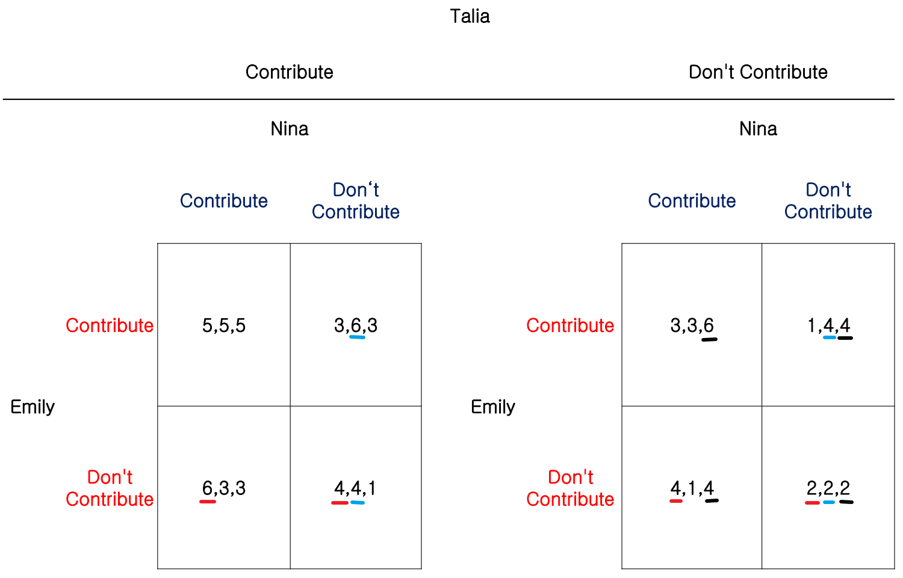
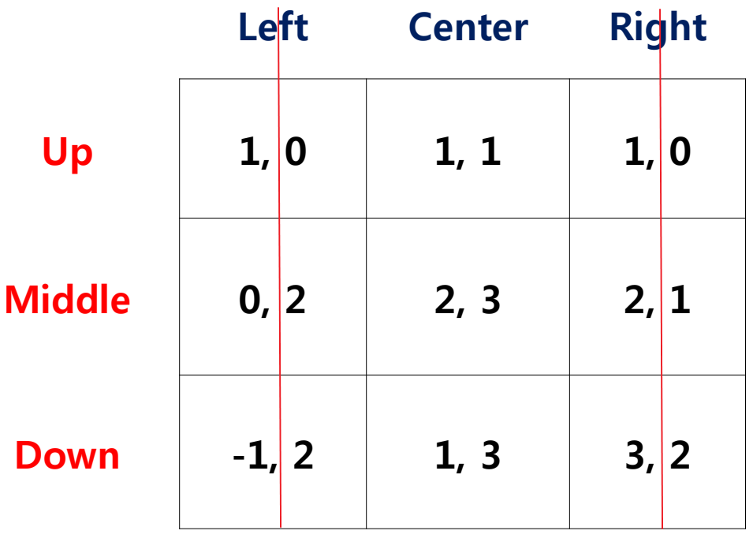

# 博弈论 {ignore}
- 2022春季
- 李润

<!-- @import "[TOC]" {cmd="toc" depthFrom=1 depthTo=6 orderedList=false} -->

<!-- code_chunk_output -->

- [博弈论 {ignore}](#博弈论-ignore)
    - [Introduction](#introduction)
    - [Dominated Strategies](#dominated-strategies)
    - [Nash Equilibrium: Existence, Multiple Equilibria and Mixed Strategies](#nash-equilibrium-existence-multiple-equilibria-and-mixed-strategies)

<!-- /code_chunk_output -->

### Introduction
- **Guessing Game**
  - Everyone choose a number between $[0,\ 100]$.
  - The one whose number is close to $\frac{2}{3}$ of the average win.
  - If you assume all other people choose the average of the range, i.e., $50$, then you may choose $50\times \frac{2}{3}\approx 33$. If you assume all other people have thought about this, i.e., they will choose $33$, then you may choose $33\times \frac{2}{3}= 22$, and so on.
  - Another prospective: the answer cannot exceed $100\times \frac{2}{3}\approx 67$, similarly we can repeat the process to get $67\times \frac{2}{3}\approx 45$, $45\times \frac{2}{3}=30$, and so on.
  - ==Both ways of thinking will derive $0$ ultimately, but choosing $0$ must not be the optimal strategy.==
 

- **Concepts in Game Theory**
  - Players: $I = \{1,\ \cdots,\ n\} $
  - Actions: $a = (a_1,\ \cdots,\ a_n) \in A = A_1 \times \cdots \times A_n$
  - Payoff function (or utility function): $u_i:A \to \mathbb{R}$ for player $i$
  - Example
    - Prisoner's Dilemma
    
    where action $C$ means "Cooperate" while $D$ means "Defect". The numbers in each cell are payoffs (the former one is the payoff of Person 1 and the latter is the payoff of Person 2).
    - There are 2 players in this example.
    - $A_1=A_2=\{C,\ D\}$, $A=A_1\times A_2=\{(C,\ C),\ (C,\ D),\ (D,\ C),\ (D,\ D)\}$
    - $u_1(a)=\begin{cases}
      2, & a=(C,\ C) \\
      0, & a=(C,\ D) \\
      3, & a=(D,\ C) \\
      1, & a=(D,\ D) \\
    \end{cases}$, $u_2(a)=\begin{cases}
      2, & a=(C,\ C) \\
      3, & a=(C,\ D) \\
      0, & a=(D,\ C) \\
      1, & a=(D,\ D) \\
    \end{cases}$
 

- **Best Response**
  - Denote $a_{-i}=<a_1,\ \cdots,\ a_{i-1},\ a_{i+1},\ \cdots,\ a_n>$ which is others' actions for player $i$. Now $a=(a_i,\ a_{-i})$.
  - ==Definition==
  $a_i^{*} \in BR(a_{-i})\ \text{iff}\ \forall a_i \in A_i,\ u_i\left( \left( a_i^{*},\ a_{-i} \right)  \right)\geqslant u_i\left( \left( a_i,\ a_{-i} \right)  \right)  $
 

- **Nash Equilibrium**
  - ==Definition==
  $a\ \text{is a Nash equilibrium iff}\ \forall i,\ a_i \in BR(a_{-i})$
  - Discrete Example
    - Still consider the Prisoner's Dilemma described above.
    - If $a=(C,\ C)$, $a_1$ is not a best response and $a_1^{*}$ should be $D$.
    - It is similar for $a=(C,\ D)$ and for $a=(D,\ C)$.
    - If $a=(D,\ D)$, $a_1$ and $a_2$ are both best response. Hence, $(D,\ D)$ reaches Nash equilibrium.
  - Continuous Example
    - Price Competition
      - 2 restaurants with prices $P_x$ and $P_y$.
      - Num of customers for each restaurant: 
      $$
      Q_x = 44 - 2P_x + P_y \\
      Q_y = 44 - 2P_y + P_x
      $$
      - Cost of serving each customer is $8$.
      - Each restaurant's goal is to maximize its profit.
      - They set prices simultaneously.
    - Since the quantity functions are the same form, 2 restaurants are ==substitute==.
    - The profit of restaurant $x$ is 
    $$
    \Pi_x = (P_x-8)(44-2P_x+P_y)=-2P_x^2+(P_y+60)P_x-8(P_y+44)
    $$By letting $\frac{\partial \Pi_x}{\partial P_x}=0$ (first order condition), we get the best response function for $x$: 
    $$
    P_x^{*} = \frac{P_y+60}{4} = \frac{P_y}{4} + 15
    $$Similarly for $y$, the best response function is $P_y^{*} = \frac{P_x}{4} + 15$.
    - According to the definition of Nash equilibrium, the prices should satisfy 
    $$
    \begin{cases}
      P_x = \frac{P_y}{4} + 15 \\
      P_y = \frac{P_x}{4} + 15 \\
    \end{cases}
    $$which means $(P_x^{*},\ P_y^{*})=(20,\ 20)$.
 

- **Method of Scoring**
  - Control $a_{-i}$ and underline the best response of $i$.
    - Example
      - Street Garden Game
      Emily, Nina and Talia have to choose simultaneously whether to contribute toward the creation of a flower garden for their small street.
      
      where numbers in each cell represent their utility respectively.
      - The Nash equilibrium is that they all choose to not contribute.

### Dominated Strategies

- **Dominance**
  - Strict Dominance
    - Strategy $\overline{s}_i \in S_i$ is strictly dominated if there is ==some== strategy $\hat{s}_i \in S_i$ s.t. $u_i((\hat{s}_i,\ s_{-i}))>u_i((\overline{s}_i,\ s_{-i}))$ for each $s_{-i} \in S_{-i}$.
  - Weak Dominance
    - Strategy $\overline{s}_i \in S_i$ is weakly dominated if there is some strategy $\hat{s}_i \in S_i$ s.t. $u_i((\hat{s}_i,\ s_{-i}))\geqslant u_i((\overline{s}_i,\ s_{-i}))$ for each $s_{-i} \in S_{-i}$ and $u_i((\hat{s}_i,\ s_{-i}))>u_i((\overline{s}_i,\ s_{-i}))$ for some $s_{-i}$.
  - Example
    - Second Price Auction
      - One indivisible unit of an object for sale.
      - $n$ potential buyers with commonly known valuations $0<v_1<v_2<\cdots<v_{n}$ for the object.
      - Buyers bid simultaneously and each submits bid $s_i \in [0,\ +\infty)$.
      - The bidder with the highest bid wins the auction and pays the second highest bid (if there are several winners, then randomly choose one).
      - Bidder $i$'s payoff ($i=1,\ 2,\ \cdots,\ n$) is given by 
      $$
      u_i = \begin{cases}
        0,& s_i<\underset{j\neq i}{\mathrm{max}}\ s_j \\
        \frac{v_i-\underset{j\neq i}{\mathrm{max}}\ s_j}{k},& s_i=\underset{j\neq i}{\mathrm{max}}\ s_j \\
        v_i-\underset{j\neq i}{\mathrm{max}}\ s_j,& s_i>\underset{j\neq i}{\mathrm{max}}\ s_j
      \end{cases}
      $$where $k$ is the num of winners.
      - Let $r=\underset{j\neq i}{\mathrm{max}}\ s_j$, we can see the choice of $r$ as the actions of buyers except $i$. The game between buyer $i$ and other buyers can be written as the following payoff matrix: 
      
      Note that bidding $s_i = v_i$ is a ==weakly dominant== strategy even if buyer $i$ does not know others' valuations.
 

- **Method of Eliminating**
  - We can get Nash equilibrium by eliminating ==strictly dominated== strategies iteratively.
  - Example
    
    - We can easily find that for column player, "Left" and "Right" are both strictly dominated by "Center", which means we can eliminate them. Then, the matrix becomes $3\times 1$ as follows: 
    
    - Now we can see that for row player, "Up" and "Down" are both strictly dominated by "Middle". By eliminating these strategies we get the Nash equilibrium ("Middle", "Center").
  - However, by eliminating weakly dominated strategies iteratively, we do not always get the Nash equilibrium (order matters).

### Nash Equilibrium: Existence, Multiple Equilibria and Mixed Strategies

- **Existence**
  A Nash equilibrium exists in game $\Gamma_{n}=\{I,\ \{S_i\},\ \{u_i(\cdot)\}\}$ if $\forall i \in I$, 
  - $\{S_i\}$ is a nonempty, convex and compact (closed and bounded) subset of some Euclidean space $\mathbb{R}^{M}$;
  - $u_i(s)$
 
